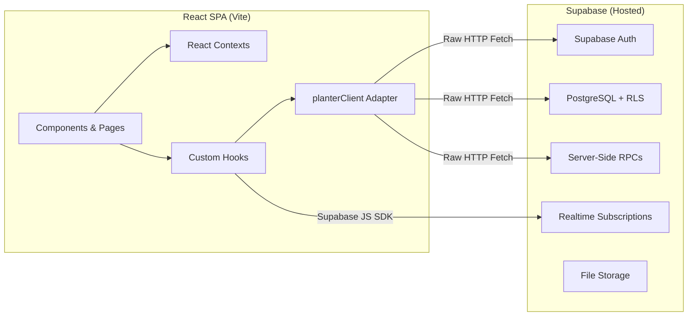
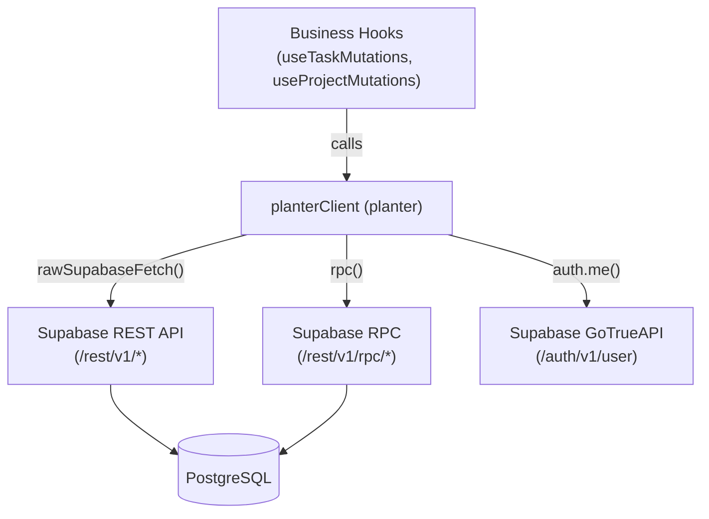
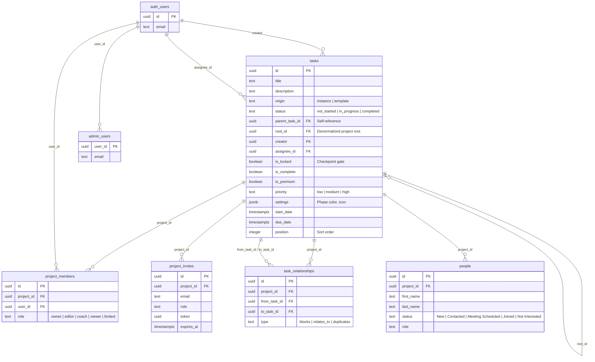
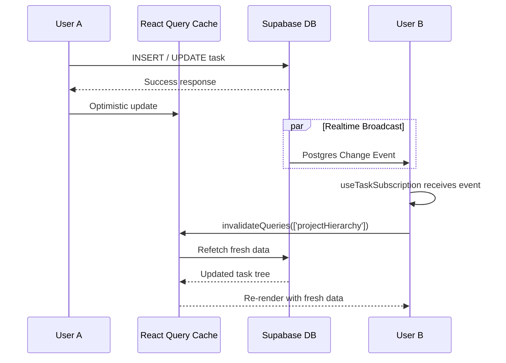
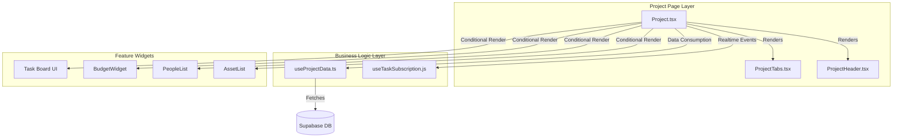
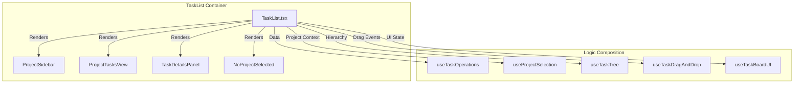

# PlanterPlan — Complete Architecture Reference

> **Last Updated**: 2026-03-03\
> **Status**: Alpha (Wave 16 — Zero-Error Build, Strict Typing & FSD Enforced)\
> **Commit**: HEAD **Specification**: [spec.md](../spec.md)

---

## Table of Contents

1. [System Overview](#1-system-overview)
2. [Tech Stack](#2-tech-stack)
3. [Directory Structure (Feature-Sliced Design)](#3-directory-structure)
4. [Application Entry & Provider Tree](#4-application-entry--provider-tree)
5. [Routing](#5-routing)
6. [State Management & Contexts](#6-state-management--contexts)
7. [API Adapter Layer — `planterClient`](#7-api-adapter-layer)
8. [Feature Domains](#8-feature-domains)
9. [Database Schema](#9-database-schema)
10. [Security Model](#10-security-model)
11. [Real-Time Data Flow](#11-real-time-data-flow)
12. [Shared UI Component Library](#12-shared-ui-component-library)
13. [Build Pipeline & Optimization](#13-build-pipeline--optimization)
14. [Testing Strategy](#14-testing-strategy)
15. [CI/CD & GitHub Automation](#15-cicd--github-automation)
16. [Key Architectural Decisions](#16-key-architectural-decisions)

---

## 1. System Overview

PlanterPlan is a **project management tool tailored for church planting**. It
models everything as a hierarchical **task tree**: a "Project" is a root-level
task with no parent. The system supports two paradigms:

- **Templates** — Standardized, reusable task trees (`origin = 'template'`)
  curated in a Master Library.
- **Instances** — Active projects created by **deep-cloning** a template
  (`origin = 'instance'`), giving each church planter a personalized, editable
  copy.

Users manage projects through a multi-view interface (list, board, phases), with
role-based access control, team membership, and people/CRM tracking.



```
### Architectural Invariants (Strictly Enforced)

The following rules were established during the Debt Remediation Sprint and are strictly enforced by the CI pipeline and ESLint:

1. **Strict Type Safety**: The use of `any`, generic `unknown` without immediate narrowing, and type-masking (e.g., `as unknown as Type`) is completely banned. All payloads and state must be strictly typed.
2. **FSD Lateral Import Ban**: Feature slices (`src/features/*`) must be strictly decoupled. A feature slice may never import directly from a sibling feature slice. All cross-domain composition must happen at the Page or Widget layer, or via centralized shared constants.
3. **Date Engine Mandate**: All date parsing, manipulation, and `toISOString()` serialization must be routed through the canonical `src/shared/lib/date-engine`. Raw `new Date()` math is forbidden in UI components to prevent timezone and formatting bugs.
4. **Zod Validated Payloads**: All form submissions and API mutation payloads must be strictly governed by `zod` schemas and integrated via `react-hook-form`. Ad-hoc `Record<string, unknown>` payloads are banned.

---

## 2. Tech Stack

| Layer                    | Technology           | Version | Purpose                                                                |
| ------------------------ | -------------------- | ------- | ---------------------------------------------------------------------- |
| **Runtime**              | React                | 18.3.1  | UI framework (ADR-002)                                                 |
| **Language**             | TypeScript           | 5.x     | Core utilities & type safety                                           |
| **Build**                | Vite                 | 7       | Dev server, bundler, HMR                                               |
| **Styling**              | Tailwind CSS         | v4      | Utility-first CSS                                                      |
| **Component Primitives** | Radix UI             | Various | Accessible headless UI primitives                                      |
| **Animations**           | Framer Motion        | 12      | Layout and interaction animations                                      |
| **Icons**                | Lucide React         | 0.563   | Icon library                                                           |
| **Charts**               | Recharts             | 3       | Data visualization                                                     |
| **Drag & Drop**          | dnd-kit              | 6/10    | Kanban board, task reordering                                          |
| **Server Queries**       | TanStack React Query | 5       | Server state cache & invalidation                                      |
| **Routing**              | React Router DOM     | 7       | Client-side navigation                                                 |
| **Validation**           | Zod                  | 4       | Schema validation                                                      |
| **Sanitization**         | DOMPurify            | 3       | XSS protection for rich text                                           |
| **Dates**                | date-fns             | 4       | Date formatting & manipulation (via `date-engine` wrapper — see ADR-9) |
| **Backend**              | Supabase             | 2.95    | Auth, Postgres, Realtime, Storage                                      |
| **Unit Tests**           | Vitest + RTL         | 4 / 16  | Component & hook testing                                               |
| **E2E Tests**            | Playwright           | 1.58    | End-to-end browser testing                                             |
| **Linting**              | ESLint               | 9       | Code quality                                                           |
| **Formatting**           | Prettier             | 3       | Code formatting                                                        |

---

## 3. Directory Structure

The codebase follows a modified **Feature-Sliced Design (FSD)** pattern with
Vite path aliases. **FSD boundary rule (ADR-8):** `shared/` may never import
from `app/` or `features/`. Constants shared across layers live in
`shared/constants/index.ts`.
```

PlanterPlan-Alpha/ ├── docs/ # Documentation & DB schema │ ├── db/schema.sql #
Full database DDL (tables, views, RPCs, RLS) │ ├── ARCHITECTURE.md # Component
diagrams (legacy) │ └── operations/ # Operational guides ├── e2e/ # Playwright
E2E test suites ├── public/ # Static assets ├── scripts/ # Utility scripts ├──
supabase/ # Supabase config, edge functions, seeds │ ├── config.toml │ ├──
functions/ │ └── seeds/ ├── src/ │ ├── app/ # @app — Global wiring │ │ ├──
App.tsx # Root component, router, provider tree │ │ ├── supabaseClient.ts#
Supabase SDK singleton │ │ ├── constants/ # App-wide constants (roles, statuses)
│ │ └── contexts/ # React Context providers (5) │ │ │ ├── features/ # @features
— Business domains (11) │ │ ├── auth/ # Login/signup components │ │ ├──
dashboard/ # Dashboard widgets (ProjectCard, Stats, Pipeline) │ │ ├── library/ #
Master Library (template browsing, cloning) │ │ ├── mobile/ # Mobile-specific UX
(FAB, Agenda) │ │ ├── navigation/ # Sidebar navigation (App + Project) │ │ ├──
onboarding/ # First-run experience │ │ ├── people/ # CRM Lite (contact
management) │ │ ├── projects/ # Project CRUD, membership, phases │ │ ├──
reports/ # Project reporting (print view) │ │ ├── task-drag/ # Drag-and-drop
logic (dnd-kit) │ │ └── tasks/ # Core Task Domain │ │ ├── components/ #
TaskTree, TaskRow, TaskDetails │ │ └── hooks/ # useTaskTree, useTaskDetails │ │
│ ├── shared/ # @shared — Reusable, domain-agnostic │ │ ├── api/ #
planterClient.ts (Supabase adapter) │ │ ├── lib/ # Pure utilities (date-engine,
tree, validation) │ │ ├── constants/ # Canonical constants (ROLES,
POSITION_STEP) │ │ ├── db/ # app.types.ts, database.types.ts │ │ ├── model/ #
Shared data models │ │ ├── test/ # Test utilities │ │ └── ui/ # 35 active design
system components (Radix-based) │ │ │ ├── pages/ # @pages — Route-level views
(7) │ │ ├── Dashboard.tsx │ │ ├── Home.tsx # Public landing page │ │ ├──
Project.tsx # Single project view (tabs: board, list, phases) │ │ ├──
Reports.tsx │ │ ├── Settings.tsx │ │ ├── TasksPage.tsx │ │ └── Team.tsx │ │ │
├── layouts/ # @layouts — Page layout shells │ │ ├── DashboardLayout.tsx #
Authenticated layout with sidebar, AuthGuard router logic, and useParams
fetching │ │ └── PlanterLayout.tsx # Minimal layout wrapper │ │ │ ├── entities/

# @entities — Domain entity definitions │ │ ├── project/ │ │ └── task/ │ │ │ ├──

styles/ # CSS globals │ │ ├── globals.css # Tailwind v4 theme tokens & design
system │ │ └── index.css # Entry point │ │ │ └── main.tsx # Vite entry point │
├── package.json ├── vite.config.js ├── playwright.config.ts └──
eslint.config.js

````
### Path Aliases (vite.config.js)

| Alias       | Maps To            |
| ----------- | ------------------ |
| `@app`      | `src/app`          |
| `@features` | `src/features`     |
| `@pages`    | `src/pages`        |
| `@shared`   | `src/shared`       |
| `@layouts`  | `src/layouts`      |
| `@entities` | `src/entities`     |
| `@widgets`  | `src/widgets`      |
| `@`         | `src/` (catch-all) |

---

## 4. Application Entry & Provider Tree

The app boots from `src/main.tsx` → `App.tsx`. The provider tree wraps the
entire application in this order:

```mermaid
graph TD
    Root["<div.App>"] --> Theme["ThemeProvider"]
    Theme --> Auth["AuthProvider"]
    Auth --> ViewAs["ViewAsProviderWrapper"]
    ViewAs --> Toast["ToastProvider"]
    Toast --> ErrorBound["ErrorBoundary"]
    ErrorBound --> Routes["AppRoutes (React Router)"]
````

| Provider                  | File                                 | Responsibility                                                  |
| ------------------------- | ------------------------------------ | --------------------------------------------------------------- |
| **ThemeProvider**         | `contexts/ThemeContext.tsx`          | Forced Light mode context (dark mode removed for UX simplicity) |
| **AuthProvider**          | `contexts/AuthContext.tsx`           | Supabase JWT session, user state, admin role check via RPC      |
| **ViewAsProviderWrapper** | `contexts/ViewAsProviderWrapper.tsx` | Admin "View As" role impersonation                              |
| **ToastProvider**         | `contexts/ToastContext.tsx`          | Global toast notification system                                |

---

## 5. Routing

Routing uses **React Router DOM v7** with lazy-loaded pages, a `ProtectedRoute`
guard, and auto-redirect logic.

| Route                | Page Component  | Auth Required | Notes                                                  |
| -------------------- | --------------- | ------------- | ------------------------------------------------------ |
| `/`                  | `Home`          | No            | Redirects to `/dashboard` if authenticated             |
| `/login`             | `LoginForm`     | No            | Redirects to `/dashboard` if authenticated             |
| `/dashboard`         | `DashboardPage` | ✅            | Main hub: consolidated pipeline board and stats        |
| `/project/:id`       | `ProjectPage`   | ✅            | Single project with tabs (Board, List, Phases, People) |
| `/reports`           | `ReportsPage`   | ✅            | Lazy loaded                                            |
| `/settings`          | `SettingsPage`  | ✅            | Lazy loaded                                            |
| `/team`              | `TeamPage`      | ✅            | Team management                                        |
| `/tasks`             | `TasksPage`     | ✅            | Flat task list view                                    |
| `/board`             | `TaskList`      | ✅            | Legacy Kanban board                                    |
| `/report/:projectId` | `ProjectReport` | ✅            | Legacy print-ready project report                      |
| `*`                  | —               | —             | Catch-all → redirect to `/`                            |

---

## 6. State Management & Contexts

The app uses a **server-state-first** architecture with TanStack React Query for
caching and five React Contexts for global client state.

```mermaid
graph LR
    subgraph "Server State (React Query)"
        RQ[useQuery / useMutation]
        Cache[Query Cache]
    end

    subgraph "Client State (React Context)"
        AC[AuthContext]
        TC[ThemeContext]
        VC[ViewAsContext]
        ToC[ToastContext]
    end

    subgraph "Local State (useState)"
        UI[activeTab, selectedTask, modals]
    end

    RQ --> Cache
    AC -->|user, loading| Components
    TC -->|theme, toggle| Components
    VC -->|viewAsRole| Components
```

### Context Details

| Context           | Key State                                              | Consumers                              |
| ----------------- | ------------------------------------------------------ | -------------------------------------- |
| **AuthContext**   | `user`, `loading`, `signIn()`, `signOut()`, `signUp()` | All protected routes, service calls    |
| **ThemeContext**  | `theme` (light)                                        | Layout components, all styled elements |
| **ViewAsContext** | `viewAsRole`, `setViewAs()`                            | Admin tools, permission-gated UI       |
| **ToastContext**  | Toast queue, `showToast()`                             | Any component needing user feedback    |

### Custom Hooks (Business Logic)

| Hook                  | Domain   | Responsibility                                                          |
| --------------------- | -------- | ----------------------------------------------------------------------- |
| `useProjectData`      | Projects | Fetches project metadata, hierarchy, members via React Query            |
| `useProjectMutations` | Projects | Create, update, delete projects with optimistic updates                 |
| `useProjectRealtime`  | Projects | Supabase Realtime subscription for project changes                      |
| `useUserProjects`     | Projects | Current user's owned + joined projects                                  |
| `useTaskMutations`    | Tasks    | Pure data mutations with optimistic UI rollbacks                        |
| `useTaskActions`      | Tasks    | Complex UI orchestration and drag-and-drop rollbacks                    |
| `useProjectSelection` | Tasks    | Manages active project state, URL syncing, and hydration                |
| `useTaskTree`         | Tasks    | Builds hierarchical tree and manages expansion state                    |
| `useTaskDragAndDrop`  | Tasks    | dnd-kit integration with subtask aggregation & deduplication            |
| `useTaskBoardUI`      | Tasks    | Manages UI-specific state (modals, forms, selected items) for the board |
| `useTaskForm`         | Tasks    | Form state management for task create/edit                              |

---

## 7. API Adapter Layer

### `planterClient.ts` — The Data Access Layer

All database operations go through `planterClient`, a custom adapter that wraps
**raw `fetch()` calls** to the Supabase REST API. This was adopted to work
around `AbortError` instability in the Supabase JS SDK's `fetch` implementation.

> **Architectural Consolidation**: Converted from `.js` to `.ts` with strict
> typing. Direct `supabase.from()` calls in UI components are banned; all
> Supabase access MUST route through this adapter. Furthermore, the
> `date-engine` is the canonical source for all date math — raw `new Date()` or
> `date-fns` logic in the UI is strictly forbidden. Form payloads MUST be
> strictly typed via inferred Zod schemas and managed via React Hook Form;
> ad-hoc `Record<string, unknown>` payloads are banned.



### Entity Client Factory

`createEntityClient(tableName)` generates a standard CRUD interface for any
Supabase table:

| Method                     | Description                             |
| -------------------------- | --------------------------------------- |
| `list()`                   | Fetch all records                       |
| `get(id)`                  | Fetch single record by UUID             |
| `create(payload)`          | Insert a new record                     |
| `update(id, payload)`      | Patch a record                          |
| `delete(id)`               | Delete a record                         |
| `filter(filters)`          | Query with key-value filters            |
| `upsert(payload, options)` | Insert or update with conflict handling |

### Registered Entities

| Entity Name         | Supabase Table                       | Custom Overrides                                                                                                                        |
| ------------------- | ------------------------------------ | --------------------------------------------------------------------------------------------------------------------------------------- |
| `Project`           | `tasks`                              | `list()` filters for root tasks; `create()` maps project fields; `listByCreator()`, `listJoined()`, `addMember()`, `addMemberByEmail()` |
| `Task`              | `tasks`                              | Standard CRUD                                                                                                                           |
| `Phase`             | `tasks`                              | Standard CRUD (alias)                                                                                                                   |
| `Milestone`         | `tasks`                              | Standard CRUD (alias)                                                                                                                   |
| `TaskWithResources` | `tasks_with_primary_resource` (view) | Standard CRUD                                                                                                                           |
| `TaskResource`      | `task_resources`                     | Standard CRUD                                                                                                                           |

### Authentication Flow

The `planterClient` reads the Supabase JWT from `localStorage` to authenticate
raw fetch calls. The token key follows the pattern:
`sb-{project-ref}-auth-token`.

---

## 8. Feature Domains

### 8.1 Tasks (`features/tasks/`)

The largest domain. Manages the core task lifecycle.

```
tasks/
├── components/          # 20+ components + board subdirectory
│   ├── TaskTree/        # Recursive Tree Logic
│   │   ├── TaskTree.tsx     # Tree root & DndContext
│   │   ├── TaskRow.tsx      # Recursive row (Logic)
│   │   ├── TaskRowUI.tsx    # Row presentation
│   │   └── TaskActions.tsx  # Atomic action buttons
│   ├── TaskDetails/     # Side Panel
│   │   └── TaskDetails.tsx  # View/Edit attributes
│   ├── ProjectTasksView.tsx # Task list filtered by project
│   ├── ProjectListView.tsx  # Virtualized list
│   ├── TaskResources.tsx    # File/link attachments
│   ├── TaskDependencies.tsx # Relationship management UI
│   ├── InlineTaskInput.tsx  # Quick-add task inline
│   ├── board/
│   │   ├── ProjectBoardView.tsx  # Kanban board container
│   │   ├── BoardColumn.tsx       # Status column
│   │   └── BoardTaskCard.tsx     # Draggable task card
│   └── ... (forms, controls, selects)
├── hooks/               # 10 hooks (see §6)
│   ├── useTaskTree.ts       # Tree structural logic
│   ├── useTaskTreeDnD.ts    # Drag logic + Cycle Detection
│   ├── useTaskDetails.ts    # Single task fetcher
│   └── ...
└── lib/
    └── (task-specific utilities)
```

### 8.2 Projects (`features/projects/`)

Project lifecycle: creation, editing, membership, phases.

### 6.2 Feature Decoupling Rule

Feature slices must exclusively communicate through barrel exports (`index.ts`).
**Direct deep-imports into another slice's hooks, components, or internal logic
are strictly forbidden.** This prevents circular dependencies and uncontrolled
coupling.

### 6.3 Unified Light Mode Architecture

The application is architected for a **strict Light Mode only** environment.

- **Rule**: Do not use `dark:` Tailwind variants.
- **Rule**: Do not implement theme toggling or system sync logic.
- **Rule**: Standardize on `--color-background` for canvas and `--color-card`
  for individual widgets.

```
projects/
├── components/
│   ├── ProjectHeader.tsx       # Title, status, settings bar
│   ├── ProjectTabs.tsx         # Board | List | Phases | People tabs
│   ├── PhaseCard.tsx           # Gated phase with checkpoint logic
│   ├── MilestoneSection.tsx    # Collapsible milestone group
│   ├── AddTaskModal.tsx        # Modal for adding tasks
│   ├── EditProjectModal.tsx    # Project settings editor
│   ├── NewProjectForm.tsx      # Create project wizard
│   ├── InviteMemberModal.tsx   # Team member invitation
│   ├── InstanceList.tsx        # List of project instances
│   ├── JoinedProjectsList.tsx  # Projects user was invited to
├── hooks/
│   ├── useProjectData.ts       # All project queries
│   ├── useProjectMutations.ts  # Create/update/delete
│   ├── useProjectRealtime.ts   # Realtime subscription
│   └── useUserProjects.ts      # User's project list
└── utils/
```

### 8.3 Dashboard (`features/dashboard/`)

Main landing experience after login. Consolidated into a single Pipeline view.

| Component              | Purpose                                             |
| ---------------------- | --------------------------------------------------- |
| `CreateProjectModal`   | Template selection + project creation wizard        |
| `ProjectPipelineBoard` | Pipeline/kanban view of all projects by status      |
| `StatsOverview`        | Summary cards (total projects, tasks, completion %) |

### 8.4 Navigation (`features/navigation/`)

Dual-sidebar navigation system.

| Component                          | Purpose                                                                     |
| ---------------------------------- | --------------------------------------------------------------------------- |
| `AppSidebar`                       | Global sidebar: Dashboard, Reports, Settings, Team links (My Tasks removed) |
| `ProjectSidebar`                   | Context-aware sidebar showing project tree                                  |
| `ProjectSidebarContainer`          | Wrapper managing sidebar state                                              |
| `Header`                           | Top header bar with user menu                                               |
| `ViewAsSelector`                   | Admin role impersonation dropdown                                           |
| `SidebarNavItem` / `GlobalNavItem` | Reusable nav link components                                                |

### 8.5 Library (`features/library/`)

Master template library for browsing and cloning templates.

- **Components**: `MasterLibraryList`, `MasterLibraryItem`,
  `MasterLibrarySearch`
- **Hooks**: `useMasterLibrary`, `useMasterLibrarySearch` (uses TanStack
  `useQuery` with debouncing), `useMasterLibraryTasks` (uses TanStack
  `useInfiniteQuery` for pagination), `useLibraryActions`

### 8.6 People — CRM Lite (`features/people/`)

Contact management for church planting teams.

- **Components**: `PeopleList`, `PersonCard`, `AddPersonModal`

### 8.7 Reports (`features/reports/`)

- `ProjectReport` — Print-ready project view with completion statistics
- `ReportCard` — Summary card for report listings
- `ReportExport` — Export functionality
- `Select` — Dropdown for picking a project to view its report directly

### 8.8 Mobile (`features/mobile/`)

Mobile-specific UX enhancements:

- `MobileFAB` — Floating Action Button for quick actions
- `MobileAgenda` — "Today's Agenda" focused task view

### 8.9 Auth (`features/auth/`)

- `LoginForm` — Email/password sign-in + sign-up

### 8.10 Onboarding (`features/onboarding/`)

First-run experience for new users.

### 8.11 Task Drag (`features/task-drag/`)

Encapsulated dnd-kit drag-and-drop logic:

- `lib/` — Drag computation, collision detection, position recalculation
- `model/` — Drag state models

---

## 9. Database Schema

The database runs on **Supabase-hosted PostgreSQL** with `pgcrypto` extension.

### 9.1 Entity-Relationship Diagram



### 9.2 Tables

| Table                | Purpose                                                      | Key Columns                                                                                                          |
| -------------------- | ------------------------------------------------------------ | -------------------------------------------------------------------------------------------------------------------- |
| `tasks`              | Core table — stores projects AND tasks in a single hierarchy | `parent_task_id` (adjacency list), `root_id` (denormalized root for fast tree queries), `origin` (template/instance) |
| `project_members`    | RBAC membership                                              | `project_id`, `user_id`, `role` (5 roles)                                                                            |
| `project_invites`    | Pending email invitations                                    | `token` (UUID), `expires_at` (7 days)                                                                                |
| `task_relationships` | Task dependencies                                            | `from_task_id` → `to_task_id`, `type` (blocks/relates_to/duplicates)                                                 |
| `people`             | CRM contacts per project                                     | `project_id`, `status` (pipeline states)                                                                             |
| `admin_users`        | Explicit admin grants                                        | `user_id`, `granted_by`                                                                                              |

### 9.3 Views

| View                          | Purpose                                                           |
| ----------------------------- | ----------------------------------------------------------------- |
| `tasks_with_primary_resource` | Legacy adapter: joins tasks with NULL resource columns            |
| `view_master_library`         | Filters `tasks` to `origin = 'template'` for the template browser |

### 9.4 Indexes

| Index                   | Column(s)        | Purpose                          |
| ----------------------- | ---------------- | -------------------------------- |
| `idx_tasks_root_id`     | `root_id`        | Fast project-scoped tree queries |
| `idx_tasks_parent_id`   | `parent_task_id` | Hierarchy traversal              |
| `idx_tasks_is_locked`   | `is_locked`      | Checkpoint filtering             |
| `idx_tasks_is_premium`  | `is_premium`     | Premium feature gating           |
| `idx_people_project_id` | `project_id`     | People lookup by project         |

### 9.5 Server-Side Functions (RPCs)

| Function                                                       | Purpose                                                                                              | Security                                             |
| -------------------------------------------------------------- | ---------------------------------------------------------------------------------------------------- | ---------------------------------------------------- |
| `is_admin(p_user_id)`                                          | Check `admin_users` table                                                                            | `SECURITY DEFINER`                                   |
| `has_project_role(p_project_id, p_user_id, p_allowed_roles[])` | RBAC role check                                                                                      | `SECURITY DEFINER`                                   |
| `clone_project_template(...)`                                  | Deep clone: recursively copies entire task tree + resources via temp tables                          | `SECURITY DEFINER`, `authenticated` + `service_role` |
| `invite_user_to_project(...)`                                  | Invite by email: auto-adds if user exists, creates invite token if not                               | `SECURITY DEFINER`                                   |
| `get_invite_details(p_token)`                                  | Look up invite by token (for onboarding)                                                             | `SECURITY DEFINER`, `anon` + `authenticated`         |
| `initialize_default_project(...)`                              | Creates a 6-phase church planting template (Discovery → Growth) with scaffolded milestones and tasks | `SECURITY DEFINER`                                   |

### 9.6 Triggers

| Trigger                     | Event                             | Action                                                                |
| --------------------------- | --------------------------------- | --------------------------------------------------------------------- |
| `trg_unlock_next_phase`     | `AFTER UPDATE OF status ON tasks` | When a phase is completed, unlocks the next sibling phase by position |
| `handle_phase_completion()` | (backing function)                | Sets `is_locked = false` on the next task by position                 |

---

## 10. Security Model

### 10.1 Authentication

- **Supabase Auth** (GoTrue) handles JWT-based authentication
- `AuthContext.tsx` listens for `onAuthStateChange` events (`SIGNED_IN`,
  `SIGNED_OUT`, `TOKEN_REFRESHED`, `INITIAL_SESSION`)
- Admin status is determined via the `is_admin()` RPC with a 10-second timeout
  fallback
- Roles: `admin` (from `admin_users` table), `owner` (default for authenticated
  users), `viewer` (fallback on error)

### 10.2 Row-Level Security (RLS)

RLS is **enabled on all tables**. Policies enforce data isolation:

| Table                | SELECT                      | INSERT                                                   | UPDATE                       | DELETE                       |
| -------------------- | --------------------------- | -------------------------------------------------------- | ---------------------------- | ---------------------------- |
| `tasks`              | Creator OR any project role | Root projects: creator only; Children: owner/editor role | Creator OR owner/editor role | Creator OR owner/editor role |
| `project_members`    | Any project role OR admin   | Owner OR admin                                           | Owner OR admin               | Owner OR admin               |
| `project_invites`    | Owner/editor OR admin       | Owner/editor OR admin                                    | —                            | Owner/editor OR admin        |
| `people`             | Any project role OR admin   | Owner/editor OR admin                                    | Owner/editor OR admin        | Owner/editor OR admin        |
| `task_relationships` | Any project member          | Owner/editor                                             | —                            | Owner/editor                 |
| `admin_users`        | RLS enabled (self + admin)  | —                                                        | —                            | —                            |

### 10.3 RBAC Roles

Five project-level roles with cascading permissions:

| Role      | View            | Edit Tasks | Manage Members | Delete Project |
| --------- | --------------- | ---------- | -------------- | -------------- |
| `owner`   | ✅              | ✅         | ✅             | ✅             |
| `editor`  | ✅              | ✅         | ✅ (invite)    | ❌             |
| `coach`   | ✅              | ❌         | ❌             | ❌             |
| `viewer`  | ✅              | ❌         | ❌             | ❌             |
| `limited` | ✅ (restricted) | ❌         | ❌             | ❌             |

### 10.4 Client-Side Security

- **DOMPurify** sanitizes user-generated HTML/rich text
- **Zod** validates form inputs before submission
- **`SECURITY DEFINER`** on all RPC functions ensures they run with elevated
  privileges within controlled boundaries

---

## 11. Real-Time Data Flow

The app uses a **Stale-While-Revalidate** strategy enhanced by Supabase
Realtime.



### Subscription Hooks

| Hook                  | Channel              | Events                 | Invalidates                       |
| --------------------- | -------------------- | ---------------------- | --------------------------------- |
| `useTaskSubscription` | `tasks` table        | INSERT, UPDATE, DELETE | `['projectHierarchy', projectId]` |
| `useProjectRealtime`  | `tasks` table (root) | UPDATE                 | `['project', projectId]`          |

---

## 12. Shared UI Component Library

The `src/shared/ui/` directory contains **35 active components** built on Radix
UI primitives + Tailwind CSS, following the shadcn/ui pattern. (Pruned in Wave
12).

### Component Categories

| Category         | Components                                                                                     |
| ---------------- | ---------------------------------------------------------------------------------------------- |
| **Layout**       | `Card`, `AspectRatio`, `ScrollArea`                                                            |
| **Navigation**   | `NavigationMenu`, `Tabs`, `Menubar`                                                            |
| **Data Display** | `Table`, `Badge`, `Avatar`, `Progress`, `Chart`                                                |
| **Feedback**     | `StatusCard`                                                                                   |
| **Forms**        | `Button`, `Input`, `Textarea`, `Label`, `RadioGroup`, `Select`, `Switch`, `Slider`, `Calendar` |
| **Overlays**     | `Dialog`, `Popover`, `Tooltip`, `HoverCard`, `DropdownMenu`, `ContextMenu`                     |
| **Composition**  | `Accordion`, `Collapsible`, `ToggleGroup`, `Command`, `CommandPalette`                         |
| **App-Specific** | `ErrorBoundary`, `ErrorFallback`, `RoleIndicator`                                              |

### Design System Utilities

| Utility | File                       | Purpose                                                |
| ------- | -------------------------- | ------------------------------------------------------ |
| `cn()`  | `shared/lib/utils.ts`      | Merges Tailwind classes with `clsx` + `tailwind-merge` |
| `cva()` | `class-variance-authority` | Variant-based component styling                        |

---

## 13. Build Pipeline & Optimization

### Vite Configuration

| Setting            | Value            | Notes                      |
| ------------------ | ---------------- | -------------------------- |
| Dev server         | `127.0.0.1:3000` | Does not auto-open browser |
| Build output       | `build/`         | Production bundle          |
| Chunk size warning | 1000 KB          |                            |

### Code Splitting (Manual Chunks)

The build uses **manual chunk splitting** for optimal loading:

| Chunk Name      | Contents                      |
| --------------- | ----------------------------- |
| `ui`            | `@radix-ui/*`                 |
| `charts`        | `recharts`                    |
| `motion`        | `framer-motion`               |
| `supabase`      | `@supabase/*`                 |
| `icons`         | `lucide-react`                |
| `vendor-{name}` | Other `node_modules` packages |

### Lazy Loading

- `ReportsPage` and `SettingsPage` are **React.lazy** loaded
- `SidebarSkeleton` renders during Suspense fallback

---

## 14. Testing Strategy

### Unit & Integration Tests (Vitest + React Testing Library)

| Configuration   | Value                         |
| --------------- | ----------------------------- |
| Test runner     | Vitest 4                      |
| DOM environment | jsdom                         |
| Setup file      | `src/setupTests.ts`           |
| Exclusions      | `node_modules`, `dist`, `e2e` |

Key test files:

- `useTaskBoard.test.tsx` — Board hook logic
- `PhaseCard.test.tsx` — Phase checkpoint behavior
- `CreateProjectModal.test.tsx` — Project creation flow
- `retry.test.ts` — Fetch retry utility
- `validation.test.ts` — Input validation
- `MobileAgenda.test.tsx` — Mobile agenda

### E2E Tests (Playwright)

| Suite                     | Coverage                                     |
| ------------------------- | -------------------------------------------- |
| `golden-paths.spec.ts`    | Project Creation, Date Picker, Sidebar flows |
| `sidebar-actions.spec.ts` | Template selection, Modal flows              |
| `drag-drop.spec.ts`       | Drag persistence, Date inheritance           |
| `auth.spec.ts`            | Login, logout, session persistence           |
| `theme-integrity.spec.ts` | Dark/light mode across all views             |
| `security.spec.ts`        | Unauthorized access prevention               |

Playwright is configured to target `localhost:3010` (Isolated E2E Mode) with the
Chromium project.

---

## 15. CI/CD & GitHub Automation

| File                               | Purpose                         |
| ---------------------------------- | ------------------------------- |
| `.github/workflows/`               | 2 GitHub Actions workflow files |
| `.github/dependabot.yml`           | Automated dependency updates    |
| `.github/release-drafter.yml`      | Auto-generated release notes    |
| `.github/pull_request_template.md` | Standardized PR descriptions    |

---

## 16. Key Architectural Decisions

### ADR-1: Everything is a Task

**Decision**: Projects, phases, milestones, and tasks all live in the same
`tasks` table.

**Rationale**: Simplifies the data model — a "project" is just a root task.
Hierarchy is maintained via `parent_task_id` (adjacency list) with a `root_id`
denormalization for fast full-tree fetches without recursive queries.

**Trade-off**: Requires careful filtering to distinguish projects from
sub-tasks.

---

### ADR-2: Raw Fetch Over Supabase SDK

**Decision**: The `planterClient` uses `rawSupabaseFetch()` (native `fetch`)
instead of the Supabase JavaScript SDK for data operations.

**Rationale**: The Supabase JS SDK exhibited persistent `AbortError` issues in
the browser environment, causing unreliable data fetching. Raw fetch with manual
JWT attachment proved more stable.

**Trade-off**: Loses SDK conveniences (automatic typing, query builder chaining)
but gains reliability and explicit control.

---

### ADR-3: Server-Side Deep Clone via RPC

**Decision**: Template cloning is performed server-side via the
`clone_project_template()` PostgreSQL function, not client-side.

**Rationale**: Cloning entire task trees (potentially hundreds of records) with
resources must be atomic and consistent. A server-side function with temp tables
and a single transaction ensures no orphaned records.

---

### ADR-4: Feature-Sliced Design

**Decision**: Organize code by business domain (`features/tasks/`,
`features/projects/`) rather than technical role (`components/`, `hooks/`).

**Rationale**: Enables independent reasoning about each domain, clearer
ownership, and fewer circular dependencies. Each feature slice contains its own
components, hooks, services, and tests.

---

### ADR-5: Checkpoint-Based Phase Gating

**Decision**: Phases have an `is_locked` field that is automatically unlocked by
a database trigger (`trg_unlock_next_phase`) when the previous phase is
completed.

**Rationale**: Enforces sequential workflow for church planting (you can't
launch before planning). The trigger ensures consistency regardless of which
client performs the update.

---

### ADR-6: RBAC via Database Functions

**Decision**: All permission checks are done via `has_project_role()` PostgreSQL
function called from RLS policies, not application code.

**Rationale**: Security is enforced at the database level. Even if the frontend
is bypassed, unauthorized operations are blocked by RLS. The `SECURITY DEFINER`
flag ensures the functions run with appropriate privileges.

---

### ADR-7: Atomic Task Tree Components

**Decision**: The Task Tree is decomposed into atomic, recursive components
(`TaskTree`, `TaskRow`, `TaskActions`) rather than a monolithic `TaskList`.
`TaskDetails` sets side-by-side with the tree via `ProjectView` layout state.

**Rationale**:

1. **Performance**: Isolating `TaskRow` allows `React.memo` to prevent
   re-rendering the entire tree when one task updates.
2. **Safety**: Drag-and-drop logic (`useTaskTreeDnD`) is separated from
   rendering, enabling strict validation (Cycle Detection) before any state
   mutation.
3. **Maintainability**: `TaskActions` encapsulates the complex menu/button
   logic, reducing noise in the main row component.

---

### ADR-8: FSD Boundary Enforcement

**Decision**: Strict unidirectional data flow. `shared/` modules may **never**
import from `app/` or `features/`. Furthermore, **lateral feature imports are
strictly banned** (a slice in `features/` cannot import from another slice in
`features/`).

**Rationale**: Rampant cross-feature imports create circular dependencies and
brittle code. Cross-feature UI composition must happen by lifting state to
`widgets/` or passing components as render props. Constants needed across layers
must live in `src/shared/constants/`.

---

### ADR-9: Canonical Date Engine

**Decision**: All date manipulation, parsing, and serialization **must** route
exclusively through `src/shared/lib/date-engine/`.

**Rationale**: Mixing local `new Date()` parsing with UTC `.toISOString()`
serialization causes off-by-one-day timezone errors. **Strict Ban**: You are
explicitly forbidden from using `new Date(string)` or `.toISOString()` directly
in application code. The `date-engine` wrapper must dictate all date-only vs.
datetime semantics.

---

_This document is auto-generated from the codebase at HEAD. For operational
guides, see `docs/operations/`. For the database DDL, see `docs/db/schema.sql`._

---

## 17. Component Diagrams (Legacy Reference)

These diagrams detail specific internal structures of complex modules.

### 17.1 Project Page Architecture

The `Project` module (`src/pages/Project.tsx`) uses a composition of specialized
hooks and UI components.



### 17.2 Task List Composition

The `TaskList` (`src/features/tasks/components/TaskList.tsx`) now directly
composes specialized hooks for optimal re-rendering.


