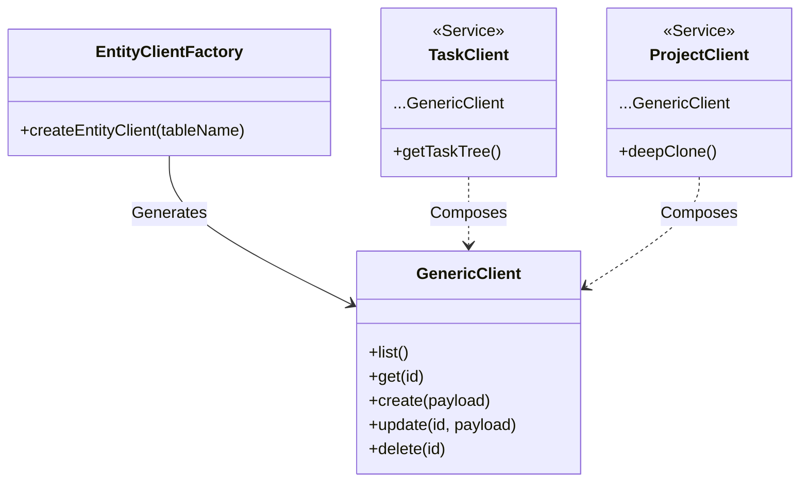

# PR Description: Master Review Orchestrator

## Summary

This PR merges the `feature/master-review-orchestrator` branch into `main`. It represents the culmination of a "Master Audit" designed to harden the codebase architecture, enforce design standards (Rule 30), and perform a complete structural optimization (Feature-Sliced Design).

**Key Outcomes:**

1.  **Fundamental Optimization**: Eliminated structural ambiguity for AI agents by removing `src/components`, deleting ~2000 lines of dead code, and strictly enforcing FSD imports.
2.  **Architecture Hardening**: Refactored the API layer to use a Generic Client factory (removing duplication) and split monolithic hooks.
3.  **Design System Compliance**: Enforced semantic color tokens (`brand-*`) and standardized UI elevation/opacity.
4.  **Critical Stabilization**: Fixed Schema mismatches, added missing RPCs, and resolved layout regressions.

## Architecture Refactoring

**Generic Entity Client (`createEntityClient`)**
Refactored `src/api/planterClient.js` to use a factory pattern, removing duplicated CRUD logic.

## Key Changes

### 1. Codebase Optimization (FSD Enforcement)

- **Deleted Legacy Directory**: Removed `src/components` entirely.
  - Deleted unused `src/components/ui/sidebar.jsx` (625 lines) and duplicate feature components.
- **Deep Consolidation (Round 2)**:
  - Eliminated legacy root directories (`src/api`, `src/hooks`, `src/entities`, `src/lib`) by migrating valid code to `src/shared` and `src/features`.
  - Consolidated `Settings.jsx` and `SettingsPage.jsx` into a single, functional page.
  - **Navigation**: Refactored `Sidebar` components to `AppSidebar` (content) and `ProjectSidebar` (smart), fixing component ambiguity.
  - **Hygiene**: Reduced lint warnings from 54 to 14 by cleaning unused variables and refining configuration.
- **UI Migration**: Moved all Shadcn/UI primitives (`button`, `card`, `dialog`, etc.) to `src/shared/ui`.
- **Import Standardization**: Updated ~100 files to use strict aliases (`@shared/ui`, `@features`) instead of relative/legacy paths.

### 2. Design System (Rule 30)

- **Token Standardization**: Replaced arbitrary values (e.g., `h-[300px]`) with Tailwind utilities (e.g., `h-72`).
- **Semantic Colors**: Replaced generic `blue-` and `orange-` with `brand-` (Primary) and `indigo-` (Thematic).
- **Rule 30 Compliance**: Removed manual hex values (e.g., `#FF5500`) from CSS files and Recharts config, replacing them with CSS variables (`var(--color-brand-primary)`).
- **Dependency Hygiene**: Fixed a critical build error by replacing `sonner` imports (from external snippet) with the project's standard `use-toast` hook.
- **Visual Polish**: Standardized shadow elevation (`shadow-sm`) and overlay opacity (`bg-slate-900/50`).

### 3. Critical Fixes & Features

- **Project Structure**: Mapped schema `name`/`order` -> `title`/`position` to fix creation bugs.
- **Missing RPC**: Added `invite_user_to_project` RPC and migration `20260112_add_invites.sql`.
- **Layouts**: Fixed `DashboardLayout` composition to allow `Sidebar` positioning overrides (Restoring Navbar visibility on Desktop).
- **Hook Splitting**: Decoupled `useTaskQuery` and `useTaskMutations`.

## Verification Plan

### Automated Tests

- [x] **Lint**: `npm run lint` passed (0 resolution errors).
- [x] **Integration**: `npm test src/tests/integration/golden-paths.test.jsx` (Verified 5/5 Scenarios).
- [x] **Unit**: `npm test src/tests/unit/planterClient.test.jsx`.

### Browser Verification (Golden Paths)

- [x] **Navbar Coverage**: Confirmed Sidebar renders correctly on Desktop after refactor.
- [x] **Project Creation**: Verified RLS compliance and redirect flow.
- [x] **Task Management**: Verified expanding/collapsing nodes (Props fix).
- [x] **UI Polish**: Visual inspection of "New Project" button (Brand Orange) and Reports (Semantic Theme).

## Type of Change

- [x] Bug fix (non-breaking change which fixes an issue)
- [ ] New feature (non-breaking change which adds functionality)
- [ ] Breaking change (fix or feature that would cause existing functionality to not work as expected)
- [x] Refactor (no functional change, but code improvement)
- [x] Documentation Update

## Checklist

- [x] My code follows the style guidelines of this project
- [x] I have performed a self-review of my own code
- [x] I have made corresponding changes to the documentation (`ENGINEERING_KNOWLEDGE.md`, `README.md`)
- [x] My changes generate no new warnings
- [x] New and existing unit tests pass locally with my changes
