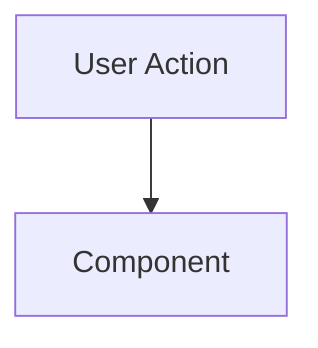

# Pull Request

<!-- 
Copy contents from `PR_DESCRIPTION_DRAFT.md` (generated by Agent) or fill manually.
-->

## 📋 Summary

<!-- 2-3 sentence executive summary. User-facing language. -->

## ✨ Highlights

<!-- 
- **Bold Concept:** Detail...
-->

## 🗺️ Roadmap Progress

| Item ID | Feature Name | Phase | Status | Notes |
| ------- | ------------ | ----- | ------ | ----- |
|         |              |       |        |       |

## 🏗️ Architecture Decisions

### Key Patterns & Decisions

-

### Logic Flow / State Changes

## 🔍 Review Guide

### 🚨 High Risk / Security Sensitive

-

### 🧠 Medium Complexity

-

### 🟢 Low Risk / Boilerplate

-

## 🧪 Verification Plan

### 1. Environment Setup

- [ ] Run `npm install`
- [ ] Run migration: `[filename].sql`

### 2. Manual Verification

- **[Feature Area]**:
  1. [Instruction]
  2. [Outcome]

### 3. Automated Tests

- [ ] `npm run lint` passed (Zero warnings).
- [ ] `npm test` passed.
- [ ] `npm run build` passed.
