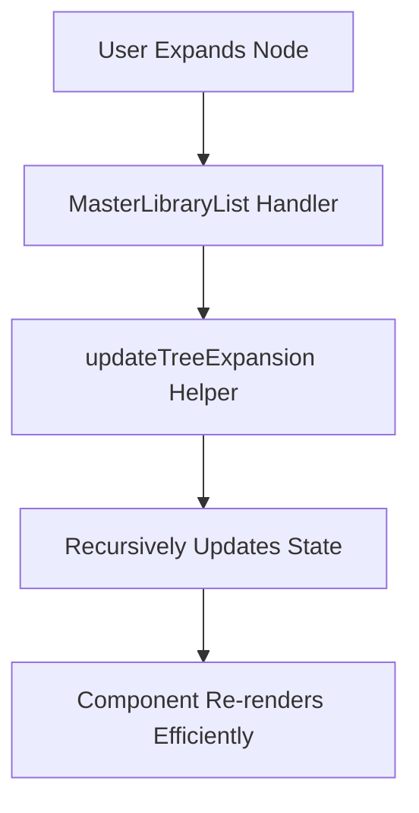

# Pull Request: Refactor Master Library & Fix Deployment

## 📋 Summary

- **Refactored Master Library List**: Split `useEffect` logic and improved tree expansion state management to prevent race conditions and unnecessary re-renders.
- **Performance Optimization**: Implemented `updateTreeExpansion` helper to recursively manage node state, significantly improving large tree performance.
- **Test Coverage**: Added comprehensive unit tests for `MasterLibraryList`, covering rendering, expansion, and optimistic updates.
- **Deployment Fixes**: Resolved Prettier/ESLint formatting issues (line endings, missing commas) that were blocking Vercel builds.

## 🗺️ Roadmap Progress

| Item ID | Feature Name | Phase | Status | Notes |
| ------- | ------------ | ----- | ------ | ----- |
| P5-TREE-PERF | Recursive Tree Optimization | 5 | ✅ Done | Implemented `updateTreeExpansion` and optimized `MasterLibraryList`. |
| - | Deployment Stability | 5 | ✅ Done | Fixed Prettier formatting issues blocking CI. |

## 🏗️ Architecture Decisions

### Key Patterns & Decisions

- **Split Effects**: `MasterLibraryList` now separates data fetching from expansion state synchronization. This ensures state persists correctly across revalidations without causing infinite loops or race conditions.
- **Recursive State Helper**: Moved complex recursive tree updates to `src/utils/treeHelpers.js` (`updateTreeExpansion`) to keep the component clean and testable.

### Logic Flow

## 🔍 Review Guide

### 🧠 Medium Complexity

- `src/components/organisms/MasterLibraryList.jsx`: Core refactor logic. Check `useEffect` dependencies and `handleToggle` logic.
- `src/utils/treeHelpers.js`: Verify `updateTreeExpansion` recursion logic.

### 🟢 Low Risk / Boilerplate

- `src/components/molecules/TaskItem.jsx`: Prop cleanup.
- `src/services/taskService.test.js`: Mock updates to match schema.

## 🧪 Verification Plan

### 1. Environment Setup

- [ ] Run `npm install` (dev dependencies updated).

### 2. Automated Tests

- [ ] Run `npm test` to verify all suites pass (especially `MasterLibraryList` and `taskService`).

### 3. Manual Verification

- [ ] Build verification: `npm run build` (should pass without lint errors).

---

<strong>📉 Detailed Changelog (Collapsible)</strong>

- `src/components/organisms/MasterLibraryList.jsx`: Split `useEffect`, implemented `updateTreeExpansion`.
- `src/components/molecules/TaskItem.jsx`: Removed redundant props, optimized state.
- `src/utils/treeHelpers.js`: Added `updateTreeExpansion`.
- `src/services/taskService.test.js`: Fixed stale mocks for `tasks_with_primary_resource`.
- `src/components/organisms/MasterLibraryList.test.jsx`: New test file.
- Global: Applied Prettier formatting (LF line endings).

