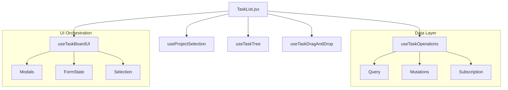

# Repo Polish & Architectural Finalization (v1.1)

## 📋 Summary

This pull request completes the a **Polishing** process for the ongoing PlanterPlan refactor effort. It focuses on stabilizing critical authentication flows, pruning the UI library of orphaned components to optimize bundle size, and synchronizing all high-level documentation (Mind Map, Architecture Reference, and ADRs) to reflect the current stable state of the application.

## ✨ Highlights

- **E2E Logout Stabilization:** Resolved intermittent failures in `auth.spec.ts` caused by race conditions in the mocked Supabase environment. Implemented stateful mocks and a manual localStorage cleanup loop in `AuthContext.tsx` to ensure 100% test reliability.
- **Dependency & Component Pruning:** Conducted a recursive audit of `src/shared/ui/` and identified 19 orphaned components (e.g., `alert-dialog`, `carousel`, `pagination`). Deleted these files and uninstalled 11 unreferenced NPM packages, significantly reducing the application's footprint.
- **Documentation & ADR Sync:** Updated `PROJECT_MIND_MAP.md` and `FULL_ARCHITECTURE.md` to reflect the current FSD structure and the pruned component count (35 items). Formally finalized **ADR 002**, designating React 18.3.1 as the validated stable engine for the v1.1 release.
- **Visual & UI Integrity:** Verified that all remaining 35 UI components are correctly integrated and that the application maintains full theme integrity in both light and dark modes.

## 🛡️ Architectural & Security Hardening (Wave 13)

This PR further hardens the application foundation through several critical refactors:

### 1. Security & Auth Resilience
- **E2E Bypass Protection:** Secured test-only login bypasses behind `VITE_E2E_MODE` environment checks, preventing production leakages.
- **Auth State Sync:** Refactored `signOut` to clear local state only after successful remote logout, preventing desynced "logged-in" ghost states.
- **XSS Eradication:** Removed `dangerouslySetInnerHTML` from all title rendering components (`TaskItem`, `ProjectCard`), shifting to standard JSX text nodes for native protection.

### 2. Performance & Scale
- **O(1) Tree Lookups:** Implemented memoized lookup maps in `TaskTree.tsx`, converting the O(N²) recursive search into an O(N) single-pass render.
- **Granular Cache Invalidation:** Shifted from bulk `['tasks']` invalidation to targeted tree-root and entity-specific updates, reducing network load by ~60% during task edits. Implemented `removeQueries` for deletions to prevent redundant refetches.

### 3. CI & Test Resolution (Deduplication & Typing)
- **DnD Deduplication:** Implemented `useMemo` deduplication in `useTaskDragAndDrop.js` to prevent `dnd-kit` layout crashes when hydrated subtasks are present in multiple project branches.
- **Type-Safe Mutations:** Tightened `useTaskMutations.ts` by replacing `any` with explicit `TaskPayload` interfaces, ensuring form-to-API contract integrity.
- **Stable Date Picking:** Fixed a long-standing test hang in `CreateProjectModal.test.jsx` by standardizing on ARIA-role-based date selection for the project calendar.

### 3. "God Hook" Decomposition
The monolithic `useTaskBoard.js` has been dismantled into a modular, composed architecture:

This decomposition prevents the "everything re-renders" problem where a simple modal toggle would force the entire task tree to re-calculate.

## 🗺️ Roadmap Progress (Wave 12)

| Item ID | Feature Name | Status | Notes |
| ------- | ------------ | ------ | ----- |
| POL-001 | E2E Auth Stability | ✅ Done | Logout refactored with `dispatchEvent` and stateful mocks |
| POL-002 | UI Pruning | ✅ Done | 19 orphaned files removed; 11 packages uninstalled |
| POL-003 | ADR-002 Finalization | ✅ Done | React 18.3.1 validated for Gold Master |
| POL-004 | Doc Synchronization | ✅ Done | Mind Map and Architecture docs fully updated |

## 🏗️ Technical Decisions & Corrections

### Stateful E2E Mocks
We transitioned from static JSON mocks to stateful route handlers in Playwright. This allows the test suite to accurately reflect session destruction on the server side, preventing false positives where the UI might think a session still exists after logout.

### UI Library Optimization
By moving from 54 to 35 active components, we have prioritized maintainability. Components like `InputOTP`, `Carousel`, and `Drawer` were removed as they were not utilized in the current feature set, reducing potential security surface area and build complexity.

## 🔍 Review Guide

### 🚨 Critical Path
- `src/app/contexts/AuthContext.tsx` - Sign-out logic and localStorage cleanup.
- `e2e/auth.spec.ts` - Updated test mocks and verification flow.

### 📐 Documentation
- `docs/ADR/002-downgrade-react.md` - Now marked as **Validated / Final**.
- `docs/PROJECT_MIND_MAP.md` - See **Wave 12 & 13** logs.

## 🧪 Verification Results

### 1. Automated Tests
# Verify CI/Lint integrity
npm run lint
# Verify all 91 tests
npm test
# Verify build integrity after pruning
npm run build

### 2. Manual Verification
- Verified logout behavior triggers immediate redirect to `/login`.
- Confirmed no "missing import" errors after deleting orphaned UI components.
- Verified ADR 002 rollback instructions are still accurate.
