# Pull Request: Stability & Security Release

## 📋 Summary

This pull request delivers a comprehensive hardening of the application's core systems, addressing critical security vulnerabilities, performance bottlenecks, and design inconsistencies identified during the Phase 2 High-Rigor Audit.

**Key Achievements:**
1.  **Security Hardening (P0):** Implemented strict Row Level Security (RLS) policies and patched SQL injection risks in the database schema.
2.  **Auth Stability (P0):** Resolved a critical race condition in `AuthContext` that caused flaky checkouts and "Sign Out" failures.
3.  **Performance Optimization (P1):** Improved React rendering performance by memoizing complex components (`chart.jsx`, `CommandPalette`).
4.  **Design System Integrity (P2):** Migrated hardcoded hex values to semantic CSS variables/Tailwind classes for consistent theming.
5.  **Live Issue Resolution (P0):** Fixed critical production bugs including a broken Logout button and a Task Details crash.

**Impact:** significantly improved application security posture, eliminated critical authentication bugs, and enhanced UI responsiveness.

## ✨ Key Highlights

### 🛡️ Security & Reliability (P0/P1)
*Executed via "Surgical Refactor"*
-   **RLS Policy Hardening:** Updated `schema.sql` to explicitly set `search_path = public` on `SECURITY DEFINER` functions, neutralizing privilege escalation vectors.
-   **Anonymous Access Block:** Verified strict RLS policies blocking anonymous access to sensitive endpoints (`/rest/v1/tasks`).
-   **Secure Invite Flow:** Implemented `get_invite_details` RPC to securely expose limited invite data to unauthenticated users.

### 🔍 Review Remediation (Post-Audit)
*Fixes applied based on automated code review findings*
-   **CRITICAL RLS Fix:** Patched `INSERT` policy on `tasks` table to strictly enforce `creator = auth.uid()`, preventing authenticated users from spoofing project ownership.
-   **XSS Protection:** Added input sanitization to `ChartStyle` component in `chart.jsx` to prevent CSS/JS injection via malicious IDs.
-   **Regression Testing:** Added verify-spoofing test case to `src/tests/security/RLS.test.js`.
-   **Code Cleanup:** Removed leftover debug logging from `Dashboard.jsx`.

### 🔑 Auth Context Refactor
-   **Race Condition Fix:** Eliminated the conflict between `getSession()` and `onAuthStateChange` by consolidating session initialization into the listener.
-   **Resilience:** Added a 2-second timeout to critical RPC calls (`is_admin`) with safe fallback to 'viewer' role, preventing application hangs during network latency.
-   **Logout Consistency:** Standardized `Header.jsx` to use `AuthContext.signOut()`, preventing missed session cleanups.

### 🐛 Live Issue Fixes (Hotfix)
-   **Task View Crash:** Added null guards to `TaskDetailsView.jsx` to prevent white-screen crashes when selecting Tasks.
-   **Header Logout:** Fixed non-functional "Log out" button in the main navigation dropdown.

```mermaid
sequenceDiagram
    participant U as User
    participant AC as AuthContext
    participant SB as Supabase Auth
    participant RPC as DB (is_admin)

    U->>AC: Load App
    AC->>SB: onAuthStateChange(callback)
    SB-->>AC: SESSION_INIT (Session Found)
    
    rect rgb(20, 20, 20)
        note right of AC: Critical Fix: No redundant getSession()
        AC->>RPC: is_admin(user_id)
        
        alt Success (Fast)
            RPC-->>AC: true/false
            AC->>AC: setUser(role: admin/owner)
        else Timeout (>2000ms)
            AC->>AC: Fallback: setUser(role: viewer)
            note right of AC: Prevents App Hang
        end
    end
    
    AC-->>U: Render Dashboard
```



### 📱 UI/UX & Performance (P2)
-   **Render Optimization:** Memoized `ChartStyle` generation in `chart.jsx` and project lists in `CommandPalette` to reduce render thrashing.
-   **Design Consistency:** Replaced hardcoded `#10b981` and `#f8fafc` with `var(--color-emerald-500)` and `var(--color-slate-50)` in `PhaseBarChart.jsx` and `Home.jsx`.

## 🗺️ Remediation Status

| Priority | Feature | Status | Verification Method |
| :--- | :--- | :--- | :--- |
| **P0** | **RLS Policy Hardening** | ✅ Done | `src/tests/security/RLS.test.js` |
| **P0** | **Auth Race Condition** | ✅ Done | `e2e/auth.spec.ts` |
| **P1** | **Chart Memoization** | ✅ Done | Manual / Unit Test |
| **P1** | **CommandPalette Optimization** | ✅ Done | Manual / Unit Test |
| **P2** | **Design System Unification** | ✅ Done | Visual Audit |
| **P0** | **Task View Crash** | ✅ Done | `src/tests/unit/TaskDetailsView.test.jsx` |
| **P0** | **Logout Button Fix** | ✅ Done | `e2e/auth.spec.ts` |

## 🧪 Verification Results

### Automated Verification
-   **Security Suite:**
    -   `src/tests/security/RLS.test.js`: ✅ Passed (5/5 tests) - Verified Anon blocks & Secure Invite.
-   **E2E Auth Suite:**
    -   `e2e/auth.spec.ts`: ✅ Passed - Verified Login, Persistence, and Logout.

## 📦 Git Instructions

```bash
git checkout -b chore/security-and-stability-harden
git add .
git commit -m "chore: release security and stability hardening

- Harden RLS policies and fix SQL injection risks
- Fix AuthContext race condition and timeout handling
- Optimize React rendering for charts and command palette
- Standardize design tokens"
git push -u origin chore/security-and-stability-harden
```