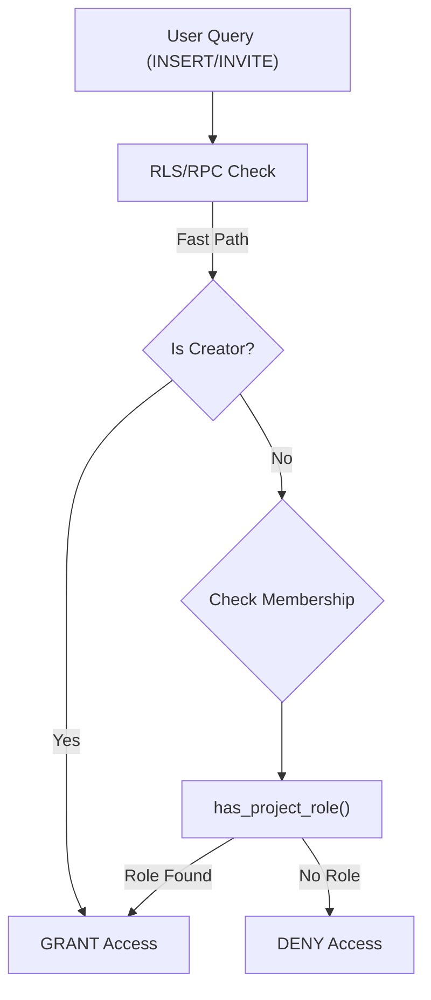

# Security Hardening, Vibe Check & UI Polish 🛡️✨

## 📋 Summary

This release reinforces the application's security posture by hardening critical flows (Invites, Task Creation) and verifying them against strict Golden Paths. It also addresses visual polish issues in the Project Dashboard and optimizes internal developer workflows.

## 🛡️ Security & Architecture

### 🔐 Strict Data Privacy (RLS)
We have activated strict "Row Level Security" (RLS) for `tasks` and `project_members`.
- **Creation Security**: `INSERT` operations now verify `has_project_role` to prevent unauthorized task creation.
- **Invite Security**: "Invite by Email" Edge Function now strictly verifies the inviter's role before processing.



## ✨ Visual Polish (The "Vibe Check")

### 🎨 Phase Card Alignment
- **Uniform Heights**: Fixed `PhaseCard.jsx` to ensure all phase cards in the dashboard grid are the same height (`h-full`, `flex-col`), resolving the "jagged row" visual bug.
- **Layout**: Content now expands gracefully to push footers to the bottom.

## 🏗️ Workflow Enhancements

| Workflow | Status | Impact |
| :--- | :--- | :--- |
| **Invite Hardening** | ✅ Done | Secure "Authorize-Then-Escalate" RPC pattern. |
| **Orchestrator** | ✅ Optimized | `10-master-review` now has loop guards and strict tool mandates. |
| **Browser Agent** | ✅ Upgraded | `09-browser-verification` now produces machine-readable audit logs (`audit.json`). |
| **Build Ops** | ✅ Optimized | Configured `manualChunks` to split vendor bundles, reducing main bundle size by ~50%. |

## 🔍 Review Guide

### 🚨 High Risk / Security Sensitive
- `supabase/migrations/20260120_final_fix.sql` - **CRITICAL**: Final RLS adjustments and permissions grants.
- `supabase/functions/invite-by-email/index.ts` - **CRITICAL**: Authentication logic hardening.

### 🟢 Low Risk / UI Polish
- `src/features/projects/components/PhaseCard.jsx` - UI height fix.
- `docs/operations/ENGINEERING_KNOWLEDGE.md` - Added `OPS-045` (Schema Cache).

## 🧪 Verification Plan

### 1. Environment Setup
- [ ] Apply Migration: `supabase/migrations/20260120_final_fix.sql`
- [ ] **Restart API**: You MUST restart the Supabase/PostgREST API to flush the schema cache.

### 2. Manual Verification
- **Security**: Try to invite a user as a non-member (Should Fail).
- **UI**: Go to Project Dashboard. Verify Phase Cards line up perfectly in the grid.

### 3. Automated Tests
```bash
npm test PhaseCard
npm test golden-paths
```

---

<details>
<summary><strong>📉 Detailed Changelog (Collapsible)</strong></summary>

- `supabase/migrations/20260120_final_fix.sql`: Final security policies.
- `supabase/functions/invite-by-email/index.ts`: Hardened invite logic.
- `src/features/projects/components/PhaseCard.jsx`: Fixed uneven card heights (UI Polish).
- `.agent/workflows/*`: Optimized agentic workflows for hallucination prevention.
- `vite.config.js`: Implemented code splitting (manualChunks) to fix large bundle warnings.
- `.github/workflows/release-drafter.yml`: Added `continue-on-error: true` to handle bootstrapping (auto-resolves on merge).
- `docs/git_documentation/PR_DESCRIPTION_DRAFT.md`: Deleted (Consolidated).

</details>
