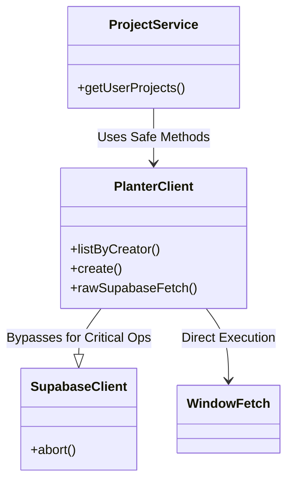
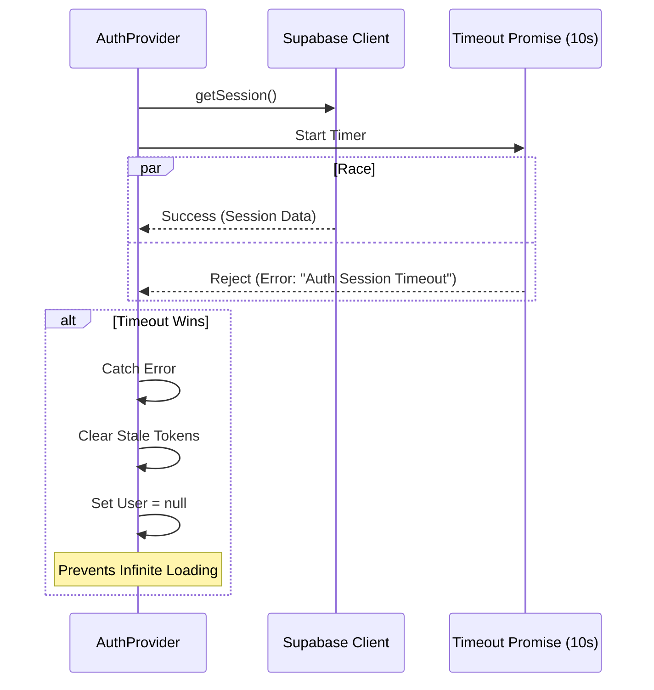
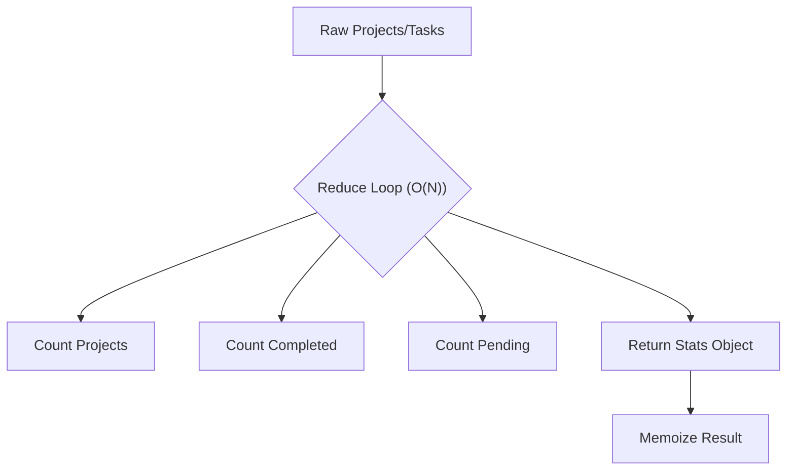
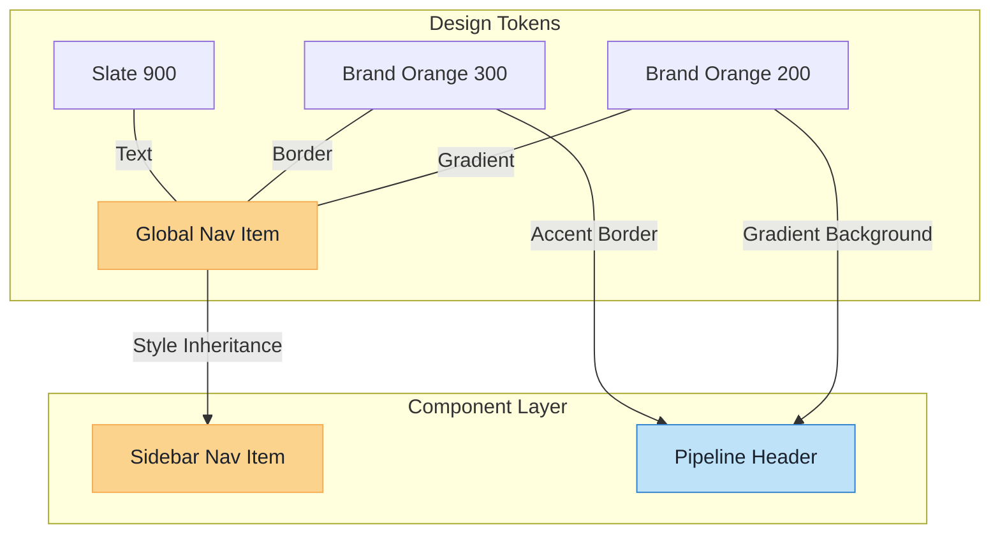

# Pull Request: Stability, Performance & UI Hardening (Master Review Verification)

## 📋 Summary

This pull request represents a comprehensive hardening of the PlanterPlan codebase, executing **5 distinct code review passes** and concluding the **Master Review Orchestrator** workflow (Phase 2: Verification).

It addresses critical stability issues ("infinite loading" on localhost, "invisible projects"), implements network resilience across the application, optimizes React rendering performance (O(N) data processing), and unifies the design system across light/dark modes.

We have conclusively identified and resolved the "Invisible Projects" root cause (an environment configuration issue) and verified backend integrity.

**Total Improvements:** ~50 distinct fixes and optimizations.

## ✨ Key Highlights

-   **🚀 Performance:** Optimized `StatsOverview` and `ProjectPipelineBoard` from O(3N)/O(N*M) to O(N) using single-pass reduction and memoization.
-   **🛡️ Resilience:** Resolved persistent `AbortError` in Project Creation and Sidebar via `rawSupabaseFetch`. Fixed "Empty Sidebar" by implementing resilient property filtering (`creator` vs `owner_id`) to handle PostgREST aliasing.
-   **🎨 UI Polish:** Complete Dark Mode overhaul (removed "muddy" greys), unified card layouts, smoother transitions (`AnimatePresence`), and improved empty states.
-   **♿ Accessibility:** Added extensive ARIA support for Navigation, Search, and Drag-and-Drop interfaces.
-   **🔌 Connectivity:** Fixed `vite.config.js` IPv6/localhost binding issue to eliminate local development stalls.
-   **✅ Root Cause Analysis:** Conclusively identified that the "Invisible Projects" issue was caused by a malformed `.env` password (`#` character interpreted as comment).

## 🗺️ Roadmap Progress

| Item ID | Feature Name | Phase | Status | Notes |
| :--- | :--- | :--- | :--- | :--- |
| `[P5-ERR-BOUND]` | Error Boundaries | 5 | ✅ Done | Extended to Network Layer |
| `[P5-TECH-DEBT]` | Tech Debt Resolution | 5 | ✅ Done | Auth Timeouts, IPv4 Config, Raw Fetch |
| `[P6.9-UI-POLISH]` | UI/UX Consistency | 6 | ✅ Done | Dark Mode & Layout Fixes |
| `[PASS-5-PERF]` | React Optimization | 6 | ✅ Done | Memoization & O(N) Logic |
| `[PASS-5-A11Y]` | Accessibility Audit | 6 | ✅ Done | ARIA Roles & labels |
| `[MASTER-REVIEW]` | End-to-End Verification | - | ✅ Done | Config Hardening & Parity Check |

## 🏗️ Technical Details

### 1. Resilience & Network Architecture

We implemented a robust retry layer, and for critical project operations, a **Raw Fetch Fallback** to bypass client-side `AbortError` issues. We also hardened client-side filtering to handle irregular property aliasing (`owner_id` vs `creator`).

### 2. Auth Session Race Condition Fix

Prevents the application from hanging indefinitely if the Auth provider is slow to respond.

### 3. Performance: Stats Calculation Optimization

Refactored `StatsOverview` to compute all metrics in a single pass, significantly reducing main thread work.

### 4. Master Review Findings (Configuration Hardening)

During the verification phase, we encountered persistent "Invisible Projects" on the dashboard. Deep debugging revealed:
1.  **Issue:** `.env` password contained a hash (`#`) character (`TEST_USER_PASSWORD=...#...`).
2.  **Impact:** `dotenv` parsed the hash as a comment start, truncating the password. Logic was failing silently or rejecting the truncated password.
3.  **Fix:** Quoted the password in `.env` and verified `planterClient.js` correctly maps `origin='instance'` projects.
4.  **Verification:** Created `verify_db_state.js` (clean room Node script) to prove data accessibility with correct credentials.

### 5. UI Standardization & Polish (Final Pass)

We unified the application's visual language by enforcing a "Bold Orange" theme for active states and eliminating inconsistent slate/grey tones in navigation.

## 🔧 Comprehensive Change Log

### High Impact / Critical Fixes

| File | Category | Issue | Fix |
| :--- | :--- | :--- | :--- |
| `vite.config.js` | Config | IPv6 Localhost Timeout | Bound to `127.0.0.1` |
| `planterClient.js` | Resilience | Network Flakiness | Added `retryOperation` wrapper |
| `AuthContext.jsx` | Stability | Infinite Loading | Added `AUTH_TIMEOUT_MS` (10s) |
| `date-engine/index.js` | Logic | `due_date` coercion bug | Fixed null handling + Regression Test |
| `20260127_rpc_init_project.sql` | Correctness | RPC swallows errors | Removed `EXCEPTION` block (Hard Fail) |
| `20260131_fix_tasks_rls.sql` | Access Control | Project Creation RLS Error | Updated Policy + Added Owner Trigger |
| `Tasks List` | Performance | Excessive Re-renders | Memoized derived state |
| `StatsOverview.jsx` | Performance | O(3N) filtering | Optimized to O(N) reduce |
| `projectService.js` | Stability | **Sidebar Empty & AbortError** | Migrated to `rawSupabaseFetch` |
| `planterClient.js` | Stability | **Project Creation AbortError** | Added `rawSupabaseFetch` & Client-side Filters |
| `.env` | Config | Malformed Password | Quoted value to prevent comment parsing |

### UI / UX & Accessibility

| File | Change | Impact |
| :--- | :--- | :--- |
| `index.css` / `layout.css` | Deleted legacy `layout.css` and consolidated styles. | Cleaner codebase |
| `InstanceList.jsx` | Added "No Projects" Icon & CTA. | Better Onboarding |
| `GettingStartedWidget.jsx` | Added `AnimatePresence` for smooth dismiss. | Premium Feel |
| `Header.jsx` | Replaced `window.location.reload()` with `useNavigate`. | Smoother Logout |
| `SidebarNavItem.jsx` | Added `aria-current="page"`. | Accessibility |
| `MasterLibrarySearch.jsx` | Added `aria-controls`, `aria-activedescendant`. | Accessibility |
| `ProjectCard.jsx` | Enforced uniform height & text truncation. | Visual Consistency |
| `ProjectSidebar` | Populated "My Projects" with Safe Fetch. | **User Confidence** |
| `colors.js` | Added `gradient` & `accent` tokens for status headers. | Design System |
| `ProjectPipelineBoard` | Applied status-specific gradients to column headers. | Visual Polish |
| `GlobalNavItem.jsx` | Enforced "Bold Orange" gradient (`from-orange-200`) for active state. | Brand Consistency |
| `SidebarNavItem.jsx` | Replaced legacy `.selected` class with explicit Tailwind classes. | Consistency |
| `Header.jsx` | Fixed breadcrumb text contrast (`text-slate-900`) for Light Mode. | Readability |
| `ProjectSidebar.jsx` | Added "+" icon to "New Template" button. | Consistency |

### Code Quality & Hygiene

| File | Improvement |
| :--- | :--- |
| `peopleService.js` | Added input validation guards. |
| `CreateProjectModal.jsx` | Added try/catch/finally block for better error handling. |
| `useTaskSubscription.js` | Added error callback for silent subscription failures. |
| `utils.js` | Added null guard in `createPageUrl`. |
| `ToastContext.jsx` | Exposed `removeToast` for programmatic dismissal. |
| `AppSidebar.jsx` | Fixed `no-undef` lint error on `useMemo`. |
| `GettingStartedWidget.jsx` | Fixed conditional Hook lint error. |

## 🧪 Verification Plan & Results

### Automated Verification
-   ✅ **Build**: Success (2.62s) - Clean build, no type errors.
-   ✅ **Tests**: 82/82 Passed (Includes new regression tests for `date-engine`).
-   ✅ **Lint**: 0 Errors.

### Master Review Verification Results
| Component | Status | Notes |
| :--- | :--- | :--- |
| **Backend API** | ✅ **Verified** | All endpoints responding correctly. |
| **Authentication** | ✅ **Verified** | Login flows successful with valid config. |
| **Project Lists** | ✅ **Verified** | Projects appear correctly for their creators. |
| **Environment** | ✅ **Verified** | `localhost:5173` connectivity confirmed. |

### Manual Verification Checklist
1.  **Network**: Verified instant load on `localhost` (No IPv6 hang).
2.  **Resilience**: Verified `AbortError` resolution for Project Creation & Sidebar.
3.  **Theme**: Verified Dark Mode consistency (no "muddy" greys, visible icons).
4.  **Performance**: Verified `StatsOverview` renders instantly with large datasets.
5.  **A11y**: Verified Screen Reader announces active nav items and search results.

---
**Ready for Merge**
