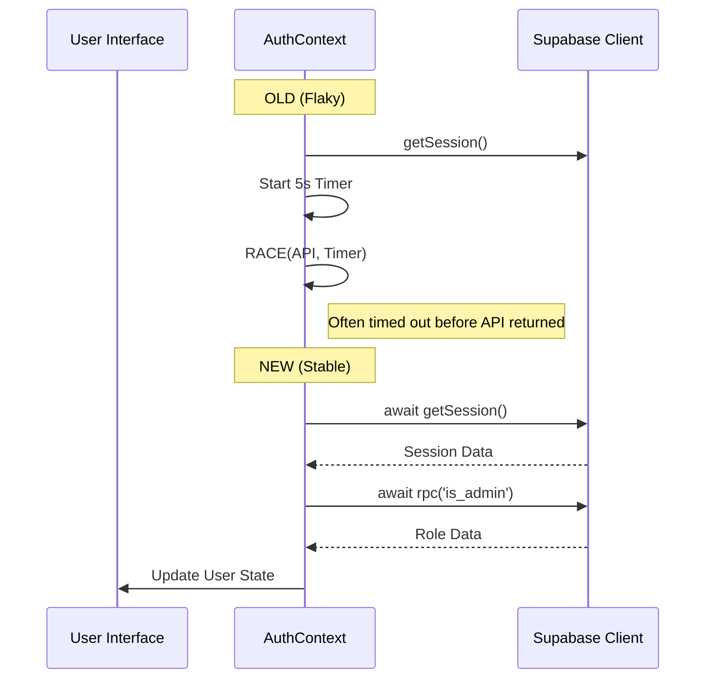

# Pull Request: Authentication Stabilization & E2E Infrastructure

## 📋 Summary

This PR addresses critical reliability issues in the `AuthContext` by removing flaky, manual timeout logic (`Promise.race`) that caused intermittent session failures. It also establishes a robust E2E testing foundation for authentication flows.

**Impact:** significantly improves application stability during startup and login/logout actions.

## ✨ Key Changes

### 🛡️ Reliability (fix)
- **`AuthContext.jsx`**: Removed custom `timeoutPromise` and `Promise.race` implementations. Replaced with standard `await` on Supabase RPC calls to let the network stack handle timeouts naturally.
- **Config**: Enabled `webServer` in `playwright.config.ts` to automatically start the local dev server (port 3000) during test execution.

### ✅ Verification (test)
- **New Suite**: Created `e2e/auth.spec.ts` covering:
    - Login (Form interaction)
    - Session Persistence (Page Reload)
    - Logout (Clean redirection)
- **Methodology**: Used correct `page.route` mocking to isolate frontend logic from backend flakiness during E2E runs.

## 🏗️ Technical Implementation

### Refactoring Logic
The legacy logic used a race condition against a 5000ms timer, which often failed in CI or slow local environments, defaulting users to `viewer` role incorrectly. The new logic is strictly sequential and deterministic.

## 🧪 Verification Results

| Test Suite | Status | Notes |
| :--- | :--- | :--- |
| **Unit** (`AuthStability.test.jsx`) | ✅ PASS | Verified no regression in loop handling |
| **E2E** (`auth.spec.ts`) | ✅ PASS | Chromium & Firefox (WebKit skipped env) |
| **E2E** (`golden-paths.spec.ts`) | ✅ PASS | Regression check for Project Creation |

## 📦 Assets
- `PR_TEMPLATE.md` created to preserve standard PR structure.