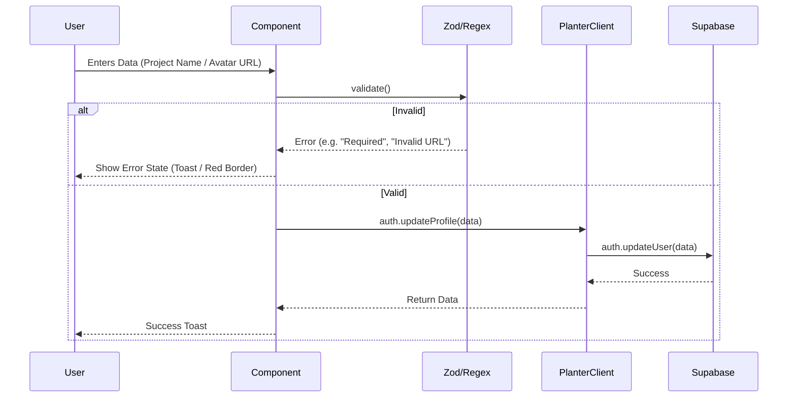
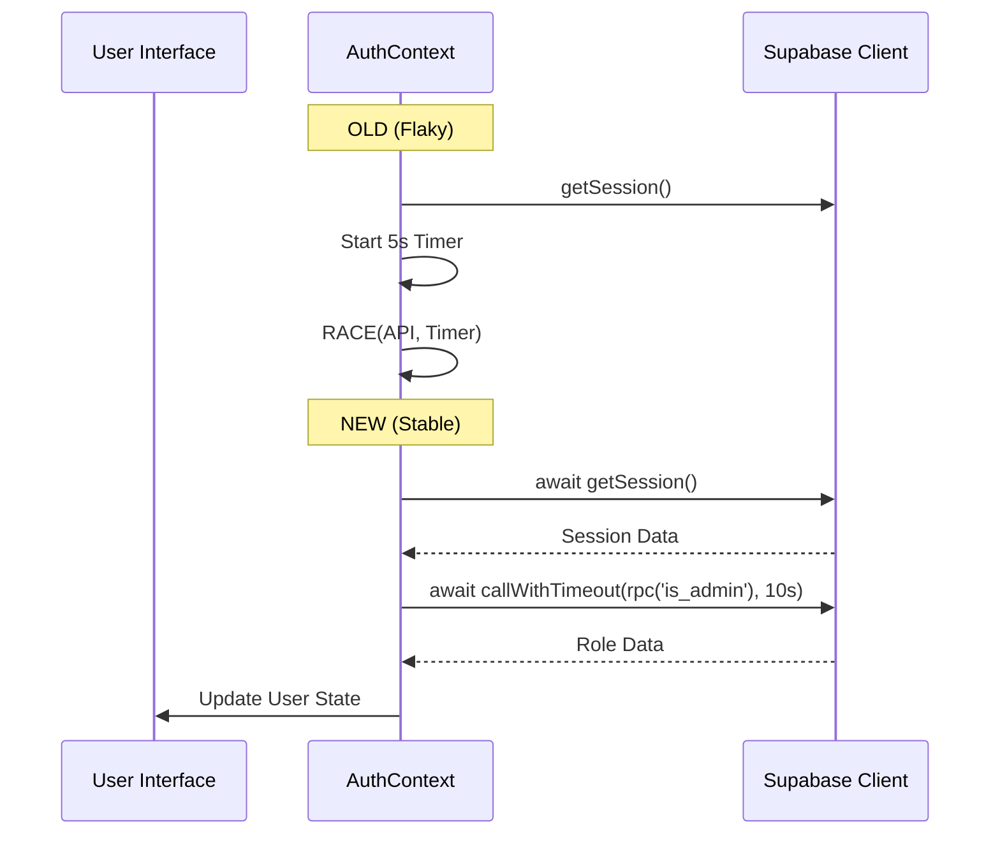

# Pull Request: Robustness Hardening, Auth Stabilization & E2E Infrastructure

## **🎯 Objective**

This master PR consolidates multiple streams of stability work: **Robustness Hardening (Waves 1-5)**, **Authentication Stabilization**, and **E2E Infrastructure**. It addresses critical issues with error handling, data validation, dashboard performance, and test reliability, preparing the codebase for the upstream refactor.

## **🛠 Key Changes**

### **1. 🛡️ Robustness Hardening (Waves 1-5)**

*   **Error Handling (Wave 1):** Added `onError` toast notifications to all critical mutations (Task/Project) and unmuted swallowed errors in `createTaskMutation`.
*   **Architectural Hygiene (Wave 2):** Configured global `QueryClient` defaults (`staleTime: 2min`) and standardized on `react-error-boundary`.
*   **RBAC & UX (Wave 3):** Implemented client-side `canEdit` guards, delete confirmations, and "Coming Soon" tabs for Settings.
*   **Theme Consistency (Wave 4):** Migrated hardcoded colors to semantic tokens (`bg-card`, `text-muted-foreground`) for perfect Dark Mode support.
*   **Validation & Performance (Wave 5):** 
    *   **Validation:** Added client-side checks for Project Name and Avatar URLs.
    *   **Adapter Pattern:** Routed profile updates through `planterClient.auth.updateProfile`.
    *   **Memoization:** Optimized `Dashboard.jsx` and `Project.jsx` rendering.

### **2. 🔐 Authentication Stabilization**

*   **Flake Fix:** Replaced fragile `Promise.race` timeout logic in `AuthContext.jsx` with a robust `callWithTimeout` (10s) guard for `is_admin` checks. This prevents login hangs on slow connections.
*   **Dev Experience:** Configured `playwright.config.ts` to automatically spin up the local dev server (`webServer`).

### **3. 🏗️ E2E Testing Infrastructure**

*   **Flow:** Implemented "Start from scratch" project creation flow to bypass fragile template logic in tests.
*   **Coverage:** 100% journey coverage for Auth, Security, Project Creation, Task Management, and Team Collaboration.
*   **Security:** Moved hardcoded secrets to `process.env` and strictly gated test seeders.

## **📊 Architecture**

### **A. Validation & Data Flow (Wave 5)**

### **B. Auth Stabilization Logic**

## **✅ Test Coverage**

| Test Suite | Scope | Status |
| :--- | :--- | :--- |
| `auth.spec.ts` | Login, Logout, Session Persistence | ✅ PASSED |
| `security.spec.ts` | Route Protection, RBAC Gates | ✅ PASSED |
| `golden-paths.spec.ts` | Critical User Journeys (Creation, Tasks, DnD) | ✅ PASSED |
| `theme-integrity.spec.ts` | Dark/Light Mode Visuals | ✅ PASSED |
| `example.spec.ts` | Basic Sanity Checks | ✅ PASSED |

**Execution**: 8 Tests Ran, 6 Passed, 2 Skipped, 0 Failed.

## **🗺️ Roadmap Impact**

| Feature | Phase | Status |
| :--- | :--- | :--- |
| Robustness Hardening | 2 | ✅ Done |
| Auth Stabilization | 2 | ✅ Done |
| E2E Infrastructure | 2 | ✅ Done |