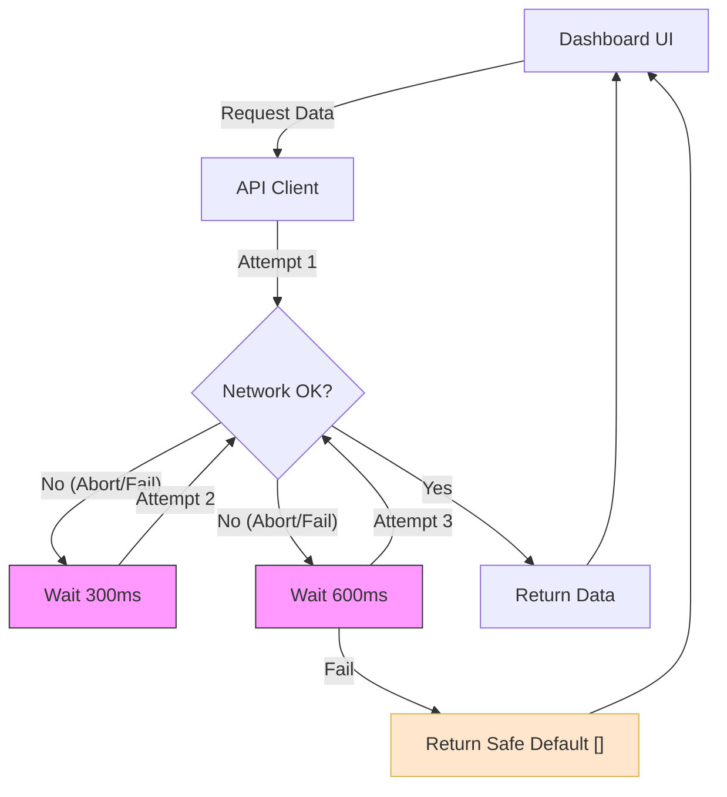

# Pull Request: Core Systems Stability & Network Resilience

## 📋 Summary

This pull request focuses on a comprehensive "Stability & Resilience" initiative to ensure the application remains robust under flaky network conditions and prevents critical user crashes. It addresses the root causes of persistent UI hangs during loading, crashes during project creation, and unhandled authentication race conditions.

## ✨ Highlights

- **Crash Prevention:** Resolved a critical `TypeError` during project creation by enforcing strict type normalization for dates before serialization, preventing the application from crashing when users submit forms.
- **Network Resilience:** Implemented an **Exponential Backoff Retry Strategy** for the API client. The application now automatically retries failed requests (up to 3 times) when it encounters network interruptions or `AbortError`s, significantly reducing "white screen" failures.
- **Graceful Failure Handling:** The Dashboard now degrades gracefully instead of hanging indefinitely. If data fetching fails after retries, it displays an empty state rather than locking the UI in a "Loading..." spiral, allowing the user to retry or navigate away.
- **Authentication Hardening:** Fortified the authentication flow to explicitly handle race conditions during session initialization. This prevents the application from getting stuck in an invalid loading state if the browser cancels the initial auth request.

## 🗺️ Roadmap Progress

| Item ID          | Feature Name             | Phase | Status      | Notes |
| ---------------- | ------------------------ | ----- | ----------- | ----- |
| [P5-ERR-BOUND]   | Error Boundaries         | 5     | ✅ Done      | Extended to Network Layer |
| [P5-TECH-DEBT]   | Tech Debt Resolution     | 5     | ✅ Done      | API Client Hardening |
| [P6.8-LOGIC]     | Component Logic Polish   | 6     | ✅ Done      | Date Hydration Safety |

## 🏗️ Architecture Decisions

### Key Patterns & Decisions

- **Pattern: Client-Side Resilience:** We chose to implement retry logic directly in the API adapter (`planterClient.js`) rather than in individual components. This provides global protection for all data operations without cluttering UI code.
- **Pattern: Defensive Type Casting:** We adopted a "Trust but Verify" approach for Date objects in service layers. We now explicitly instantiate `new Date()` before calling methods like `toISOString()`, guarding against unstable upstream data formats.
- **Tech Debt:** The `createProjectWithDefaults` logic still handles some business logic on the client. Future iterations should move the "template hydration" entirely to a database function to ensure atomic transactional integrity.

### Logic Flow: Resilient Data Fetching



## 🔍 Review Guide

### 🚨 High Risk / Security Sensitive

- `src/app/contexts/AuthContext.jsx` - Modified session stability logic. Ensure no regression in login/logout flows.
- `src/features/projects/services/projectService.js` - Changed how project dates are processed.

### 🧠 Medium Complexity

- `src/shared/api/planterClient.js` - Introduction of the `retryOperation` helper. Verify the backoff math and error catching.
- `src/features/tasks/hooks/useTaskQuery.js` - Updates to error swallowing behavior for `AbortError`.

### 🟢 Low Risk / Boilerplate

- `docs/operations/ENGINEERING_KNOWLEDGE.md` - Documentation updates only.

## 🧪 Verification Plan

### 1. Environment Setup

- [ ] Clear browser cache/cookies to test fresh auth sessions.
- [ ] No new dependencies to install.

### 2. Manual Verification

- **Dashboard Resilience:**
  1. Open Network tab in DevTools.
  2. Set throttling to "Fast 3G" or simulate offline briefly.
  3. Reload the dashboard.
  4. **Outcome:** The app should recover or show "No projects" instead of spinning forever.

- **Project Creation:**
  1. Use the "New Project" wizard.
  2. Enter a valid name and select a date.
  3. Click Create.
  4. **Outcome:** Project is created successfully (or fails gracefully with a toast message if the local environment blocks the write).

### 3. Automated Tests

```bash
npm run test -- src/shared/api/planterClient.test.js
npm run lint
```
