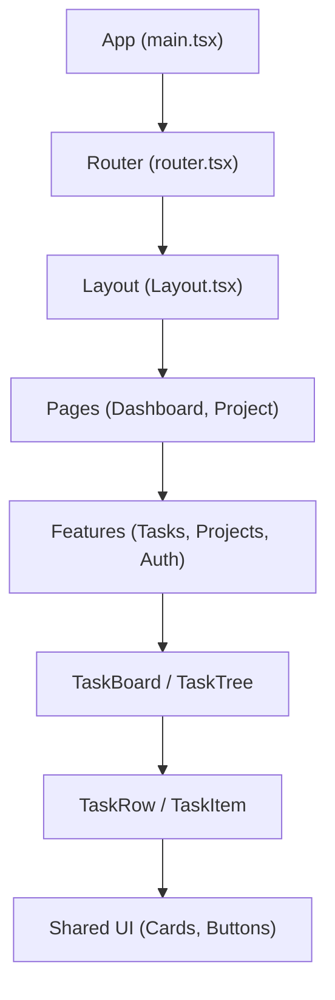
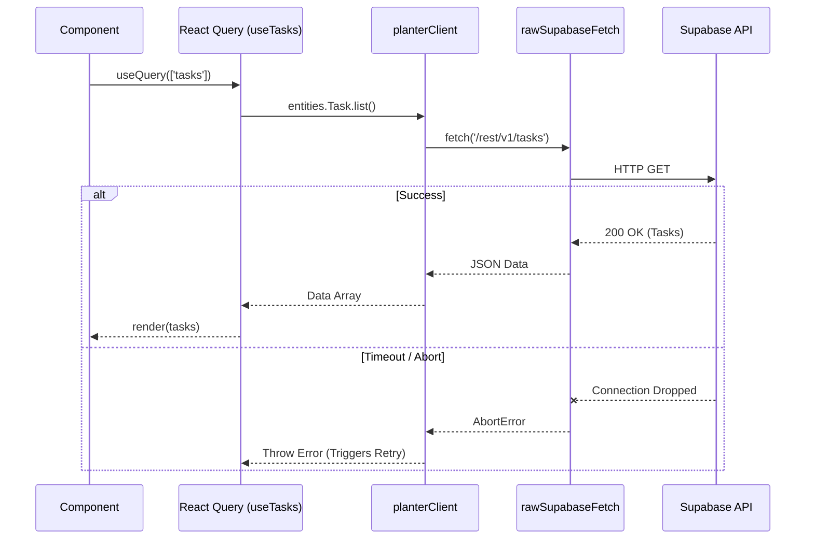

# Pull Request: v1.1 Gold Master Integration & Architectural Restoration

## 📋 Summary

This pull request represents a massive architectural overhaul and stabilization effort, merging the `gold-master` branch into `main`. The goal of this release is to fundamentally restructure the application for long-term scalability and engineering excellence. We have transitioned to a strict Feature-Sliced Design (FSD) architecture, adopted React Router v7's Data Router, embraced TypeScript for core utilities, and successfully downgraded to React 18 (ADR-002) to ensure third-party library stability. Concurrently, we have restored critical network resilience, theme syncing, and comprehensive security testing.

## ✨ Highlights

- **Feature-Sliced Design (FSD) Restructuring:** The entire `src/` directory has been reorganized into FSD layers (`app`, `pages`, `features`, `shared`). This highly modular structure prevents circular dependencies and distinctly separates concerns (e.g., separating `tasks` logic from `projects` logic).
- **React Router v7 Data Router Migration:** Upgraded the application's routing infrastructure to leverage `createBrowserRouter`. This enables advanced data loading patterns (like `protectedLoader` and `publicLoader`) and implements lazy-loaded routes for optimized bundle sizes.
- **TypeScript & React 18 Adoption (ADR-002):** Strategically downgraded to React 18 to resolve intractable compatibility issues with drag-and-drop and UI libraries. Simultaneously, we introduced TypeScript (`.ts`/`.tsx`) for critical paths, significantly improving type safety across hooks and components.
- **Network Resilience Restored:** Removed the unstable `@supabase-cache-helpers` dependency. Data fetching now relies on standard `@tanstack/react-query` hooks powered by our custom `planterClient.js` and `rawSupabaseFetch`, effectively enforcing `[NET-005]` abort resilience and timeout protections.
- **UI & Security Parity:** Reinstated full dark mode support via semantic CSS variables and restored missing task detail fields. Crucially, we resurrected and modernized security unit tests (`RLS.test.js`, `XSS.test.jsx`, `RPCHardening.test.js`), proving our defenses against privilege escalation and unauthorized access.

## 🗺️ Roadmap Progress

| Item ID | Feature Name | Phase | Status | Notes |
| ------- | ------------ | ----- | ------ | ----- |
| ARCH-01 | FSD Restructuring | 1 | ✅ Done | Full `src/` directory migration |
| ARCH-02 | React Router v7 | 1 | ✅ Done | Implemented Data Router & Lazy Loading |
| ARCH-03 | React 18 Downgrade | 1 | ✅ Done | Resolved library compatibility (ADR-002) |
| DEV-101 | Network Stability | 2 | ✅ Done | Removed cache-helpers, added retry logic |
| DEV-102 | Theme Restoration | 2 | ✅ Done | Context restored, globals.css patched |
| DEV-103 | Task Details UI | 3 | ✅ Done | Restored purpose/action/date fields |
| DEV-104 | Security Tests | 4 | ✅ Done | RLS/XSS/RPC tests passing independently |

## 🏗️ Architecture Decisions

### Key Patterns & Decisions

- **Strict FSD Enforcement:** We now enforce strict import boundaries. Features cannot import from other features directly; they must communicate via shared entities or be orchestrated at the Page level.
- **Custom Supabase Fetcher:** We chose to build `rawSupabaseFetch` to wrap the Supabase client. This allows us to inject aggressive timeout controls, handle connection drops gracefully, and properly intercept `AbortController` signals during component unmounts.

### FSD Component Hierarchy



> **Note**: Always use quotes for node labels to prevent syntax errors (e.g., `A["Label"]`).

### Network Stability Data Flow



## 🔍 Review Guide

### 🚨 High Risk / Security Sensitive

- `src/features/tasks/hooks/useTasks.ts` & `src/features/members/hooks/useMembers.ts` - Data fetching foundations.
- `src/tests/security/RLS.test.js` - Tests enforcing database row-level security guardrails.
- `src/app/router.tsx` - Route protection logic (`protectedLoader`).

### 🧠 Medium Complexity

- `src/features/tasks/components/TaskTree/TaskRow.tsx` - New TypeScript implementation of the draggable task row.
- `src/shared/api/planterClient.js` - The core network adapter handling raw fetch and retries.
- `src/features/tasks/components/TaskDetails/TaskDetails.tsx` - Full-fidelity task editing component.

### 🟢 Low Risk / Boilerplate

- `src/shared/ui/*` - Reusable Shadcn UI components.
- `src/styles/globals.css` - CSS variables and Tailwind configuration.

## 🧪 Verification Plan

### 1. Environment Setup

- [x] Run `npm install` (to apply React 18 downgrade and new TypeScript dev dependencies).
- [x] Ensure `.env.local` is present with Supabase credentials.

### 2. Manual Verification

- **Routing & Authentication:**
  1. Access `http://localhost:5173`. Assuming no session, verify redirect to `/login`.
  2. Log in. Verify successful redirect to `/dashboard` via the new routing loaders.
- **Theme Toggling:**
  1. Click the header theme toggle. Verify the application smoothly shifts to dark mode, matching semantic tokens.
- **Task Management (FSD & Network):**
  1. Open a Project and view the Task Board.
  2. Add, edit, and drag a task. Verify optimistic updates and lack of network errors in the console.

### 3. Automated Tests

```bash
npm test
npx playwright test e2e/v2-golden.spec.ts
npm run lint
```
