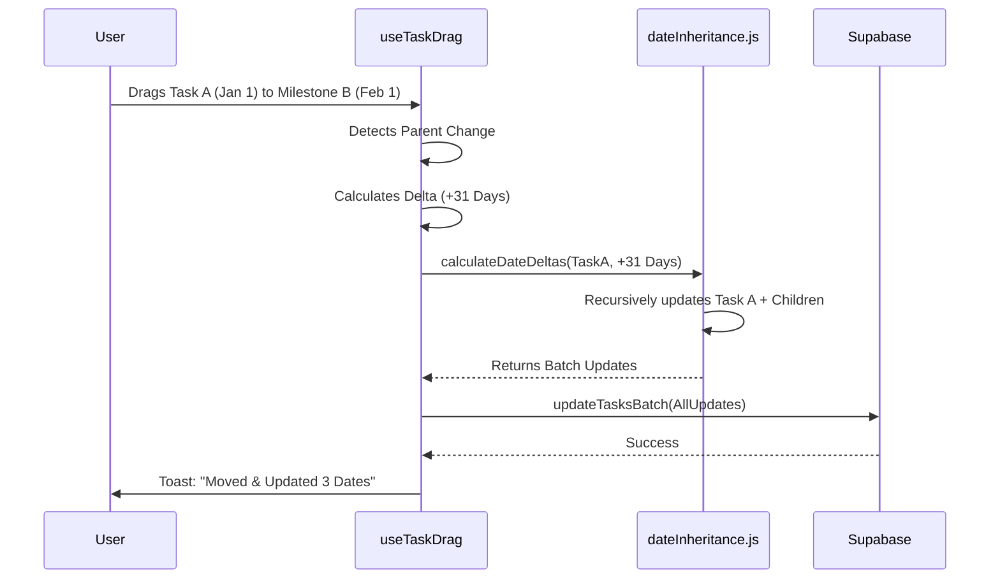

# PR: Project Creation, Task Hierarchy & Recursive DnD

## 🎯 Objective
Overhaul the core Project and Task management experience to support robust project initialization, infinite task nesting, and intuitive drag-and-drop organization with intelligent date cascading.

## 🛠 Key Changes

### 1. Project Creation Hardening
*   **Fix:** `initialize_default_project` RPC (Security Definer) now handles creator membership to prevent RLS deadlocks.
*   **Validation:** Implemented Zod schemas in `CreateProjectModal`.

### 2. Task Hierarchy & Rendering
*   **Recursive UI:** `TaskItem` now recursively renders `SortableTaskItem` children.
*   **Tree Builder:** `buildTree` utility efficiently transforms flat SQL results into nested objects.

### 3. Recursive Drag & Drop Engine
*   **Smart Reparenting:** `useTaskDrag` handles moving tasks between parents, updating `parent_task_id`.
*   **Date Inheritance:** Dragging a task to a new time-context (Milestone) automatically shifts dates for the entire subtree.
    *   *Logic:* `dateInheritance.js` calculates deltas and `positionService.js` performs atomic batch updates.

## 📊 Date Cascade Logic

## ✅ Verification: Regression Suite

| Test Suite | Focus Area | Status |
| :--- | :--- | :--- |
| `src/tests/integration/create-project.spec.jsx` | Project Creation & RLS | ✅ PASSED |
| `src/tests/integration/task-hierarchy.spec.jsx` | Recursive Tree Rendering | ✅ PASSED |
| `src/tests/integration/drag-interaction.spec.jsx` | Drag Reordering & Reparenting | ✅ PASSED |
| `src/tests/unit/dateInheritance.test.js` | Date Math & Subtree Propagation | ✅ PASSED |
| `src/tests/unit/dragDropUtils.test.js` | Circular Dependency Prevention | ✅ PASSED |