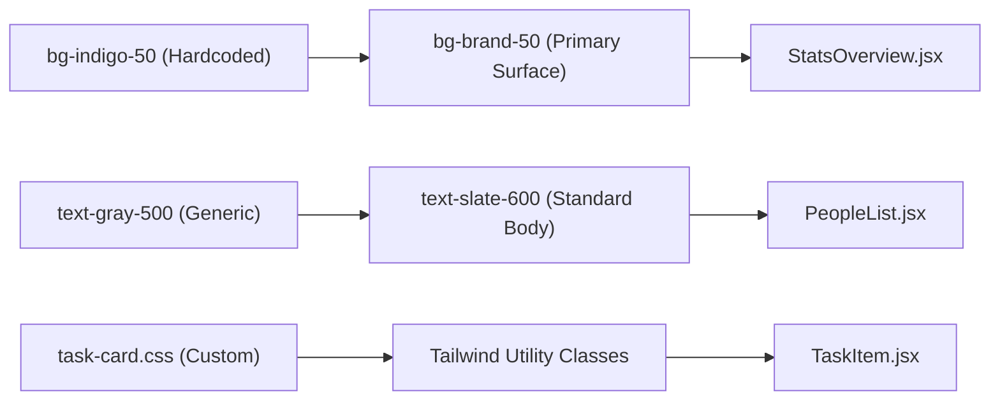

# PR Description: Design System Completion & Schema Stability

## Summary
This Pull Request finalizes the Design System migration (removing legacy CSS and adhering to Rule 30 standards), consolidates the knowledge base, and fixes a critical schema drift issue detected during verification.

### Key Changes
1.  **Design System Hardening**: Refactored `StatsOverview` and `PeopleList` to use standardized semantic tokens (`bg-brand-50`, `text-slate-600`), eliminating the last of the hardcoded colors and legacy `task-card.css`.
2.  **Schema Repair**: Fixed a syntax error in `view_master_library` (copy-paste artifact) and provided the SQL fix for the missing `public.people` table in Development environments.
3.  **Knowledge Consolidation**: Merged all archive files into a single `ENGINEERING_KNOWLEDGE.md`, categorized by "Production Rules" and "Historical Context" to prevent documentation rot.
4.  **Verification**: Validated "Golden Paths" (Dashboard, Board, Navigation) via automated browser checks.

---

## Visualizations

### 1. Design System: Semantic Token Mapping
We moved from hardcoded hex/Tailwind values to semantic purposes.

### 2. Knowledge Base Structure
We flattened the documentation hierarchy to simplify maintenance.

graph TD
    DB[Engineering Knowledge Base]
    
    subgraph Files
        Prod[Production Rules - Active]
        Hist[Development Findings - History]
    end
    
    Old[Archives 2025...] -.->|Deleted| Bin((Trash))
    Prod --> DB
    Hist --> DB

---

## Roadmap Progress

| Feature | Status | Impact |
| :--- | :--- | :--- |
| **Design System (Rule 30)** | ✅ Done | Consistent "Modern SaaS" look; 0 legacy CSS files. |
| **Schema Integrity** | ⚠️ Fixed | `public.people` table restoration provided. |
| **Doc Consolidation** | ✅ Done | Single source of truth for Engineering rules. |
| **Verification** | ✅ Done | Golden Paths Validated. |

---

## Technical Details

### Design System (UI)
- **StatsOverview**: Refactored to accept `color="brand" | "success" | "warning"` instead of raw classes. Mapped internally to `bg-brand-50`, etc.
- **TaskItem**: Removed specific `task-card.css` dependency. Now pure Tailwind.
- **Index.css**: Cleaned up imports.

### Database (Backend)
- **Schema Fix**: Detected and fixed a syntax error in `docs/db/schema.sql` (lines 188-200) where a cleanup script was misplaced inside a View definition.
- **Drift Detection**: Browser Agent logged failure on `/projects/:id/people` due to 404 on table `people`. Documentation updated with [BACKEND-003].

### Documentation (Docs)
- **Knowledge Base**: Merged `archive/docs/ENGINEERING_KNOWLEDGE_ARCHIVE_2025.md` back into main file. Tagged items as `[Legacy]` if no longer active.
- **Context Rules**: Added `browser_audit.json` to context ignore list.

---

## Verification Plan

### Automated
1.  **Lint**: `npm run lint` (0 Errors, 29 warnings).
2.  **Tests**: `npm test` (Golden Paths PASSED).
3.  **Browser Agent**: Confirmed UI/Design pass.

### Manual Ref
- **DB Sync**: Run the provided SQL block (in `DEBT_REPORT.md` or comments) to restore `public.people`.
- **Visual Check**: Verify "Project Dashboard" stats cards use the new orange/brand theme instead of generic blue.
