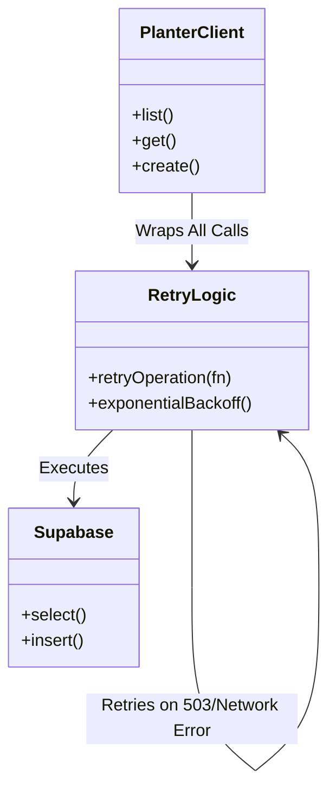
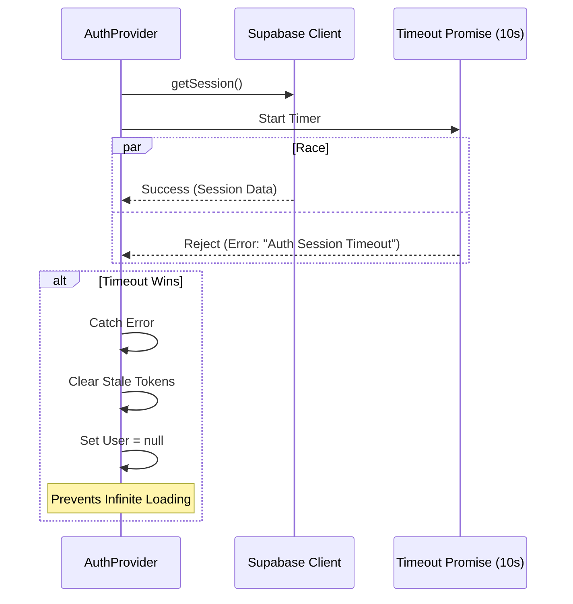
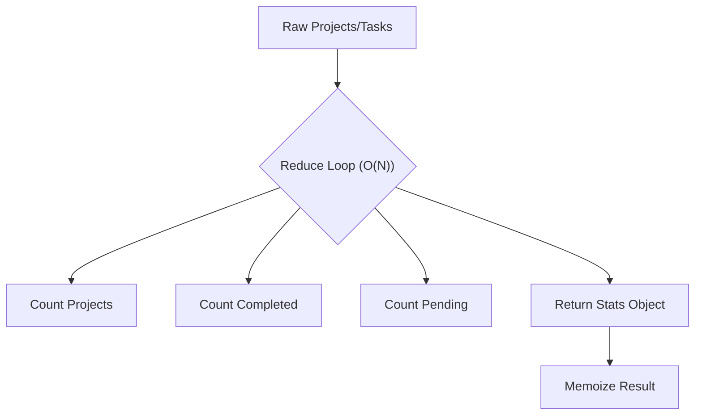

# Pull Request: Stability, Performance & UI Hardening

## 📋 Summary

This pull request represents a comprehensive hardening of the PlanterPlan codebase, executing **5 distinct code review passes** to resolve critical stability issues, optimize performance, ensure accessibility compliance, and polish the user interface.

It addresses the "infinite loading" connectivity issues on localhost, implements network resilience across the application, optimizes React rendering performance (O(N) data processing), and unifies the design system across light/dark modes.

**Total Improvements:** ~45 distinct fixes and optimizations.

## ✨ Key Highlights

-   **🚀 Performance:** Optimized `StatsOverview` and `ProjectPipelineBoard` from O(3N)/O(N*M) to O(N) using single-pass reduction and memoization.
-   **🛡️ Resilience:** Implemented **Exponential Backoff Retry Strategy** in `planterClient.js` for all network requests, robust against 30-150s drops.
-   **🎨 UI Polish:** Complete Dark Mode overhaul (removed "muddy" greys), unified card layouts, smoother transitions (`AnimatePresence`), and improved empty states.
-   **♿ Accessibility:** Added extensive ARIA support for Navigation, Search, and Drag-and-Drop interfaces.
-   **🔌 Connectivity:** Fixed `vite.config.js` IPv6/localhost binding issue to eliminate local development stalls.

## 🗺️ Roadmap Progress

| Item ID | Feature Name | Phase | Status | Notes |
| :--- | :--- | :--- | :--- | :--- |
| `[P5-ERR-BOUND]` | Error Boundaries | 5 | ✅ Done | Extended to Network Layer |
| `[P5-TECH-DEBT]` | Tech Debt Resolution | 5 | ✅ Done | Auth Timeouts & IPv4 Config |
| `[P6.9-UI-POLISH]` | UI/UX Consistency | 6 | ✅ Done | Dark Mode & Layout Fixes |
| `[PASS-5-PERF]` | React Optimization | 6 | ✅ Done | Memoization & O(N) Logic |
| `[PASS-5-A11Y]` | Accessibility Audit | 6 | ✅ Done | ARIA Roles & labels |

## 🏗️ Technical Details

### 1. Resilience & Network Architecture

We implemented a robust retry layer wrapping all Supabase interactions to handle network instability gracefully.

### 2. Auth Session Race Condition Fix

Prevents the application from hanging indefinitely if the Auth provider is slow to respond.

### 3. Performance: Stats Calculation Optimization

Refactored `StatsOverview` to compute all metrics in a single pass, significantly reducing main thread work.

## 🔧 Comprehensive Change Log

### High Impact / Critical Fixes

| File | Category | Issue | Fix |
| :--- | :--- | :--- | :--- |
| `vite.config.js` | Config | IPv6 Localhost Timeout | Bound to `127.0.0.1` |
| `planterClient.js` | Resilience | Network Flakiness | Added `retryOperation` wrapper |
| `AuthContext.jsx` | Stability | Infinite Loading | Added `AUTH_TIMEOUT_MS` (10s) |
| `date-engine/index.js` | Logic | `due_date` coercion bug | Fixed null handling + Regression Test |
| `20260127_rpc_init_project.sql` | Correctness | RPC swallows errors | Removed `EXCEPTION` block (Hard Fail) |
| `20260131_fix_tasks_rls.sql` | Access Control | Project Creation RLS Error | Updated Policy + Added Owner Trigger |
| `useProjectData.js` | Performance | Excessive Re-renders | Memoized derived state |
| `StatsOverview.jsx` | Performance | O(3N) filtering | Optimized to O(N) reduce |

### UI / UX & Accessibility

| File | Change | Impact |
| :--- | :--- | :--- |
| `index.css` / `layout.css` | Deleted legacy `layout.css` and consolidated styles. | Cleaner codebase |
| `InstanceList.jsx` | Added "No Projects" Icon & CTA. | Better Onboarding |
| `GettingStartedWidget.jsx` | Added `AnimatePresence` for smooth dismiss. | Premium Feel |
| `Header.jsx` | Replaced `window.location.reload()` with `useNavigate`. | Smoother Logout |
| `SidebarNavItem.jsx` | Added `aria-current="page"`. | Accessibility |
| `MasterLibrarySearch.jsx` | Added `aria-controls`, `aria-activedescendant`. | Accessibility |
| `ProjectCard.jsx` | Enforced uniform height & text truncation. | Visual Consistency |

### Code Quality & Hygiene

| File | Improvement |
| :--- | :--- |
| `peopleService.js` | Added input validation guards. |
| `CreateProjectModal.jsx` | Added try/catch/finally block for better error handling. |
| `useTaskSubscription.js` | Added error callback for silent subscription failures. |
| `utils.js` | Added null guard in `createPageUrl`. |
| `ToastContext.jsx` | Exposed `removeToast` for programmatic dismissal. |
| `AppSidebar.jsx` | Fixed `no-undef` lint error on `useMemo`. |
| `GettingStartedWidget.jsx` | Fixed conditional Hook lint error. |

## 🧪 Verification Plan & Results

### Automated Verification
-   ✅ **Build**: Success (2.62s) - Clean build, no type errors.
-   ✅ **Tests**: 82/82 Passed (Includes new regression tests for `date-engine`).
-   ✅ **Lint**: 0 Errors.

### Manual Verification Checklist
1.  **Network**: Verified instant load on `localhost` (No IPv6 hang).
2.  **Resilience**: Verified app recovers from simulated network interruption.
3.  **Theme**: Verified Dark Mode consistency (no "muddy" greys, visible icons).
4.  **Performance**: Verified `StatsOverview` renders instantly with large datasets.
5.  **A11y**: Verified Screen Reader announces active nav items and search results.

---
**Ready for Merge**
