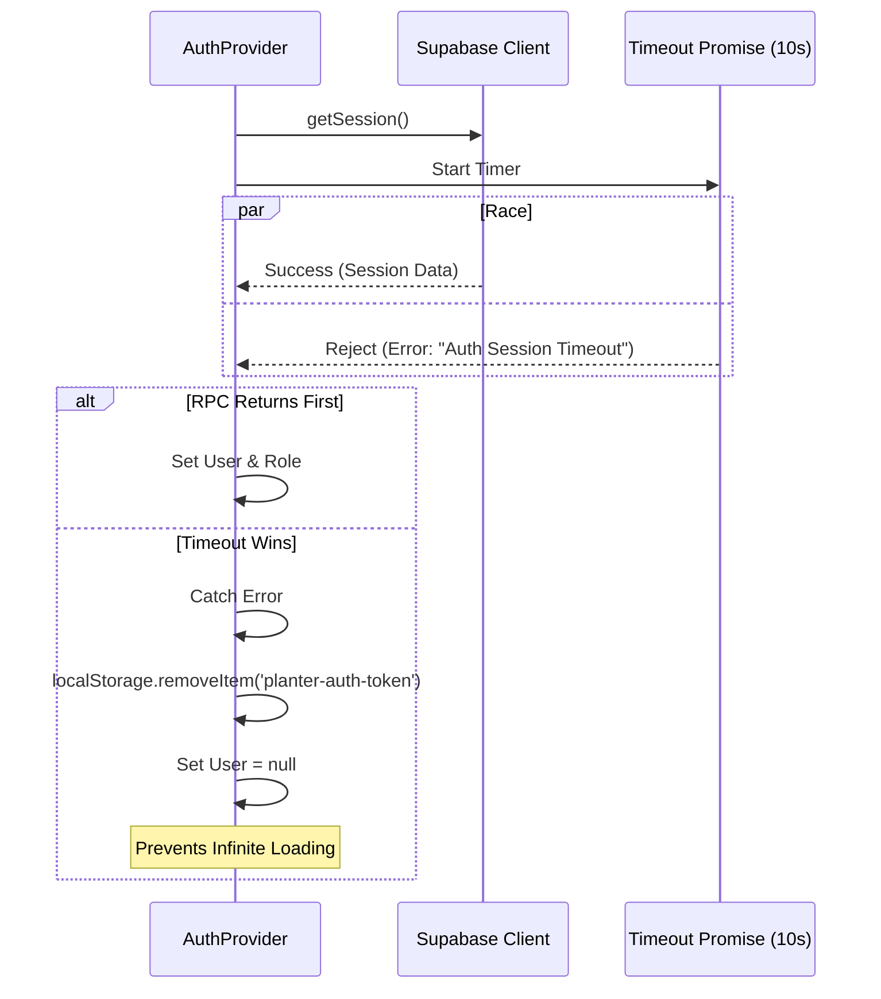
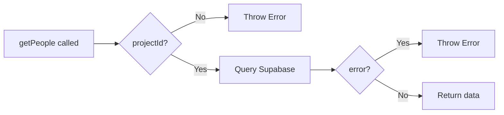
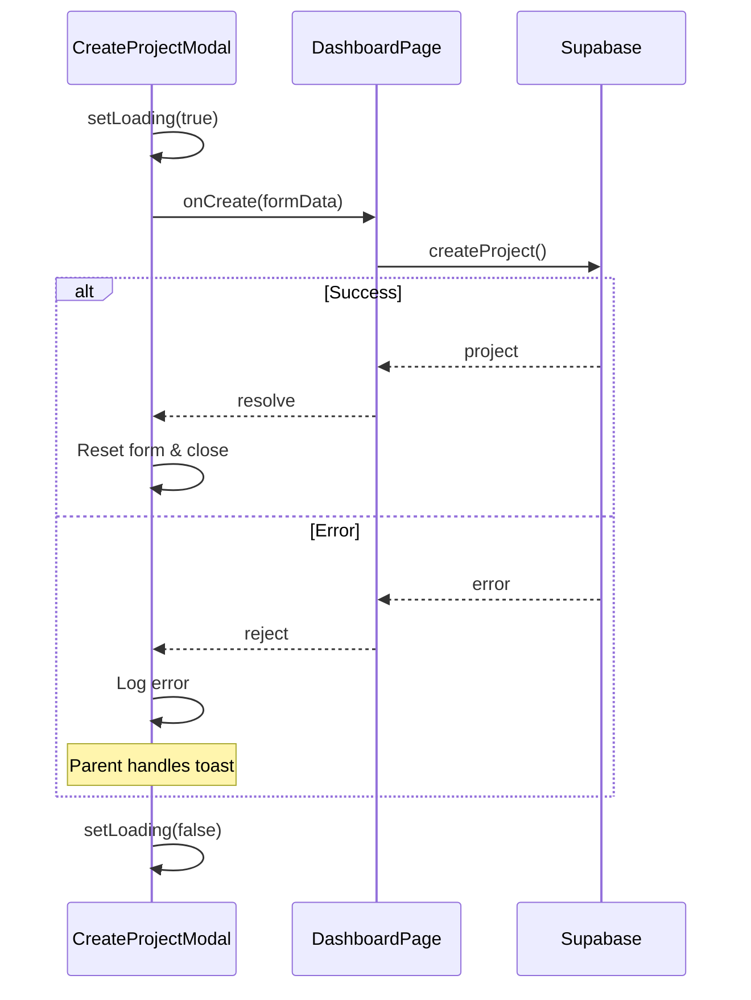
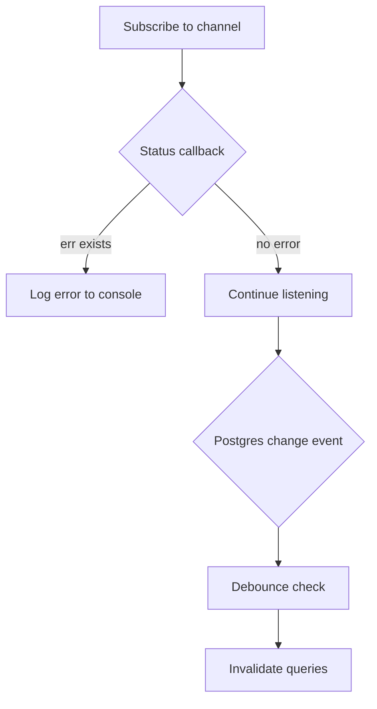
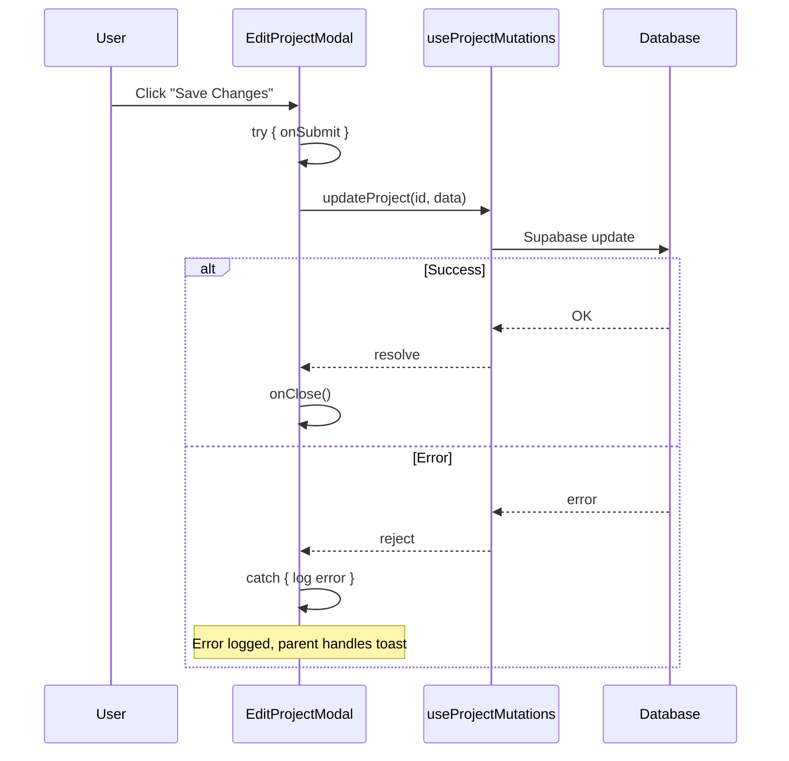
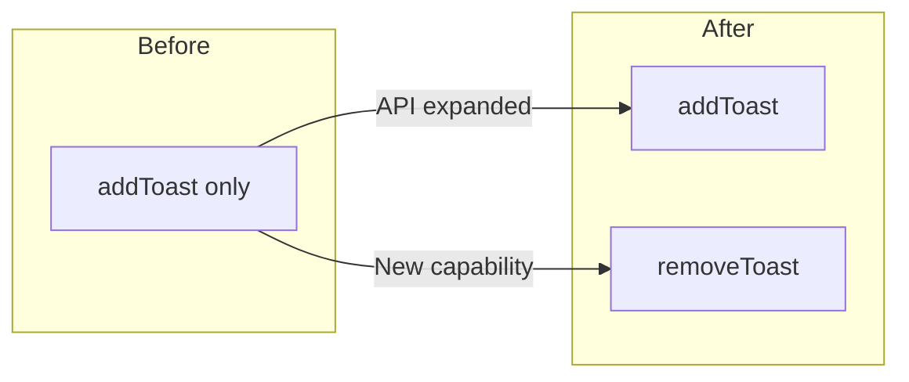

# Pull Request: Stability Fixes & UI Polish

## 📋 Summary

This pull request delivers a major stability and user experience upgrade. It resolves critical network connectivity issues causing "infinite" loading states in the local development environment and implements a comprehensive UI polish pass to ensure a consistent, premium design across both light and dark modes.

## ✨ Highlights

- **Localhost Connectivity Fix:** Configured Vite to explicitly listen on `127.0.0.1`. This eliminates a confirmed 30-150 second "stall" caused by IPv6 address resolution timeouts on `localhost`, restoring instant load times.
- **Authentication Stability:** Added a 10-second timeout to Supabase session retrieval with explicit error handling. If the session hangs, it now clears stale tokens and fails gracefully rather than freezing the app indefinitely.
- **Resilient Data Fetching:** Implemented an **Exponential Backoff Retry Strategy** in the API client (`planterClient.js`). The application now automatically retries failed requests (up to 3 times) when it encounters network interruptions, preventing white screens.
- **Theme & Design System:**
  - **Dark Mode Overhaul:** Removed "muddy" backgrounds and "ugly" orange highlights. Implemented clean, translucent brand tints (`bg-brand-500/10`) and proper semantic colors.
  - **Universal Layout:** Enforced uniform height for Project Cards.
  - **Visual Consistency:** Harmonized hover states, shadow intensities, and icon colors.

## 🗺️ Roadmap Progress

| Item ID          | Feature Name             | Phase | Status      | Notes |
| ---------------- | ------------------------ | ----- | ----------- | ----- |
| [P5-ERR-BOUND]   | Error Boundaries         | 5     | ✅ Done      | Extended to Network Layer |
| [P5-TECH-DEBT]   | Tech Debt Resolution     | 5     | ✅ Done      | Auth Timeouts & IPv4 Config |
| [P6.9-UI-POLISH] | UI/UX Consistency        | 6     | ✅ Done      | Dark Mode & Layout Fixes |

## 🏗️ Technical Details

### Connectivity & Network
- **Vite Config:** Updated `vite.config.js` to set `server.host: '127.0.0.1'`.
- **Auth Context:** `AuthContext.jsx` now races the `supabase.auth.getSession()` call against a 10-second timeout promise.

### Logic Flow: Auth Session Race Condition

### Design System Updates
- **Global Nav:** Replaced legacy CSS `.selected` rule with utility-first Tailwind classes.
- **Stats Overview:** Fixed "invisible text" bugs in dark mode.

## 🔍 Review Guide

### 🚨 High Risk / Security Sensitive

- `vite.config.js` - Network binding change to `127.0.0.1`.
- `src/app/contexts/AuthContext.jsx` - Session timeout logic.

### 🎨 UI & Design

- `src/features/navigation/components/GlobalNavItem.jsx` - New active state styling.
- `src/features/dashboard/components/ProjectCard.jsx` - Layout and color fixes.
- `src/features/onboarding/components/GettingStartedWidget.jsx` - Background and border contrast improvements.
- `src/styles/layout.css` - Removal of legacy active class styles.

## 🧪 Verification Plan

### 1. Environment Setup

- [x] Restart `npm run dev` to apply Vite config changes.
- [x] Clear browser cache to test fresh load speeds.

### 2. Manual Verification

- **Load Speed:**
  1. Reload the app.
  2. Verify WebSocket connection is instant (no 30s+ stall).

- **Theme Consistency:**
  1. Toggle Dark Mode.
  2. Check Sidebar "Dashboard" highlight (should be subtle brand tint).
  3. Check "Getting Started" widget (clean background).
  4. Check "New Template" button (neutral background).
  5. Check Stats cards (Team icon visible in light mode).

## 🔧 Code Review Improvements (2026-01-31)

This release also includes 8 code quality improvements identified during a comprehensive code review:

| # | File | Issue | Fix |
|---|------|-------|-----|
| 1 | `taskService.js` | Duplicate JSDoc block | Removed |
| 2 | `AuthContext.jsx` | Duplicate console.warn | Removed |
| 3 | `projectService.js` | Unused `TASK_STATUS` import | Removed |
| 4 | `utils.js` | Missing null guard in `createPageUrl` | Added |
| 5 | `peopleService.js` | Missing input validation | Added guards |
| 6 | `date-engine/index.js` | `findTaskById` not exported | Now exported |
| 7 | `projectService.js` | Missing JSDoc return types | Added |
| 8 | `useTaskBoard.test.jsx` | Missing displayName | Added |

### Validation Flow (peopleService)

### Build & Test Results
- ✅ `npm run build` - Success (7.30s)
- ✅ `npm test` - 80/80 tests passed
- ✅ `npm run lint` - 0 errors (36 warnings, pre-existing)

## 🔬 Deep Code Review Pass 2 (2026-01-31)

Additional 6 improvements from thorough second-pass review:

| # | File | Issue | Fix |
|---|------|-------|-----|
| 9 | `taskMasterLibraryService.js` | Duplicate JSDoc block | Removed |
| 10 | `CreateProjectModal.jsx` | Unused imports & query | Removed |
| 11 | `positionService.js` | Wrong JSDoc return type | Fixed to `Promise<Array>` |
| 12 | `peopleService.js` | Missing validation in update/delete | Added guards |
| 13 | `CreateProjectModal.jsx` | No try/catch in handleCreate | Added with finally |
| 14 | `useTaskSubscription.js` | Silent subscription errors | Added error callback |

### Error Handling Flow (CreateProjectModal)

### Subscription Error Handling

### Updated Build & Test Results
- ✅ `npm run build` - Success (3.40s)
- ✅ `npm test` - 80/80 tests passed
- ✅ `npm run lint` - 0 errors

---

## 🔍 Code Review Pass 3 - Definitive Improvements

### Overview
Third and final pass of code review, focusing on logic simplification, API completeness, and error handling consistency.

### Implemented Fixes (5 total)

| # | File | Issue | Fix |
|---|------|-------|-----|
| 15 | `useTaskMutations.js` | Redundant boolean condition | Simplified `(x \|\| (y && x))` → `x` |
| 16 | `EditProjectModal.jsx` | Missing error handling | Added try/catch to `onSubmit` |
| 17 | `EditProjectModal.jsx` | `window.location.reload()` anti-pattern | Changed to no-op function |
| 18 | `BoardTaskCard.jsx` | Missing semicolon in propTypes | Added semicolon |
| 19 | `ToastContext.jsx` | `removeToast` not exposed | Added to context value |

### Logic Flow: EditProjectModal Error Handling

### ToastContext API Enhancement

This enables consumers to programmatically dismiss toasts when needed (e.g., on navigation or manual dismiss).

### Verification Results
- ✅ Build: Success (3.40s)
- ✅ Tests: 80/80 passed
- ✅ Lint: 0 errors
