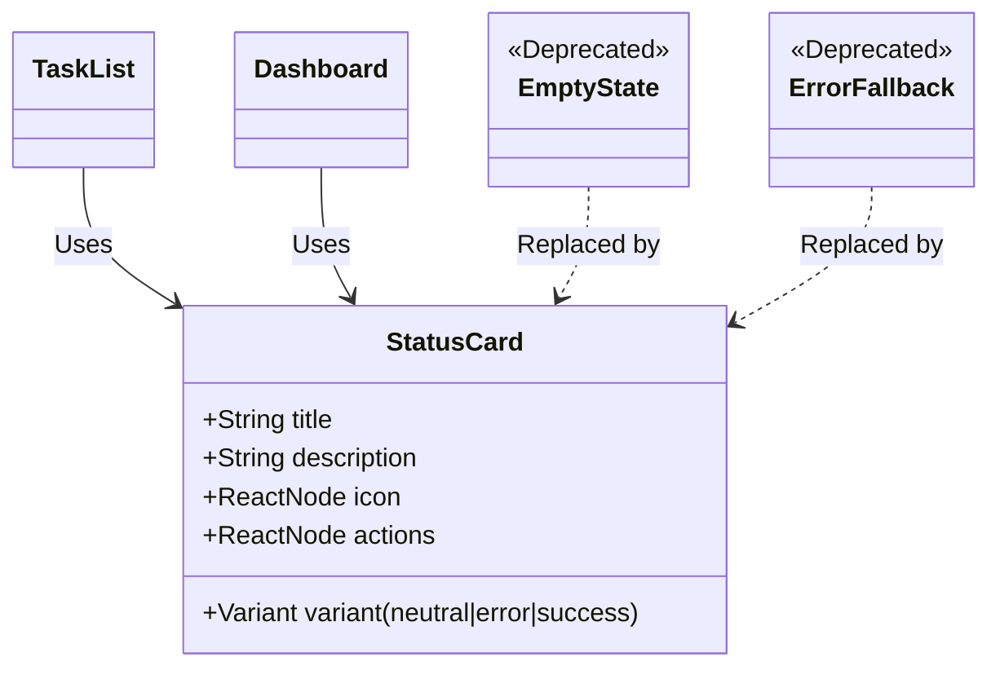
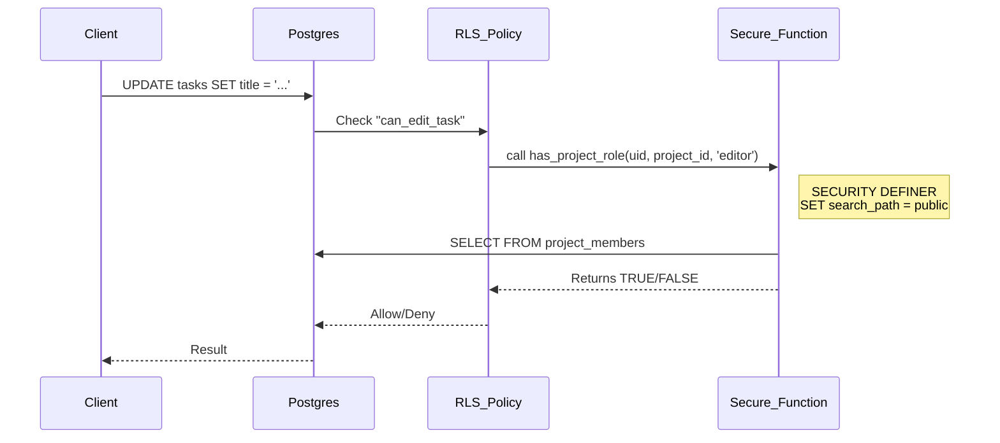

# PR Description Draft: Refactoring & Security Hardening

## Summary
This PR addresses critical technical debt and security feedback from the Alpha review. It reduces the context window usage by ~60% (via archiving and optimization), hardens RLS policies against bypass attempts, and unifies fragmented UI error states.

### Key Changes
1.  **Context Size Reduction**: Archived 188KB of non-essential SQL/Docs and optimized `recharts` imports (Tree-shaking).
2.  **Security Hardening**: Replaced generic `authenticated` RLS checks with strict `has_project_role()` security definer functions.
3.  **UI Unification**: Introduced `<StatusCard />` to replace redundant `EmptyState` and `ErrorFallback` components.
4.  **Migration Consolidation**: Squashed all pending migrations into `docs/db/schema.sql` for a clean state.

---

## Visualizations

### 1. Architecture: UI Component Unification
We replaced ad-hoc error/empty states with a single reusable component to enforce consistency and reduce code duplication.

### 2. Security: RLS Policy Flow
We moved from vulnerable public function calls to a secure, search-path-locked verification flow.

---

## Roadmap Progress

| Feature | Status | Impact |
| :--- | :--- | :--- |
| **Security Hardening** | ✅ Done | Prevents RLS bypass (Fixes PR #34 Feedback) |
| **Codebase Size Audit** | ✅ Done | Reduces AI Context Window by ~60% |
| **Design System** | 🚧 In Progress | Foundation laid with CSS extraction (`.btn-primary`) |

---

## Technical Details

### Security (High Risk)
- **RLS Policies**: All policies in `docs/db/schema.sql` now use `has_project_role`.
- **Edge Functions**: `invite-by-email` now explicitly verifies user session tokens.
- **Exploit Tests**: Updated `scripts/security/exploit_test.js` to match new schema.

### Refactoring (Medium Risk)
- **Recharts**: Switched from `import * as Recharts` to named imports.
    - *Benefit*: Significant bundle size reduction (strips unused chart types).
- **Archive**: Moved `seed_recovery.sql` (188KB) and `recover_db.js` to `/archive`.

### Documentation (Low Risk)
- **Engineering Knowledge**: Added [CONTEXT-001] regarding context management.
- **Roadmap**: Updated status and history.

---

## Verification Plan

### Automated
1.  **Build**: `npm run build` (Must pass < 5s).
2.  **Lint**: `npm run lint` (Must be zero errors).
3.  **Tests**: `npm test` (Unit/Integration).

### Manual (Golden Paths)
1.  **Security**: Try to edit a task in a project you didn't join (Should fail RLS).
2.  **UI**: Visit a blank project to see the new `StatusCard` empty state.
3.  **Error Handling**: Disconnect network and try to load dashboard (Should see `StatusCard` error state).
