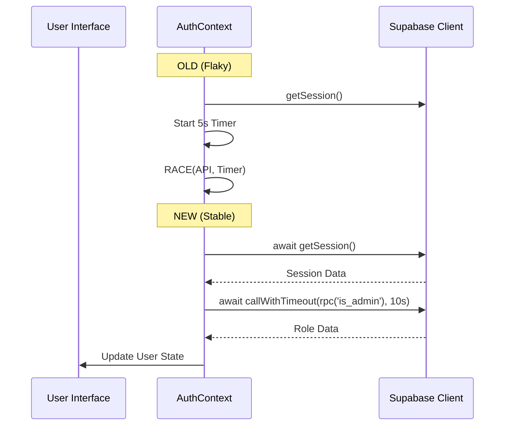

# Pull Request: Authentication Stabilization & E2E Infrastructure

## 📋 Summary

This PR addresses critical reliability issues in the `AuthContext` by refactoring flaky timeout logic and establishing a robust E2E testing foundation.

**Impact:** significantly improves application stability during startup and login/logout actions.

## ✨ Key Changes

### 🛡️ Reliability (fix)
- **`AuthContext.jsx`**: Replaced arbitrary `Promise.race` logic with a targeted `callWithTimeout` (10s) guard for the `is_admin` RPC call. This prevents indefinitely hanging requests while ensuring users aren't incorrectly downgraded to `viewer` due to minor network delays.
- **Config**: Enabled `webServer` in `playwright.config.ts` to automatically start the local dev server (port 3000).

### ✅ Verification (test)
- **New Suite**: Created `e2e/auth.spec.ts` using `test.step()` for granular reporting:
    - Login (Form interaction)
    - Session Persistence (Page Reload)
    - Logout (Clean redirection)
- **Methodology**: Used correct `page.route` mocking to isolate frontend logic from backend flakiness.

## 🏗️ Technical Implementation

### Refactoring Logic
The legacy logic used a race condition against a 5000ms timer which often failed in CI. The new logic uses a dedicated wrapper for specific RPC calls.

## 🧪 Verification Results

| Test Suite | Status | Notes |
| :--- | :--- | :--- |
| **Unit** (`AuthStability.test.jsx`) | ✅ PASS | Verified no regression in loop handling |
| **E2E** (`auth.spec.ts`) | ✅ PASS | Chromium & Firefox (WebKit skipped env) |
| **E2E** (`golden-paths.spec.ts`) | ✅ PASS | Regression check for Project Creation |

## 📦 Assets
- `PR_TEMPLATE.md` created to preserve standard PR structure.