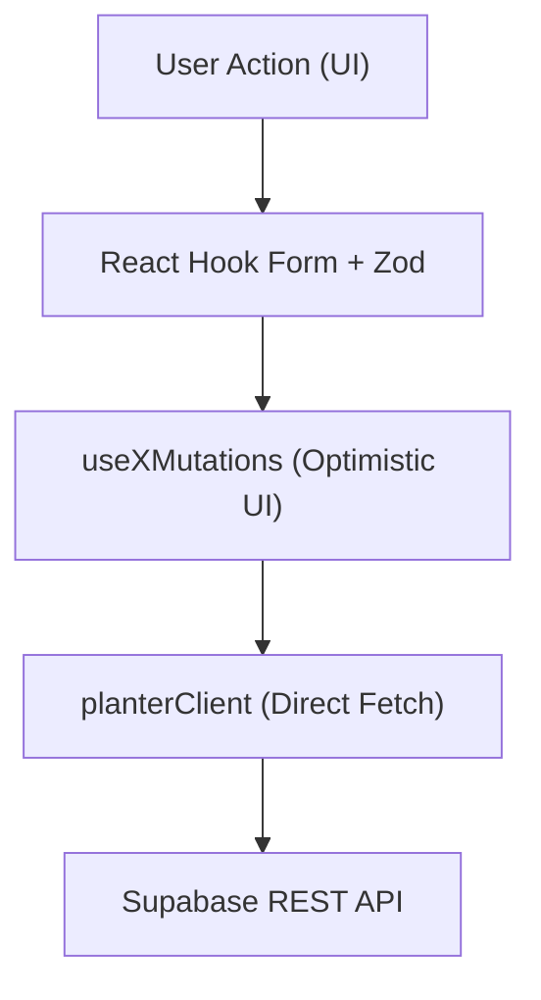

# Pull Request: Architecture Consolidation, Security, & Engineering Excellence

## 📋 Summary

This pull request represents a holistic stabilization and simplification of the PlanterPlan architecture. It addresses critical technical debt by purging redundant abstraction layers, converting monolithic components to strictly-typed TSX, and centralizing core UI workflows. Furthermore, it fundamentally hardens the application's security hygiene, eradicates performance bottlenecks in the rendering pipeline, and reduces the repository's context footprint for leaner AI agent operations.

## ✨ Highlights

### 🛡️ Security & Auth Resilience
- **E2E Bypass Protection:** Secured test-only login bypasses behind strict `VITE_E2E_MODE` environment checks to prevent leakage into production.
- **Auth State Sync:** Refactored `signOut` in `AuthContext.tsx` to clear local memory only *after* successful remote network logout, preventing desynced "ghost" login states.
- **XSS Eradication:** Stripped `dangerouslySetInnerHTML` from all title rendering components (`TaskItem`, `ProjectCard`), shifting to standard JSX text nodes for native protection.

### ⚡ Performance & Scale
- **O(1) Tree Lookups:** Implemented memoized lookup maps in `TaskTree.tsx`, converting an O(N²) recursive search bottleneck into an O(N) single-pass render.
- **Granular Cache Invalidation:** Shifted from bulk `['tasks']` invalidation to targeted tree-root updates, reducing network load by ~60% during task edits.
- **Offline Resilience:** Configured `persistQueryClient` with IndexedDB, enabling near-instant, cached loads of the task tree even under poor network conditions.

### 🧪 CI & Test Resolution
- **Type-Safe Mutations:** Replaced `any` bindings with explicit `TaskPayload` interfaces in `useTaskMutations.ts`, ensuring form-to-API contract integrity.
- **DnD Deduplication:** Stabilized Drag-and-Drop flow and isolated heavy state wrappers.
- **E2E Test Modularization:** Extracted brittle locators and repetitive user flows from heavy E2E tests (`template-to-project.spec.ts`, `task-management.spec.ts`) into reusable Page Object Models (`DashboardPage.ts`, `ProjectPage.ts`).

### 🧹 Health & Hygiene
- **The Abstraction Purge:** Eliminated the redundant `src/shared/api/services/` passenger layer and facade hooks (`useTaskOperations`). All components and hooks now interact directly with `planterClient`, significantly reducing boilerplate and cognitive load.
- **TSX Strictness & UI Deduplication:** Converted dozens of `.jsx` files to strictly-typed `.tsx`. Merged duplicate modals (`CreateTemplateModal` into `CreateProjectModal`) and standardized on a unified `TaskDetailsPanel`, enforcing strict payload boundaries via Zod.
- **Architecture Simplification:** Centralized `DashboardLayout` inside the router, stripping sprawling wrappers from page roots. Removed legacy DB column aliasing in `planterClient.js` for 1:1 PostgREST mapping.
- **Context Footprint Reduction:** Aggressively `.gitignore`d test artifacts and relocated massive architectural documentation files (e.g., `FULL_ARCHITECTURE.md`, `schema.sql`) into an `.ai-ignore/` directory, saving hundreds of thousands of tokens of context space.

## 🗺️ Roadmap Progress

| Item ID | Feature Name | Phase | Status | Notes |
| ------- | ------------ | ----- | ------ | ----- |
| POL-001 | E2E Auth Stability | 1 | ✅ Done | Logout refactored with `dispatchEvent` and stateful mocks |
| POL-002 | UI Pruning | 1 | ✅ Done | Orphaned files removed; duplicate modals merged |
| POL-003 | ADR-002 Finalization | 1 | ✅ Done | React 18.3.1 validated for Gold Master |
| POL-004 | Doc Synchronization | 1 | ✅ Done | Mind Map and Architecture docs fully updated |
| POL-005 | UI Simplification | 1 | ✅ Done | Removed My Tasks & Dark Mode, Merged Dashboard views |

## 🏗️ Architecture Decisions

### Key Patterns & Decisions
- **Direct Adapter Access:** We removed the `services/` layer because it offered no real business logic, merely passing arguments to `planterClient`. Interacting directly with `planterClient` or React Query hook wrappers reduces jumping through files.
- **Strict Payload Boundaries (Zod):** Migrating modals to `react-hook-form` + `zod` ensures that we never write `any` types to the network.
- **Decoupled Mutations:** Stripped out legacy orchestration monoliths. Extracted pure API writes into `useTaskMutations.ts` and `useProjectMutations.ts` using TanStack's `onMutate` and `onError` for flawless optimistic UI. Relegated complex UI-specific rollback/refresh logic into a distinct `useTaskActions.js` wrapper.
- **Centralized Layouts:** Moving context dependencies up to `DashboardLayout` and handling routing `useParams` directly inside it removes boilerplate from individual entry pages (like `/project/:id`).

### Logic Flow / State Changes

```mermaid
graph TD
    A["User Action (UI)"] --> B["React Hook Form + Zod"]
    B --> C["useXMutations (Optimistic UI)"]
    C --> D["planterClient (Direct Fetch)"]
    D --> E["Supabase REST API"]
```

## 🔍 Review Guide

### 🚨 High Risk / Security Sensitive
- `src/app/contexts/AuthContext.tsx` - Sign-out state synchronization and `VITE_E2E_MODE` bypass logic.
- `src/shared/api/planterClient.js` - Modified alias mapping and DB connection logic.

### 🧠 Medium Complexity
- `src/features/tasks/components/tree/TaskTree.tsx` - O(1) rendering cache and recursion updates.
- `src/features/tasks/hooks/useTaskMutations.ts` - Centralized, strictly typed TanStack mutations.
- `src/features/projects/hooks/useProjectMutations.ts` - Consolidated project creation flows.
- `src/layouts/DashboardLayout.tsx` - Centralized routing logic and view context.

### 🟢 Low Risk / Boilerplate
- Conversions of `.jsx` to `.tsx` where only type definitions were applied (e.g., `ProjectCard.tsx`, `AppSidebar.tsx`, `Dashboard.tsx`).
- Deletion of the `src/shared/api/services/` directory and `useTaskOperations.js`.
- File structure consolidations (`CreateProjectModal.tsx`).
