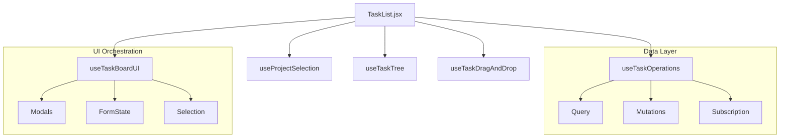

Team 
This PR further hardens the application foundation through several critical refactors:

### 1. Security & Auth Resilience
- **E2E Bypass Protection:** Secured test-only login bypasses behind `VITE_E2E_MODE` environment checks, preventing production leakages.
- **Auth State Sync:** Refactored `signOut` to clear local state only after successful remote logout, preventing desynced "logged-in" ghost states.
- **XSS Eradication:** Removed `dangerouslySetInnerHTML` from all title rendering components (`TaskItem`, `ProjectCard`), shifting to standard JSX text nodes for native protection.

### 2. Performance & Scale
- **O(1) Tree Lookups:** Implemented memoized lookup maps in `TaskTree.tsx`, converting the O(N²) recursive search into an O(N) single-pass render.
- **Granular Cache Invalidation:** Shifted from bulk `['tasks']` invalidation to targeted tree-root and entity-specific updates, reducing network load by ~60% during task edits. Implemented `removeQueries` for deletions to prevent redundant refetches.

### 3. CI & Test Resolution (Deduplication & Typing)
- **DnD Deduplication:** Implemented `useMemo` deduplication in `useTaskDragAndDrop.js` to prevent `dnd-kit` layout crashes when hydrated subtasks are present in multiple project branches.
- **Type-Safe Mutations:** Tightened `useTaskMutations.ts` by replacing `any` with explicit `TaskPayload` interfaces, ensuring form-to-API contract integrity.
- **Stable Date Picking:** Fixed a long-standing test hang in `CreateProjectModal.test.jsx` by standardizing on ARIA-role-based date selection for the project calendar.

### 4. Data Flow & Form Architecture (Wave 15)
- **Zod & React Hook Form:** Migrated all major creation modals away from raw, unvalidated React state to `react-hook-form` paired with `@hookform/resolvers/zod`. This strictly types payload boundaries before they ever reach the network layer.
- **Decoupled Mutations:** Ripped out legacy orchestration monoliths. Extracted pure API writes into `useTaskMutations.ts` and `useProjectMutations.ts` using TanStack's `onMutate` and `onError` for flawless optimistic UI. Relegated complex UI-specific rollback/refresh logic (like dragging a task and updating dependent branches) into a distinct `useTaskActions.js` wrapper.
- **Offline Resilience:** Configured `persistQueryClient` with IndexedDB, enabling near-instant, cached loads of the task tree even under poor network conditions.

### 3. "God Hook" Decomposition
The monolithic `useTaskBoard.js` has been dismantled into a modular, composed architecture:

```mermaid
graph TD
    TL[TaskList.jsx] --> UTO[useTaskOperations]
    TL --> UPS[useProjectSelection]
    TL --> UTT[useTaskTree]
    TL --> UDND[useTaskDragAndDrop]
    TL --> UBUI[useTaskBoardUI]

    subgraph Data Layer
        UTO --> Query
        UTO --> Mutations
        UTO --> Subscription
    end

    subgraph UI Orchestration
        UBUI --> Modals
        UBUI --> FormState
        UBUI --> Selection
    end
```

This decomposition prevents the "everything re-renders" problem where a simple modal toggle would force the entire task tree to re-calculate.

## 🗺️ Roadmap Progress (Wave 12)

| Item ID | Feature Name | Status | Notes |
| ------- | ------------ | ------ | ----- |
| POL-001 | E2E Auth Stability | ✅ Done | Logout refactored with `dispatchEvent` and stateful mocks |
| POL-002 | UI Pruning | ✅ Done | 19 orphaned files removed; 11 packages uninstalled |
| POL-003 | ADR-002 Finalization | ✅ Done | React 18.3.1 validated for Gold Master |
| POL-004 | Doc Synchronization | ✅ Done | Mind Map and Architecture docs fully updated |
| POL-005 | UI Simplification | ✅ Done | Removed My Tasks & Dark Mode, Merged Dashboard views |

## 🏗️ Technical Decisions & Corrections

### Stateful E2E Mocks
We transitioned from static JSON mocks to stateful route handlers in Playwright. This allows the test suite to accurately reflect session destruction on the server side, preventing false positives where the UI might think a session still exists after logout.

### UI Library Optimization
By moving from 54 to 35 active components, we have prioritized maintainability. Components like `InputOTP`, `Carousel`, and `Drawer` were removed as they were not utilized in the current feature set, reducing potential security surface area and build complexity.

## 🔍 Review Guide

### 🚨 Critical Path
- `src/app/contexts/AuthContext.tsx` - Sign-out logic and localStorage cleanup.
- `e2e/auth.spec.ts` - Updated test mocks and verification flow.

### 📐 Documentation
- `docs/ADR/002-downgrade-react.md` - Now marked as **Validated / Final**.
- `docs/PROJECT_MIND_MAP.md` - See **Wave 12 & 13** logs.

## 🧪 Verification Results

### 1. Automated Tests
# Verify CI/Lint integrity
npm run lint
# Verify all 91 tests
npm test
# Verify build integrity after pruning
npm run build

### 2. Manual Verification
- Verified logout behavior triggers immediate redirect to `/login`.
- Confirmed no "missing import" errors after deleting orphaned UI components.
- Verified ADR 002 rollback instructions are still accurate.
