# PR Description: Design System Completion & Bug Fixes

## Summary
This Pull Request finalizes the Design System migration, fixes critical bugs identified in PR #102 feedback, and adds regression tests to prevent recurrence.

### Key Changes
1.  **Bug Fixes (PR #102 Feedback)**:
    - Fixed Project Creation failure (form sent `name` but API expected `title`)
    - Fixed Sidebar sync (now uses same data hook as Dashboard)  
    - Fixed Drag-and-Drop for subtasks (DnD context now includes all tasks)
    - Added admin access for specified user

2.  **Regression Test Coverage (13 New Tests)**:
    - `CreateProjectModal.test.jsx`: 8 tests covering field mapping, template selection, UI state
    - `useTaskBoard.test.jsx`: 5 tests verifying DnD aggregation and expansion state

3.  **Design System Hardening**: Refactored UI components to use semantic tokens, eliminated legacy CSS.

4.  **Knowledge Consolidation**: Added 3 new entries to `ENGINEERING_KNOWLEDGE.md` documenting the bugs and prevention rules.

---

## Visualizations

### Bug Fix Architecture

```mermaid
graph TD
    subgraph "Before (Broken)"
        Modal1["CreateProjectModal"] -->|"name: 'X'"| Mutation1["useProjectMutations"]
        Mutation1 -->|"expects title"| Fail["❌ Silent Failure"]
    end
    
    subgraph "After (Fixed)"
        Modal2["CreateProjectModal"] -->|"title: 'X'"| Mutation2["useProjectMutations"]
        Mutation2 --> Success["✅ Project Created"]
    end
```

### Test Coverage Map

---

## Roadmap Progress

| Feature | Status | Impact |
| :--- | :--- | :--- |
| **Design System (Rule 30)** | ✅ Done | Consistent "Modern SaaS" look; 0 legacy CSS files. |
| **Project Creation Bug** | ✅ Fixed | Forms now pass correct field names. |
| **Sidebar Sync Bug** | ✅ Fixed | Sidebar updates immediately on project creation. |
| **DnD Subtask Bug** | ✅ Fixed | Subtasks can be dragged and dropped. |
| **Test Coverage** | ✅ Improved | 13 new regression tests added. |

---

## Technical Details

### Bug Fixes

#### 1. Project Creation (FE-045)
- **File**: `CreateProjectModal.jsx`
- **Fix**: Changed `name` state to `title` to match mutation expectations

#### 2. Sidebar Sync (SYNC-001)
- **Files**: `ProjectSidebarContainer.jsx`, `useProjectMutations.js`
- **Fix**: Switched to `useUserProjects` hook, added query invalidation

#### 3. DnD for Subtasks (DND-002)
- **File**: `useTaskBoard.js`
- **Fix**: Aggregate `tasks` + `hydratedProjects` before passing to `useTaskDrag`

### New Tests

| File | Tests | Coverage |
| :--- | :--- | :--- |
| `CreateProjectModal.test.jsx` | 8 | Form field mapping, template flow, UI regression |
| `useTaskBoard.test.jsx` | 5 | DnD task aggregation, expansion state |

---

## Verification Plan

### Automated
1.  **Lint**: `npm run lint` (0 Errors)
2.  **Tests**: `npm test` (All 64 tests pass, including 13 new)

### Manual Verification
- Create a new project → Verify it appears in Sidebar immediately
- Drag a subtask to another task → Verify it moves correctly
- Check admin access for designated user

---

## Files Changed

### High Risk (Review Required)
- `src/features/dashboard/components/CreateProjectModal.jsx` - Form field mapping
- `src/features/tasks/hooks/useTaskBoard.js` - DnD aggregation logic
- `docs/db/schema.sql` - Admin function update

### Medium Risk
- `src/features/navigation/components/ProjectSidebarContainer.jsx` - Data hook change
- `src/features/projects/hooks/useProjectMutations.js` - Query invalidation

### Low Risk (Tests)
- `src/features/dashboard/components/CreateProjectModal.test.jsx` - New tests
- `src/features/tasks/hooks/useTaskBoard.test.jsx` - New tests
- `docs/operations/ENGINEERING_KNOWLEDGE.md` - New entries

---

## Design System Completion Features (NEW)

### 1. Dark Mode 🌙

Full dark mode support with system preference sync and localStorage persistence.

| Component | Description |
| :--- | :--- |
| `ThemeContext.jsx` | Theme provider with `useMemo` for resolved theme |
| `globals.css` | Dark CSS variables under `.dark` selector |
| `Header.jsx` | Sun/Moon toggle button |

**Usage**: Click the Moon/Sun icon in the header to toggle themes.

### 2. List Virtualization ⚡

Performance optimization for large task lists using `react-virtuoso`.

| Component | Description |
| :--- | :--- |
| `ProjectListView.jsx` | Conditionally virtualizes lists > 50 items |

**Threshold**: Lists with 50+ items use virtualization; smaller lists keep DnD support.

### 3. View-As Role Switcher 👁️

Privileged users (ADMIN/OWNER) can preview the app as other roles.

| Component | Description |
| :--- | :--- |
| `ViewAsContext.jsx` | Context with `effectiveRole` for permission checks |
| `ViewAsSelector.jsx` | Dropdown in Header (only visible to privileged users) |
| `ViewAsProviderWrapper.jsx` | Determines user's global role |

**Rules**:
- Only shows for ADMIN and OWNER roles
- Stored in session (not localStorage) to prevent lock-in
- Persistent in navbar between breadcrumb and avatar

---

## New Files Added

| File | Purpose |
| :--- | :--- |
| `src/app/contexts/ThemeContext.jsx` | Dark mode provider |
| `src/app/contexts/ViewAsContext.jsx` | View-As role context |
| `src/app/contexts/ViewAsProviderWrapper.jsx` | User role detection |
| `src/features/navigation/components/ViewAsSelector.jsx` | Header dropdown |

