# Project & Task Core Overhaul

> Recursive Hierarchy · Drag-and-Drop with Date Inheritance · Auth & App Reliability · Playwright E2E

---

## Overview

This pull request delivers a comprehensive overhaul of PlanterPlan's project and task management core. The changes span seven areas—from how projects are created and tasks are structured, through drag-and-drop interactions and reliability hardening, to a full Playwright end-to-end test suite.

---

## 1. Project Creation — RLS-Safe Initialization

Projects are now initialized through a `SECURITY DEFINER` RPC, which atomically provisions the creator as a project member at creation time. This eliminates race conditions where Row-Level Security policies would block the creator from accessing their own project immediately after creation.

- `CreateProjectModal` offers **template creation** and **"Start from scratch"** as explicit paths.
- After successful creation, the user is navigated directly to `/project/[id]`.

**Files changed:**
`projectService.js` · `CreateProjectModal.jsx` · `Dashboard.jsx`

## 1a. RLS Policy Hardening & Zombie Trigger Removal

During verification, a critical `403 Forbidden` error on project creation was traced to **legacy triggers** (`trigger_maintain_task_root_id`, `trg_auto_add_project_owner`) that were silently modifying data during `INSERT` operations. These modifications violated strict `CHECK` constraints in the RLS policies (specifically `root_id IS NULL`).

**Resolution:**
- **Dropped Legacy Triggers**: Removed `trigger_maintain_task_root_id`, `trigger_propagate_task_root_id`, and `trg_auto_add_project_owner` (redundant logic handled by RPC/App).
- **Refined RLS Policy**: Updated `tasks` INSERT policy to be robust against self-referential `root_id` assignments `(root_id IS NULL OR root_id = id)`.
- **Cleaned Helper Functions**: Dropped and recreated `has_project_role` to resolve parameter name conflicts (`p_project_id` vs `pid`).

This "Nuclear Cleanup" ensures a clean separation of concerns: The Application/RPC handles business logic, and RLS strictly enforces permissions without interference from legacy database logic.

## 1b. Date Picker UX Overhaul

The previous date picker implementation required excessive clicks to navigate to future dates (vital for long-term project planning).

**Improvements:**
- **Smart Defaults**: Date picker now opens 3 months in the future by default.
- **Dropdown Navigation**: Added intuitive Year/Month dropdowns for rapid traversal.
- **Bounds Protection**: Disabled past dates to prevent invalid project launches.
- **Visual Polish**: Adjusted calendar styles for better readability in the modal.

---

## 2. Template System — Dedicated Creation Flow

The "New Template" action is now decoupled from project creation, offering a specialized experience for building reusable assets.

- **Dedicated Modal**: `CreateTemplateModal` focuses on title, description, and category (Checklist, Workflow, Blueprint).
- **URL-Driven State**: Sidebar buttons navigate to `/dashboard?action=new-project` or `?action=new-template`, allowing the Dashboard to auto-open the correct modal. This bridges the architectural gap between the layout sidebar and the page-level modal state.

**Files changed:**
`CreateTemplateModal.jsx` · `Dashboard.jsx` · `ProjectSidebarContainer.jsx`

---

## 3. Recursive Task Hierarchy

Tasks now render as an arbitrarily deep parent–child structure. Flat query results from the database are transformed into stable nested trees using shared helper utilities, enabling folder-like nesting at any depth.

**Files changed:**
`treeHelpers.js` · `TaskItem.jsx` · `SortableTaskItem.jsx`

---

## 4. Drag & Drop — Reorder, Reparent, and Date Inheritance

Drag-and-drop supports two operations: **reordering** tasks within the same parent and **reparenting** tasks across milestones. When a task moves to a new time context, the **Date Inheritance Engine** calculates the calendar delta and shifts every date in the entire subtree accordingly.

All changes are persisted as atomic batch updates (positions, parent reassignment, and date deltas in a single transaction). The UI provides clear affordances: drop-target highlights, cursor states, and toast notifications summarizing the result.

```mermaid
sequenceDiagram
    participant User
    participant Hook as useTaskDrag
    participant Dates as dateInheritance
    participant Persist as positionService
    participant DB as Supabase

    User->>Hook: Drags "Task A" (Jan 1) into Milestone B (Feb 1)
    Hook->>Hook: Detects parent change
    Hook->>Hook: Calculates delta (+31 days)
    Hook->>Dates: shiftSubtreeDates(Task A, +31d)
    Dates->>Dates: Recursively shifts Task A + all descendants
    Dates-->>Hook: Returns batch of updated date values
    Hook->>Persist: Atomic batch update (position + dates)
    Persist->>DB: Single transaction
    DB-->>Persist: Committed
    Persist-->>User: Toast — "Moved · Updated dates for 5 subtasks"
```

**Files changed:**
`useTaskDrag.js` · `dateInheritance.js` · `positionService.js`

---

## 5. Architecture — Feature-Sliced Design & Optimistic Recovery

The task domain is restructured along **Feature-Sliced Design** boundaries, separating data concerns from interaction behavior. Mutations follow a consistent optimistic update pattern with context-aware rollback, so the UI recovers instantly if a server request fails.

**Files changed:**
`entities/task/*` · `features/task-drag/*` · `useTaskMutations.js`

---

## 6. Reliability Hardening

A collection of stability improvements across the application:

| Area | What Changed |
|:-----|:-------------|
| **Auth startup** | Role resolution uses a bounded timeout wrapper for the admin-check RPC, preventing hangs without spurious role downgrades |
| **Error surfacing** | Critical mutations now display toast notifications on failure; previously swallowed errors are removed |
| **Query defaults** | `QueryClient` configured with reduced refetch frequency and bounded retry counts |
| **Error boundaries** | `react-error-boundary` wrapping standardized with consistent reset behavior |
| **RBAC UX gates** | Edit and invite controls are disabled for unauthorized roles (UX guardrails; server RLS remains authoritative) |
| **Profile settings** | Input validation (avatar URL format) and profile updates routed through the client adapter |

**Files changed:**
`AuthContext.jsx` · `Project.jsx` · `Dashboard.jsx` · `main.jsx` · `App.jsx` · `TaskList.jsx` · `TaskItem.jsx` · `Settings.jsx`

---

## 7. Theming — Semantic Design Tokens

Key UI surfaces are migrated to semantic design tokens, ensuring components respond correctly to dark and light modes without hardcoded color values.

**Files changed:**
`Project.jsx` · `Settings.jsx` · `Reports.jsx` · `Home.jsx`

---

## 8. Database — Schema Hardening & Policy Hygiene

An audit of Supabase edge logs revealed **51 failing requests** across two root causes, which drove a comprehensive schema review covering permissions, missing objects, and performance.

### Root Cause Analysis

| Error | Count | Cause | Fix |
|:------|:------|:------|:----|
| `401 PGRST301` | ~30 | Stale local JWTs (issuer `127.0.0.1`) sent to remote Supabase | `getSupabaseToken()` patch (client-side) |
| `403 42501` | ~20 | `tasks_with_primary_resource` view missing `GRANT SELECT` | Added view GRANTs |

### Permission Model

```mermaid
graph TD
    subgraph "PostgREST Request Flow"
        A["Client Request"] --> B{"GRANT check"}
        B -- "No GRANT" --> C["403 42501 ❌"]
        B -- "GRANT exists" --> D{"RLS Policy check"}
        D -- "Policy passes" --> E["200 OK ✅"]
        D -- "Policy fails" --> F["Empty result / 403"]
    end

    subgraph "GRANTs Added"
        G["tasks_with_primary_resource → SELECT"]
        H["view_master_library → SELECT"]
        I["invite_user_to_project → EXECUTE"]
        J["is_admin → EXECUTE"]
    end

    style C fill:#ffebee,stroke:#c62828
    style E fill:#e8f5e9,stroke:#2e7d32
    style G fill:#e3f2fd,stroke:#1565c0
    style H fill:#e3f2fd,stroke:#1565c0
    style I fill:#e3f2fd,stroke:#1565c0
    style J fill:#e3f2fd,stroke:#1565c0
```

### Schema Improvements

| # | Severity | Change | Impact |
|---|:---------|:-------|:-------|
| 1 | 🔴 | `GRANT SELECT` on views | **Fixes 403 bug** — views now queryable via API |
| 2 | 🔴 | `GRANT EXECUTE` on `invite_user_to_project` | Invitations no longer silently fail |
| 3 | 🟡 | `GRANT EXECUTE` on `is_admin` | Explicit grant (was relying on default) |
| 4 | 🟡 | `handle_updated_at()` trigger | `tasks` and `people` timestamps auto-update |
| 5 | 🟡 | `task_resources` table + RLS | Backing table for `clone_project_template` |
| 6 | 🟢 | `idx_tasks_creator` index | RLS eval avoids full table scan |
| 7 | 🟢 | `idx_tasks_assignee_id` index | Future-proofs assignment queries |
| 8 | 🟢 | `task_relationships` RLS consistency | Uses `has_project_role()` + admin bypass |

RLS policy expressions also use `(select auth.uid())` patterns, improving PostgreSQL query planning by allowing the planner to evaluate the auth check once per query rather than per-row.

**Files changed:**
`schema.sql` · `planterClient.js` · `ProjectSidebar.jsx`

---

## 9. Documentation & Workflows

| Document | Purpose |
|:---------|:--------|
| `docs/FULL_ARCHITECTURE.md` | Single Source of Truth — FSD structure, state management, provider tree, security model |
| `deep-research-report.md` | Initial codebase audit, tech stack analysis, and test coverage gap identification |
| `.agent/workflows/*` | Operational workflows including hybrid E2E verification |

---

## End-to-End Testing

Playwright is configured for both local development and CI. Tests achieve stability through:

- **Auth seeding** that bypasses fragile login-page interactions
- **Deterministic network mocking** via `page.route` interception
- **Environment-gated bypass logic** (`VITE_E2E_MODE`) for test-specific behavior
- **Secrets sourced from environment variables** — no hardcoded credentials

**Files changed:**
`playwright.config.ts` · `e2e/*` journey suites · `run_full_suite.sh` · `playwright-e2e-testing-system.md`

---

## 10. E2E Concurrency Stabilization
 
To ensure reliability in CI environments, the Playwright suite was hardened to support **fully concurrent execution** (100% pass rate across 25 tests).
 
### Key Fixes
 
| Spec | Issue | Resolution |
|:-----|:------|:-----------|
| `golden-paths.spec.ts` | **Race Condition**: Sidebar "Project Settings" button wasn't clickable immediately after creation. | **Mock Enrichment**: Updated `GET` mocks to include the newly created project in the list query, ensuring the sidebar refreshes instantly. |
| `golden-paths.spec.ts` | **Locator Flake**: Date picker selected wrong day (visual vs. accessible name). | **Precise Locator**: Switched to `.getByText('15', { exact: true })` within the dialog. |
| `sidebar-actions.spec.ts` | **Flow Drift**: Test missed the new "Choose a Template" modal step. | **Flow Alignment**: Updated test to select "Start from scratch" template before verifying project creation. |
| `drag-drop.spec.ts` | **Stale Data**: `PATCH` mocks didn't persist state, causing subsequent `GET`s to revert changes. | **Stateful Mocks**: Implemented in-memory state mutation within `page.route` handlers. |
 
---
 
## Validation Summary
 
| Category | Coverage |
|:---------|:---------|
| **Unit / Integration** | Project creation + RLS path · Recursive hierarchy rendering · Drag reorder & reparent · Date inheritance math · Optimistic rollback correctness · Auth stability regression |
| **End-to-End** | **100% Concurrent Pass Rate** (25 Tests) · Auth + security gates · Golden-path journeys · Drag-and-drop · Theme integrity · Sidebar flows |
| **Manual Verification** | **Verifed** Project Creation (User ID mismatch resolved) · **Verified** Date Picker UX (Future dates, Dropdowns) · **Verified** Sidebar Navigation updates |

---

## Reviewer Notes

- Client-side RBAC controls are **UX enforcement only**; server-side RLS remains the security boundary.
- `SECURITY DEFINER` RPCs should be audited for least-privilege configuration (`search_path`, input validation, no user-controlled SQL).