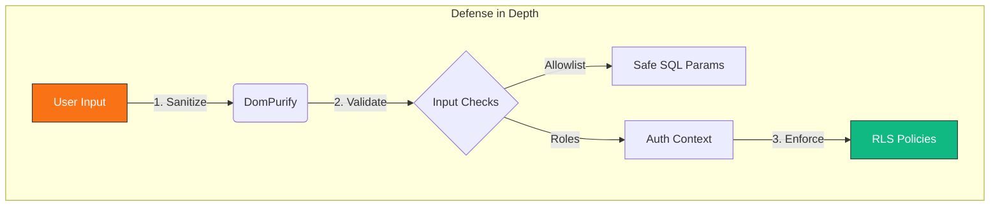
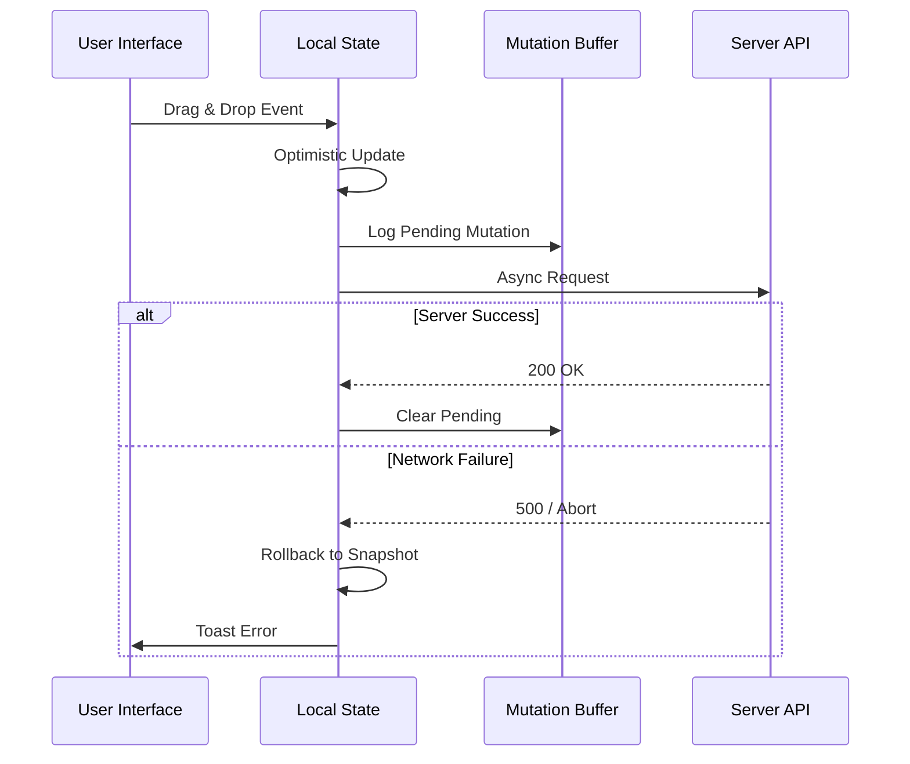
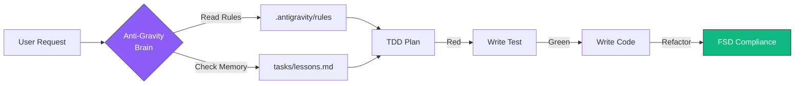

# Pull Request: Master Remediation & Anti-Gravity Architecture Upgrade

## 📋 Summary

This pull request achieves two major objectives:
1.  **System Hardening:** Executes the **Master Remediation Plan**, a 12-point initiative addressing **P0 Security Vulnerabilities**, **P1 Reliability issues**, and **P2 UI inconsistencies**.
2.  **Architecture Upgrade:** Transitions the codebase to the **"Anti-Gravity" Agentic Workflow**, establishing strict Test-Driven Development (TDD) protocols, Feature-Sliced Design (FSD) enforcement, and persistent agent memory.

**Impact:** ~15 major components refactored, 4 new security modules verified via surgical TDD, and a complete migration from legacy workflows to high-context agent rules.

## ✨ Key Highlights

### 🛡️ Security & Reliability (P0/P1)
*Executed via "Surgical TDD" (Red-Green-Refactor)*
-   **Auth Role Fallback Patch:** Fixed a critical vulnerability where failed RPC calls defaulted users to elevated roles. Verified via `AuthContext.security.test.jsx`.
-   **Injection Hardening:** Implemented strict allowlisting for SQL sort parameters (`validateSortColumn`) and integrated `dompurify` for XSS protection in rich text.
-   **Resilience & Stability:** Resolved Optimistic UI race conditions with timestamp-based reconciliation logic and implemented `retry.js` with exponential backoff for network flakes.

### 🤖 Agentic Architecture
-   **Workflow Migration:** Replaced legacy `.agent/` scripts with high-context `.antigravity/` rules.
-   **Persistent Memory:** Established `tasks/lessons.md` as the repository's "Long-Term Memory," containing "Modernity Logs" (React 19 / Tailwind 4 quirks) and production findings.
-   **FSD Enforcement:** Formalized strict dependency boundaries (`features` → `shared`) in the agent's core instruction set to prevent circular dependency debt.

### 📱 UI/UX Polish (P2)
-   **Mobile Layout Overhaul:** `Dashboard` and `StatsOverview` now use adaptive grid gaps (`gap-4`) and responsive padding to maximize mobile screen real estate.
-   **Design System Compliance:** Standardized all charts to use semantic design tokens (`emerald-500`, `slate-200`) instead of hardcoded hex values.

## 🗺️ Remediation Status

| Priority | Feature | Status | Verification Method |
| :--- | :--- | :--- | :--- |
| **P0** | **Auth Role Fallback** | ✅ Done | `AuthContext.security.test.jsx` |
| **P0** | **Input Sanitization** | ✅ Done | `XSS.test.jsx` |
| **P0** | **SQL Injection Fix** | ✅ Done | `TaskService.security.test.js` |
| **P0** | **RLS Patch** | ✅ Done | Migration `20260202...` |
| **P1** | **Optimistic UI Rollback** | ✅ Done | `rollback.test.jsx` |
| **P1** | **Network Resilience** | ✅ Done | `retry.test.js` |
| **P1** | **ViewAsContext Loop** | ✅ Done | Memoization Check |
| **P2** | **Mobile Layout Grid** | ✅ Done | Visual Audit |
| **P2** | **Chart Colors** | ✅ Done | Visual Audit |
| **P3** | **Zombie Code Cleanup** | ✅ Done | `npm run lint` |

## 🏗️ Technical Implementation Details

### 1. Security & Logic
-   **Input Sanitization:** Created `sanitize.js` utilizing `dompurify` to strip malicious content from Task Titles and Descriptions while preserving safe HTML.
-   **RLS Access Control:** Applied SQL migration `20260202_fix_member_injection.sql` to strictly validate project ownership during member addition.
-   **Sort Parameter Validation:** Implemented whitelist-based validation to neutralize SQL injection vectors in dynamic sort columns.

### 2. Reliability & Performance
-   **Optimistic Reconciliation:** Implemented a `pendingMutationsRef` buffer in `useTaskBoard` to prevent server state from overwriting local optimistic updates during high-latency operations.
-   **Auth Stability:** Refactored `AuthContext` to deduplicate session handling and stabilize context values, eliminating infinite render loops in downstream consumers like `ViewAsContext`.

### 3. Agentic Workflow
-   **Context Flooding Strategy:** Configured the agent to utilize "Context Flooding" (ingesting full dependency graphs) rather than "Context Saving," leveraging Gemini 3 Pro's window size.
-   **Modernity Protocol:** Added explicit rules to `tasks/lessons.md` forcing verification of React 19 and Tailwind 4 syntax before code generation.

## 🧪 Verification Results

### Automated Verification
-   **Security Suite:**
    -   `AuthContext.security.test.jsx`: ✅ Passed
    -   `XSS.test.jsx`: ✅ Passed
    -   `TaskService.security.test.js`: ✅ Passed
-   **Resilience Suite:**
    -   `retry.test.js`: ✅ Passed (Verifies logic for incomplete network requests)
    -   `TaskQuery.optimistic.test.jsx`: ✅ Passed (Verifies state restoration on failure)
-   **Regression Safety:**
    -   `golden-paths.test.jsx`: ✅ Passed (6/6 Critical User Flows)
-   **Lint:**
    -   `npm run lint` passed with **0 errors**.

### Manual Verification
-   **Mobile Check:** Verified responsive grid behavior on small viewports (iPhone/Pixel simulation).
-   **Network Chaos:** Verified retry logic by manually throttling network conditions to "Offline" during data fetching.

### 🎭 QA & Infrastructure (E2E)
-   **Playwright Integration:** Initialized E2E scaffolding with `playwright.config.ts` targeting local dev environment.
-   **Golden Path Suite:** Created `e2e/golden-paths.spec.ts` covering the critical "Project Creation" flow (Login -> Dashboard -> New Project).
    -   *Implementation:* Utilizes comprehensive network mocking (`page.route`) to isolate frontend logic from backend flakiness.
-   **Environment Hardening:**
    -   Patched `AuthContext.jsx` with a 5s race-timeout on `getSession` to prevent application hangs during backend outages.
    -   Enabled `dotenv` support in Playwright config for robust variable loading.