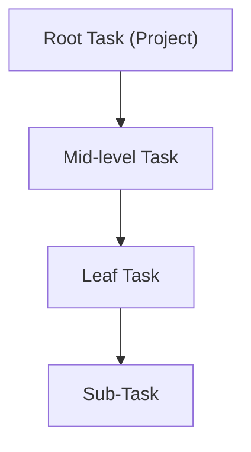
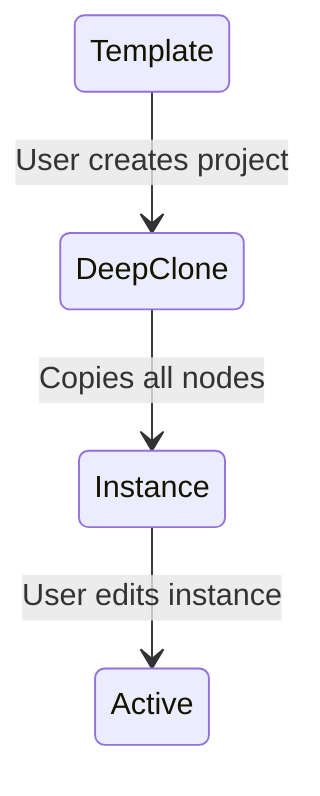
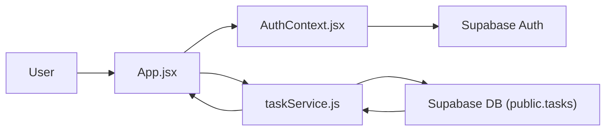

<!--
README CONTRACT (keep this block at the top)

Scope:
- This README is a codebase-understanding document for reviewers + PMs.
- It is NOT a roadmap, NOT a setup guide, NOT marketing.

Non-negotiables:
- Document ONLY what exists in the repo at the referenced commit.
- **Evidence Rule**: If you can't link it, you can't claim it.
- Every non-trivial claim must be backed by concrete repo evidence:
  - file paths, exported symbols, function names, table/column names, migration filenames.
- Mermaid diagrams must be derivable from real code flows (handlers/events/states).
- Keep the 5-section structure intact. Do not add new top-level sections.

Update discipline:
- Before editing, update "Last verified" and "Commit".
- If a section cannot be verified from code, mark it explicitly as "Unverified" and describe what is missing.
-->

# PlanterPlan

**Last verified**: 2026-01-06
**Commit**: c8b3f28
**Primary audience**: code reviewers, project managers
**Related Docs**: [Engineering Knowledge Base](./docs/operations/ENGINEERING_KNOWLEDGE.md)

---

## 1. What Is This?

PlanterPlan is a project management tool tailored for church planting. It allows users (Project Managers) to manage projects as hierarchical task trees. The system distinguishes between "Templates" (standardized task lists) and "Instances" (active projects derived from templates), supporting deep cloning to instantiate new projects.

---

## 2. Project Structure

### Directory Layout

```text
/
  docs/db/               # Database schemas and migrations
  supabase/functions/    # Edge Functions (Deno/TS)
  src/
    ├── components/
    │   ├── atoms/          # Basic building blocks (Buttons, Inputs, Breadcrumbs)
    │   ├── molecules/      # Compound components (TaskItem, ProjectHeader)
    │   ├── organisms/      # Complex sections (SideNav, TaskList)
    │   ├── templates/      # Page layouts (TaskDetailsView)
    │   └── reports/        # Data visualization
    ├── contexts/           # Global state (Auth, Toast)
    ├── hooks/              # Custom React hooks (useTaskOperations, useTreeState)
    ├── layouts/            # Page shells (DashboardLayout)
    ├── services/           # API interaction layer
    ├── styles/             # CSS modules and utilities
    └── utils/              # Helper functions
    App.jsx              # Main routing and layout
    supabaseClient.js    # Supabase initialization
```

### Where to Find Things

| To change...         | Look in...                                                                                                                        |
| -------------------- | --------------------------------------------------------------------------------------------------------------------------------- |
| **Auth Logic**       | [src/contexts/AuthContext.jsx](file:///home/joel/PlanterPlan/PlanterPlan-Alpha/PlanterPlan-Alpha/src/contexts/AuthContext.jsx)    |
| **Task API**         | [src/services/taskService.js](file:///home/joel/PlanterPlan/PlanterPlan-Alpha/PlanterPlan-Alpha/src/services/taskService.js)      |
| **Database Schema**  | [docs/db/schema.sql](file:///home/joel/PlanterPlan/PlanterPlan-Alpha/PlanterPlan-Alpha/docs/db/schema.sql)                        |
| **Task Routes**      | [src/App.jsx](file:///home/joel/PlanterPlan/PlanterPlan-Alpha/PlanterPlan-Alpha/src/App.jsx)                                      |
| **Deep Clone Logic** | [src/services/taskService.js](file:///home/joel/PlanterPlan/PlanterPlan-Alpha/PlanterPlan-Alpha/src/services/taskService.js#L216) |

### Environment Requirements

**Required env vars**
(Inferred from `src/supabaseClient.js`)

```text
REACT_APP_SUPABASE_URL=Supabase API URL
REACT_APP_SUPABASE_ANON_KEY=Supabase Anonymous Key
```

**External dependencies**

- **Supabase** -> Auth & Database (Ref: [src/supabaseClient.js](file:///home/joel/PlanterPlan/PlanterPlan-Alpha/PlanterPlan-Alpha/src/supabaseClient.js))
- **dnd-kit** -> Drag and Drop interactions (Ref: [package.json](file:///home/joel/PlanterPlan/PlanterPlan-Alpha/PlanterPlan-Alpha/package.json))

---

## 3. Core Concepts & Mental Model

### 3.1 Task Hierarchy (Projects are Tasks)

The system models everything as a `task`. A "Project" is simply a root-level task (`parent_task_id` is NULL). Hierarchy is maintained via adjacency list (`parent_task_id`). A `root_id` optimization field exists to allow quick fetching of entire trees without recursive queries.



**Repo evidence**

- `public.tasks` table definition -> [docs/db/schema.sql](file:///home/joel/PlanterPlan/PlanterPlan-Alpha/PlanterPlan-Alpha/docs/db/schema.sql#L6)
- `maintain_task_root_id` trigger -> [docs/db/schema.sql](file:///home/joel/PlanterPlan/PlanterPlan-Alpha/PlanterPlan-Alpha/docs/db/schema.sql#L30)

### 3.2 Templates vs. Instances

Tasks have an `origin` field. A `template` tree serves as a master copy. Users create projects by "Deep Cloning" a template, which duplicates the entire tree and marks the new tasks as `origin = 'instance'`.



**Repo evidence**

- `origin` column -> [docs/db/schema.sql](file:///home/joel/PlanterPlan/PlanterPlan-Alpha/PlanterPlan-Alpha/docs/db/schema.sql#L12)
- `deepCloneTask` function -> [src/services/taskService.js](file:///home/joel/PlanterPlan/PlanterPlan-Alpha/PlanterPlan-Alpha/src/services/taskService.js#L216)
- `view_master_library` (Templates) -> [docs/db/schema.sql](file:///home/joel/PlanterPlan/PlanterPlan-Alpha/PlanterPlan-Alpha/docs/db/schema.sql#L97)

---

## 4. Architecture

### 4.1 Data Flow

The app interacts directly with Supabase via service modules. State is largely server-driven, with local React state for UI. Authentication is managed globally via Context.



### 4.2 Component Responsibilities

| Component/Module | Responsibility                                                   | Primary files                                                                                                                                    |
| ---------------- | ---------------------------------------------------------------- | ------------------------------------------------------------------------------------------------------------------------------------------------ |
| **AuthContext**  | Manages user session (login/logout/user object).                 | [src/contexts/AuthContext.jsx](file:///home/joel/PlanterPlan/PlanterPlan-Alpha/PlanterPlan-Alpha/src/contexts/AuthContext.jsx)                   |
| **taskService**  | Encapsulates all DB operations for tasks (fetch, search, clone). | [src/services/taskService.js](file:///home/joel/PlanterPlan/PlanterPlan-Alpha/PlanterPlan-Alpha/src/services/taskService.js)                     |
| **TaskList**     | Main dashboard layout; manages drag-and-drop context.            | [src/components/organisms/TaskList.jsx](file:///home/joel/PlanterPlan/PlanterPlan-Alpha/PlanterPlan-Alpha/src/components/organisms/TaskList.jsx) |
| **SideNav**      | Persistent sidebar for project navigation.                       | [src/components/organisms/SideNav.jsx](file:///home/joel/PlanterPlan/PlanterPlan-Alpha/PlanterPlan-Alpha/src/components/organisms/SideNav.jsx)   |

### 4.3 Database Schema

| Table/Collection      | Purpose                                        | Key fields                                                                    |
| --------------------- | ---------------------------------------------- | ----------------------------------------------------------------------------- |
| `tasks`               | Stores both projects and tasks in a hierarchy. | `id`, `parent_task_id`, `root_id`, `origin`, `creator`, `primary_resource_id` |
| `task_resources`      | Stores resources attached to tasks.            | `id`, `task_id`, `type`, `url`, `storage_path`                                |
| `project_members`     | Manages permissions for shared projects.       | `project_id`, `user_id`, `role`                                               |
| `view_master_library` | Filters tasks to show only root templates.     | `*` (from tasks)                                                              |

**Relationships**

- `parent_task_id` -> Self-reference (Hierarchy) (Ref: [schema.sql](file:///home/joel/PlanterPlan/PlanterPlan-Alpha/PlanterPlan-Alpha/docs/db/schema.sql#L8))
- `root_id` -> Denormalized reference to the top-level project (Ref: [schema.sql](file:///home/joel/PlanterPlan/PlanterPlan-Alpha/PlanterPlan-Alpha/docs/db/schema.sql#L22))

### 4.4 Security Model

**Authentication**

- Supabase Auth (JWT) implemented in [src/contexts/AuthContext.jsx](file:///home/joel/PlanterPlan/PlanterPlan-Alpha/PlanterPlan-Alpha/src/contexts/AuthContext.jsx).

**Data isolation**

- RLS (Row Level Security) is enabled on `public.tasks` and `public.project_members`.
- Ref: `ALTER TABLE ... ENABLE ROW LEVEL SECURITY` in [docs/db/schema.sql](file:///home/joel/PlanterPlan/PlanterPlan-Alpha/PlanterPlan-Alpha/docs/db/schema.sql#L111).

---

## 5. Current State

### 5.1 Working Features

- ✅ **Authentication**: Sign in/out, session persistence (Ref: `AuthContext.jsx`).
- ✅ **Task Management**: Fetching tasks, data modeling for hierarchy (Ref: `taskService.js`).
- ✅ **Deep Cloning**: Duplicating entire template trees to new instances (Ref: `deepCloneTask` in `taskService.js`).
- ✅ **Master Library Search**: Searching templates via `searchMasterLibraryTasks`, with support for resource type filtering (Ref: `taskService.js`).
- ✅ **Project Reporting**: Read-only print view with completion stats (Ref: `ProjectReport.jsx`).
- ✅ **Master Library Tree View**: Recursive display of template hierarchies with on-demand loading (Ref: `MasterLibraryList.jsx`).
- ✅ **Optimization**: Task trees fetched via `root_id` index instead of recursive calls (Ref: `fetchTaskChildren` in `taskService.js`).
- ✅ **Side Navigation**: Persistent sidebar for project context switching (Ref: `SideNav.jsx`).
- ✅ **Adversarial Polish**: Battle-tested UI for mobile responsiveness, date handling, and layout density (Ref: `implementation_plan.md`).

### 5.2 Known Limitations

- ⚠️ **Recursive Fetching**: The `fetchTaskChildren` implementation performs an in-memory BFS rather than a recursive DB query, which may limit performance on very large trees.
  - Evidence: [src/services/taskService.js#L148-L208](file:///home/joel/PlanterPlan/PlanterPlan-Alpha/PlanterPlan-Alpha/src/services/taskService.js#L148-L208)

### 5.3 Technical Debt (Brutal Honesty)

- **No major items identified at this time.** (Previous item regarding `root_id` mismatch was resolved).
