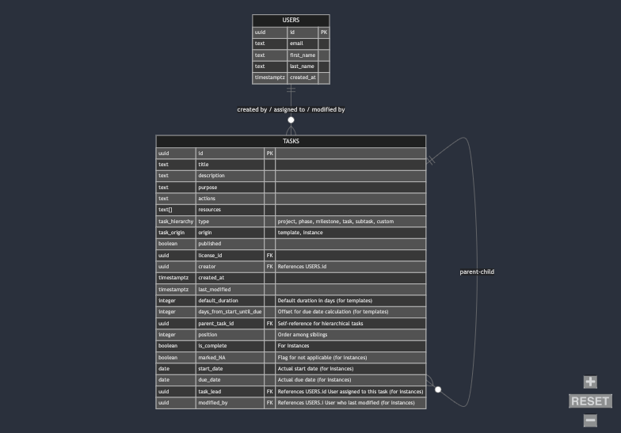

PlanterPlan

Database Schema (Mermaid code):

erDiagram
    %% USERS table (authentication handled by Supabase Auth)
    USERS {
      uuid id PK
      text email
      text first_name
      text last_name
      timestamptz created_at
    }

    %% Unified TASKS table
    TASKS {
      uuid id PK
      text title
      text description
      text purpose
      text actions
      text[] resources
      task_hierarchy type "project, phase, milestone, task, subtask, custom"
      task_origin origin "template, instance" 
      boolean published
      uuid license_id FK
      uuid creator FK "References USERS.id"
      timestamptz created_at
      timestamptz last_modified
      
      integer default_duration       "Default duration in days (for templates)"
      integer days_from_start_until_due "Offset for due date calculation (for templates)"
      uuid parent_task_id FK "Self-reference for hierarchical tasks"
      integer position               "Order among siblings"
      
      boolean is_complete            "For instances"
      boolean marked_NA              "Flag for not applicable (for instances)"
      date start_date                "Actual start date (for instances)"
      date due_date                  "Actual due date (for instances)"
      uuid task_lead FK "References USERS.id User assigned to this task (for instances)"
      uuid modified_by FK "References USERS.i User who last modified (for instances)"
    }

    %% Relationships
    USERS ||--o{ TASKS : "created by / assigned to / modified by"
    TASKS ||--o{ TASKS : "parent-child"

Schema Diagram (Mermaid):

