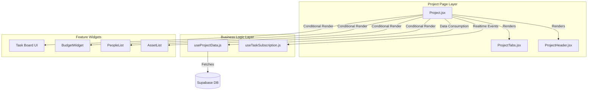
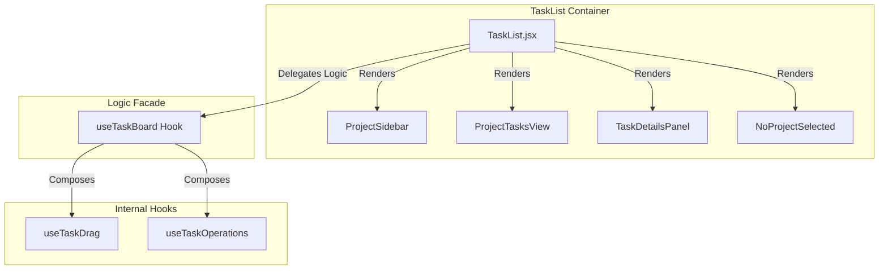
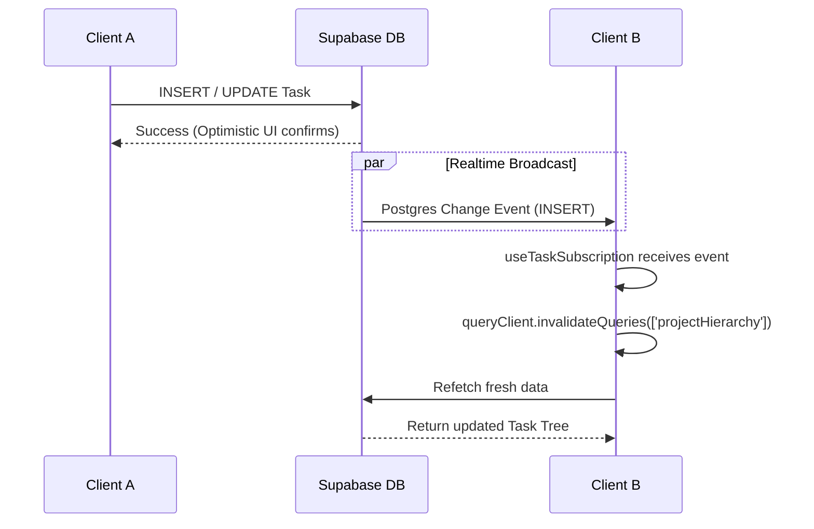

# System Architecture & Component Design

## 1. Project Module Architecture

The `Project` module (`src/pages/Project.jsx`) has been refactored from a monolithic "God Component" into a composition of specialized hooks and UI components.

### Component Diagram

### Key Decisions
- **Data Isolation**: `useProjectData` handles all `useQuery` calls for project metadata, hierarchy, and members. The view component (`Project.jsx`) receives clean data objects, not raw query results.
- **Tab State**: `ProjectTabs` encapsulates the navigation UI, allowing the parent to simply manage the `activeTab` string state.

---

## 2. Task List Architecture

The `TaskList` (`src/features/tasks/components/TaskList.jsx`) serves as the main application dashboard logic. It uses a Facade Pattern to manage complexity.

### Component Diagram

### Key Decisions
- **Panel Extraction**: The right-side details panel logic was moved to `TaskDetailsPanel` to declutter the main render method.
- **Empty State**: `NoProjectSelected` handles the "zero state" when no project is active, separating it from the main view logic.

---

## 3. Real-time Data Flow

We use a "Stale-While-Revalidate" strategy enhanced by Supabase Realtime-triggered invalidations.

