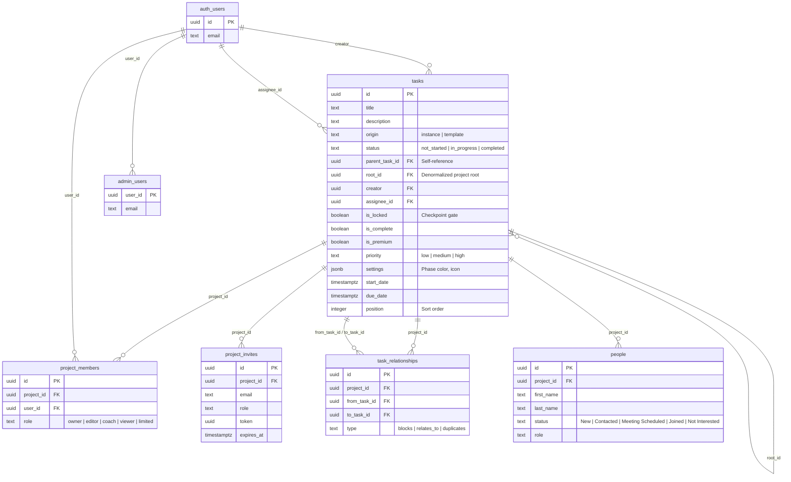

# PlanterPlan — Complete Architecture Reference

> **Last Updated**: 2026-02-11  
> **Status**: Alpha (Refactoring Phase)  
> **Commit**: HEAD on `main`

---

## Table of Contents

1. [System Overview](#1-system-overview)
2. [Tech Stack](#2-tech-stack)
3. [Directory Structure (Feature-Sliced Design)](#3-directory-structure)
4. [Application Entry & Provider Tree](#4-application-entry--provider-tree)
5. [Routing](#5-routing)
6. [State Management & Contexts](#6-state-management--contexts)
7. [API Adapter Layer — `planterClient`](#7-api-adapter-layer)
8. [Feature Domains](#8-feature-domains)
9. [Database Schema](#9-database-schema)
10. [Security Model](#10-security-model)
11. [Real-Time Data Flow](#11-real-time-data-flow)
12. [Shared UI Component Library](#12-shared-ui-component-library)
13. [Build Pipeline & Optimization](#13-build-pipeline--optimization)
14. [Testing Strategy](#14-testing-strategy)
15. [CI/CD & GitHub Automation](#15-cicd--github-automation)
16. [Key Architectural Decisions](#16-key-architectural-decisions)

---

## 1. System Overview

PlanterPlan is a **project management tool tailored for church planting**. It models everything as a hierarchical **task tree**: a "Project" is a root-level task with no parent. The system supports two paradigms:

- **Templates** — Standardized, reusable task trees (`origin = 'template'`) curated in a Master Library.
- **Instances** — Active projects created by **deep-cloning** a template (`origin = 'instance'`), giving each church planter a personalized, editable copy.

Users manage projects through a multi-view interface (list, board, phases), with role-based access control, team membership, and people/CRM tracking.


---

## 2. Tech Stack

| Layer | Technology | Version | Purpose |
|-------|-----------|---------|---------|
| **Runtime** | React | 19 | UI framework |
| **Build** | Vite | 7 | Dev server, bundler, HMR |
| **Styling** | Tailwind CSS | v4 | Utility-first CSS |
| **Component Primitives** | Radix UI | Various | Accessible headless UI primitives |
| **Animations** | Framer Motion | 12 | Layout and interaction animations |
| **Icons** | Lucide React | 0.563 | Icon library |
| **Charts** | Recharts | 3 | Data visualization |
| **Drag & Drop** | dnd-kit | 6/10 | Kanban board, task reordering |
| **Server Queries** | TanStack React Query | 5 | Server state cache & invalidation |
| **Routing** | React Router DOM | 7 | Client-side navigation |
| **Validation** | Zod | 4 | Schema validation |
| **Sanitization** | DOMPurify | 3 | XSS protection for rich text |
| **Dates** | date-fns | 4 | Date formatting & manipulation |
| **Backend** | Supabase | 2.95 | Auth, Postgres, Realtime, Storage |
| **Unit Tests** | Vitest + RTL | 4 / 16 | Component & hook testing |
| **E2E Tests** | Playwright | 1.58 | End-to-end browser testing |
| **Linting** | ESLint | 9 | Code quality |
| **Formatting** | Prettier | 3 | Code formatting |

---

## 3. Directory Structure

The codebase follows a modified **Feature-Sliced Design (FSD)** pattern with Vite path aliases.

```
PlanterPlan-Alpha/
├── docs/                    # Documentation & DB schema
│   ├── db/schema.sql        # Full database DDL (tables, views, RPCs, RLS)
│   ├── ARCHITECTURE.md      # Component diagrams (legacy)
│   └── operations/          # Operational guides
├── e2e/                     # Playwright E2E test suites
├── public/                  # Static assets
├── scripts/                 # Utility scripts
├── supabase/                # Supabase config, edge functions, seeds
│   ├── config.toml
│   ├── functions/
│   └── seeds/
├── src/
│   ├── app/                 # @app — Global wiring
│   │   ├── App.jsx          # Root component, router, provider tree
│   │   ├── supabaseClient.js# Supabase SDK singleton
│   │   ├── constants/       # App-wide constants (roles, statuses)
│   │   └── contexts/        # React Context providers (5)
│   │
│   ├── features/            # @features — Business domains (11)
│   │   ├── auth/            # Login/signup components
│   │   ├── dashboard/       # Dashboard widgets (ProjectCard, Stats, Pipeline)
│   │   ├── library/         # Master Library (template browsing, cloning)
│   │   ├── mobile/          # Mobile-specific UX (FAB, Agenda)
│   │   ├── navigation/      # Sidebar navigation (App + Project)
│   │   ├── onboarding/      # First-run experience
│   │   ├── people/          # CRM Lite (contact management)
│   │   ├── projects/        # Project CRUD, membership, phases
│   │   ├── reports/         # Project reporting (print view)
│   │   ├── task-drag/       # Drag-and-drop logic (dnd-kit)
│   │   └── tasks/           # Task CRUD, board, list, details
│   │
│   ├── shared/              # @shared — Reusable, domain-agnostic
│   │   ├── api/             # planterClient.js (Supabase adapter)
│   │   ├── lib/             # Pure utilities (date-engine, tree, validation)
│   │   ├── model/           # Shared data models
│   │   ├── test/            # Test utilities
│   │   └── ui/              # 54 Radix-based design system components
│   │
│   ├── pages/               # @pages — Route-level views (7)
│   │   ├── Dashboard.jsx
│   │   ├── Home.jsx         # Public landing page
│   │   ├── Project.jsx      # Single project view (tabs: board, list, phases)
│   │   ├── Reports.jsx
│   │   ├── Settings.jsx
│   │   ├── TasksPage.jsx
│   │   └── Team.jsx
│   │
│   ├── layouts/             # @layouts — Page layout shells
│   │   ├── DashboardLayout.jsx  # Authenticated layout with sidebar
│   │   └── PlanterLayout.jsx    # Minimal layout wrapper
│   │
│   ├── entities/            # @entities — Domain entity definitions
│   │   ├── project/
│   │   └── task/
│   │
│   ├── styles/              # CSS globals
│   │   ├── globals.css      # Tailwind v4 theme tokens & design system
│   │   └── index.css        # Entry point
│   │
│   └── main.jsx             # Vite entry point
│
├── package.json
├── vite.config.js
├── playwright.config.ts
└── eslint.config.js
```

### Path Aliases (vite.config.js)

| Alias | Maps To |
|-------|---------|
| `@app` | `src/app` |
| `@features` | `src/features` |
| `@pages` | `src/pages` |
| `@shared` | `src/shared` |
| `@layouts` | `src/layouts` |
| `@entities` | `src/entities` |
| `@widgets` | `src/widgets` |
| `@` | `src/` (catch-all) |

---

## 4. Application Entry & Provider Tree

The app boots from `src/main.jsx` → `App.jsx`. The provider tree wraps the entire application in this order:


| Provider | File | Responsibility |
|----------|------|----------------|
| **ThemeProvider** | `contexts/ThemeContext.jsx` | Dark/light mode with system sync + persistent toggle |
| **AuthProvider** | `contexts/AuthContext.jsx` | Supabase JWT session, user state, admin role check via RPC |
| **ViewAsProviderWrapper** | `contexts/ViewAsProviderWrapper.jsx` | Admin "View As" role impersonation |
| **ToastProvider** | `contexts/ToastContext.jsx` | Global toast notification system |

---

## 5. Routing

Routing uses **React Router DOM v7** with lazy-loaded pages, a `ProtectedRoute` guard, and auto-redirect logic.

| Route | Page Component | Auth Required | Notes |
|-------|---------------|---------------|-------|
| `/` | `Home` | No | Redirects to `/dashboard` if authenticated |
| `/login` | `LoginForm` | No | Redirects to `/dashboard` if authenticated |
| `/dashboard` | `DashboardPage` | ✅ | Main hub: project list, stats, pipeline |
| `/project/:id` | `ProjectPage` | ✅ | Single project with tabs (Board, List, Phases, People) |
| `/reports` | `ReportsPage` | ✅ | Lazy loaded |
| `/settings` | `SettingsPage` | ✅ | Lazy loaded |
| `/team` | `TeamPage` | ✅ | Team management |
| `/tasks` | `TasksPage` | ✅ | Flat task list view |
| `/board` | `TaskList` | ✅ | Legacy Kanban board |
| `/report/:projectId` | `ProjectReport` | ✅ | Legacy print-ready project report |
| `*` | — | — | Catch-all → redirect to `/` |

---

## 6. State Management & Contexts

The app uses a **server-state-first** architecture with TanStack React Query for caching and five React Contexts for global client state.


### Context Details

| Context | Key State | Consumers |
|---------|-----------|-----------|
| **AuthContext** | `user`, `loading`, `signIn()`, `signOut()`, `signUp()` | All protected routes, service calls |
| **ThemeContext** | `theme` (light/dark/system), `toggleTheme()` | Layout components, all styled elements |
| **ViewAsContext** | `viewAsRole`, `setViewAs()` | Admin tools, permission-gated UI |
| **ToastContext** | Toast queue, `showToast()` | Any component needing user feedback |

### Custom Hooks (Business Logic)

| Hook | Domain | Responsibility |
|------|--------|----------------|
| `useProjectData` | Projects | Fetches project metadata, hierarchy, members via React Query |
| `useProjectMutations` | Projects | Create, update, delete projects with optimistic updates |
| `useProjectRealtime` | Projects | Supabase Realtime subscription for project changes |
| `useUserProjects` | Projects | Current user's owned + joined projects |
| `useTaskBoard` | Tasks | **Facade hook** composing drag, operations, queries for the board |
| `useTaskQuery` | Tasks | React Query wrappers for task data fetching |
| `useTaskMutations` | Tasks | Task CRUD with cache invalidation |
| `useTaskSubscription` | Tasks | Realtime listener → query invalidation |
| `useTaskOperations` | Tasks | High-level task operations (status, position) |
| `useTaskForm` | Tasks | Form state management for task create/edit |
| `useTaskDrag` | Tasks | dnd-kit integration for drag-and-drop |

---

## 7. API Adapter Layer

### `planterClient.js` — The Data Access Layer

All database operations go through `planterClient`, a custom adapter that wraps **raw `fetch()` calls** to the Supabase REST API. This was adopted to work around `AbortError` instability in the Supabase JS SDK's `fetch` implementation.


### Entity Client Factory

`createEntityClient(tableName)` generates a standard CRUD interface for any Supabase table:

| Method | Description |
|--------|-------------|
| `list()` | Fetch all records |
| `get(id)` | Fetch single record by UUID |
| `create(payload)` | Insert a new record |
| `update(id, payload)` | Patch a record |
| `delete(id)` | Delete a record |
| `filter(filters)` | Query with key-value filters |
| `upsert(payload, options)` | Insert or update with conflict handling |

### Registered Entities

| Entity Name | Supabase Table | Custom Overrides |
|-------------|---------------|-----------------|
| `Project` | `tasks` | `list()` filters for root tasks; `create()` maps project fields; `listByCreator()`, `listJoined()`, `addMember()`, `addMemberByEmail()` |
| `Task` | `tasks` | Standard CRUD |
| `Phase` | `tasks` | Standard CRUD (alias) |
| `Milestone` | `tasks` | Standard CRUD (alias) |
| `TaskWithResources` | `tasks_with_primary_resource` (view) | Standard CRUD |
| `TaskResource` | `task_resources` | Standard CRUD |

### Authentication Flow

The `planterClient` reads the Supabase JWT from `localStorage` to authenticate raw fetch calls. The token key follows the pattern: `sb-{project-ref}-auth-token`.

---

## 8. Feature Domains

### 8.1 Tasks (`features/tasks/`)

The largest domain. Manages the core task lifecycle.

```
tasks/
├── components/          # 16 components + board subdirectory
│   ├── TaskList.jsx     # Main dashboard: sidebar + task view + details panel
│   ├── TaskItem.jsx     # Single task row with inline editing
│   ├── TaskDetailsView.jsx  # Full task detail panel
│   ├── TaskDetailsPanel.jsx # Wrapper for details slide-out
│   ├── ProjectTasksView.jsx # Task list filtered by project
│   ├── ProjectListView.jsx  # Virtualized list (react-virtuoso)
│   ├── TaskResources.jsx    # File/link attachments
│   ├── TaskDependencies.jsx # Relationship management UI
│   ├── InlineTaskInput.jsx  # Quick-add task inline
│   ├── board/
│   │   ├── ProjectBoardView.jsx  # Kanban board container
│   │   ├── BoardColumn.jsx       # Status column
│   │   └── BoardTaskCard.jsx     # Draggable task card
│   └── ... (forms, controls, selects)
├── hooks/               # 8 hooks (see §6)
├── services/
│   ├── taskService.js       # Hierarchy, CRUD, relationships, date propagation
│   ├── taskCloneService.js  # Deep clone logic (calls clone_project_template RPC)
│   └── taskResourcesService.js  # File upload/download
└── lib/
    └── (task-specific utilities)
```

### 8.2 Projects (`features/projects/`)

Project lifecycle: creation, editing, membership, phases.

```
projects/
├── components/
│   ├── ProjectHeader.jsx       # Title, status, settings bar
│   ├── ProjectTabs.jsx         # Board | List | Phases | People tabs
│   ├── PhaseCard.jsx           # Gated phase with checkpoint logic
│   ├── MilestoneSection.jsx    # Collapsible milestone group
│   ├── AddTaskModal.jsx        # Modal for adding tasks
│   ├── EditProjectModal.jsx    # Project settings editor
│   ├── NewProjectForm.jsx      # Create project wizard
│   ├── InviteMemberModal.jsx   # Team member invitation
│   ├── InstanceList.jsx        # List of project instances
│   ├── JoinedProjectsList.jsx  # Projects user was invited to
│   └── TaskDetailsModal.jsx    # Task detail in modal context
├── hooks/
│   ├── useProjectData.js       # All project queries
│   ├── useProjectMutations.js  # Create/update/delete
│   ├── useProjectRealtime.js   # Realtime subscription
│   └── useUserProjects.js      # User's project list
├── services/
│   └── projectService.js       # Membership, CRUD, stats, RPC calls
└── utils/
```

### 8.3 Dashboard (`features/dashboard/`)

Main landing experience after login.

| Component | Purpose |
|-----------|---------|
| `CreateProjectModal` | Template selection + project creation wizard |
| `ProjectCard` | Uniform project tile with progress indicator |
| `ProjectPipelineBoard` | Pipeline/kanban view of all projects by status |
| `StatsOverview` | Summary cards (total projects, tasks, completion %) |

### 8.4 Navigation (`features/navigation/`)

Dual-sidebar navigation system.

| Component | Purpose |
|-----------|---------|
| `AppSidebar` | Global sidebar: Dashboard, Reports, Settings, Team links |
| `ProjectSidebar` | Context-aware sidebar showing project tree |
| `ProjectSidebarContainer` | Wrapper managing sidebar state |
| `Header` | Top header bar with user menu and theme toggle |
| `ViewAsSelector` | Admin role impersonation dropdown |
| `SidebarNavItem` / `GlobalNavItem` | Reusable nav link components |

### 8.5 Library (`features/library/`)

Master template library for browsing and cloning templates.

- **Components**: `MasterLibraryList`, `MasterLibraryItem`, `MasterLibrarySearch`
- **Hooks**: `useMasterLibrary`, `useMasterLibrarySearch`, `useLibraryActions`
- **Services**: `libraryService`

### 8.6 People — CRM Lite (`features/people/`)

Contact management for church planting teams.

- **Components**: `PeopleList`, `PersonCard`, `AddPersonModal`
- **Services**: `peopleService`

### 8.7 Reports (`features/reports/`)

- `ProjectReport` — Print-ready project view with completion statistics
- `ReportCard` — Summary card for report listings
- `ReportExport` — Export functionality

### 8.8 Mobile (`features/mobile/`)

Mobile-specific UX enhancements:

- `MobileFAB` — Floating Action Button for quick actions
- `MobileAgenda` — "Today's Agenda" focused task view

### 8.9 Auth (`features/auth/`)

- `LoginForm` — Email/password sign-in + sign-up

### 8.10 Onboarding (`features/onboarding/`)

First-run experience for new users.

### 8.11 Task Drag (`features/task-drag/`)

Encapsulated dnd-kit drag-and-drop logic:

- `lib/` — Drag computation, collision detection, position recalculation
- `model/` — Drag state models

---

## 9. Database Schema

The database runs on **Supabase-hosted PostgreSQL** with `pgcrypto` extension.

### 9.1 Entity-Relationship Diagram



### 9.2 Tables

| Table | Purpose | Key Columns |
|-------|---------|-------------|
| `tasks` | Core table — stores projects AND tasks in a single hierarchy | `parent_task_id` (adjacency list), `root_id` (denormalized root for fast tree queries), `origin` (template/instance) |
| `project_members` | RBAC membership | `project_id`, `user_id`, `role` (5 roles) |
| `project_invites` | Pending email invitations | `token` (UUID), `expires_at` (7 days) |
| `task_relationships` | Task dependencies | `from_task_id` → `to_task_id`, `type` (blocks/relates_to/duplicates) |
| `people` | CRM contacts per project | `project_id`, `status` (pipeline states) |
| `admin_users` | Explicit admin grants | `user_id`, `granted_by` |

### 9.3 Views

| View | Purpose |
|------|---------|
| `tasks_with_primary_resource` | Legacy adapter: joins tasks with NULL resource columns |
| `view_master_library` | Filters `tasks` to `origin = 'template'` for the template browser |

### 9.4 Indexes

| Index | Column(s) | Purpose |
|-------|-----------|---------|
| `idx_tasks_root_id` | `root_id` | Fast project-scoped tree queries |
| `idx_tasks_parent_id` | `parent_task_id` | Hierarchy traversal |
| `idx_tasks_is_locked` | `is_locked` | Checkpoint filtering |
| `idx_tasks_is_premium` | `is_premium` | Premium feature gating |
| `idx_people_project_id` | `project_id` | People lookup by project |

### 9.5 Server-Side Functions (RPCs)

| Function | Purpose | Security |
|----------|---------|----------|
| `is_admin(p_user_id)` | Check `admin_users` table | `SECURITY DEFINER` |
| `has_project_role(p_project_id, p_user_id, p_allowed_roles[])` | RBAC role check | `SECURITY DEFINER` |
| `clone_project_template(...)` | Deep clone: recursively copies entire task tree + resources via temp tables | `SECURITY DEFINER`, `authenticated` + `service_role` |
| `invite_user_to_project(...)` | Invite by email: auto-adds if user exists, creates invite token if not | `SECURITY DEFINER` |
| `get_invite_details(p_token)` | Look up invite by token (for onboarding) | `SECURITY DEFINER`, `anon` + `authenticated` |
| `initialize_default_project(...)` | Creates a 6-phase church planting template (Discovery → Growth) with scaffolded milestones and tasks | `SECURITY DEFINER` |

### 9.6 Triggers

| Trigger | Event | Action |
|---------|-------|--------|
| `trg_unlock_next_phase` | `AFTER UPDATE OF status ON tasks` | When a phase is completed, unlocks the next sibling phase by position |
| `trg_auto_add_project_owner` | `AFTER INSERT ON tasks` | Auto-adds creator as `owner` in `project_members` for root projects |
| `handle_phase_completion()` | (backing function) | Sets `is_locked = false` on the next task by position |

---

## 10. Security Model

### 10.1 Authentication

- **Supabase Auth** (GoTrue) handles JWT-based authentication
- `AuthContext.jsx` listens for `onAuthStateChange` events (`SIGNED_IN`, `SIGNED_OUT`, `TOKEN_REFRESHED`, `INITIAL_SESSION`)
- Admin status is determined via the `is_admin()` RPC with a 10-second timeout fallback
- Roles: `admin` (from `admin_users` table), `owner` (default for authenticated users), `viewer` (fallback on error)

### 10.2 Row-Level Security (RLS)

RLS is **enabled on all tables**. Policies enforce data isolation:

| Table | SELECT | INSERT | UPDATE | DELETE |
|-------|--------|--------|--------|--------|
| `tasks` | Creator OR any project role | Root projects: creator only; Children: owner/editor role | Creator OR owner/editor role | Creator OR owner/editor role |
| `project_members` | Any project role OR admin | Owner OR admin | Owner OR admin | Owner OR admin |
| `project_invites` | Owner/editor OR admin | Owner/editor OR admin | — | Owner/editor OR admin |
| `people` | Any project role OR admin | Owner/editor OR admin | Owner/editor OR admin | Owner/editor OR admin |
| `task_relationships` | Any project member | Owner/editor | — | Owner/editor |
| `admin_users` | RLS enabled (self + admin) | — | — | — |

### 10.3 RBAC Roles

Five project-level roles with cascading permissions:

| Role | View | Edit Tasks | Manage Members | Delete Project |
|------|------|------------|----------------|----------------|
| `owner` | ✅ | ✅ | ✅ | ✅ |
| `editor` | ✅ | ✅ | ✅ (invite) | ❌ |
| `coach` | ✅ | ❌ | ❌ | ❌ |
| `viewer` | ✅ | ❌ | ❌ | ❌ |
| `limited` | ✅ (restricted) | ❌ | ❌ | ❌ |

### 10.4 Client-Side Security

- **DOMPurify** sanitizes user-generated HTML/rich text
- **Zod** validates form inputs before submission
- **`SECURITY DEFINER`** on all RPC functions ensures they run with elevated privileges within controlled boundaries

---

## 11. Real-Time Data Flow

The app uses a **Stale-While-Revalidate** strategy enhanced by Supabase Realtime.


### Subscription Hooks

| Hook | Channel | Events | Invalidates |
|------|---------|--------|-------------|
| `useTaskSubscription` | `tasks` table | INSERT, UPDATE, DELETE | `['projectHierarchy', projectId]` |
| `useProjectRealtime` | `tasks` table (root) | UPDATE | `['project', projectId]` |

---

## 12. Shared UI Component Library

The `src/shared/ui/` directory contains **54 reusable components** built on Radix UI primitives + Tailwind CSS, following the shadcn/ui pattern.

### Component Categories

| Category | Components |
|----------|-----------|
| **Layout** | `Card`, `Separator`, `AspectRatio`, `ScrollArea`, `Resizable` |
| **Navigation** | `Breadcrumb`, `NavigationMenu`, `Tabs`, `Pagination`, `Menubar` |
| **Data Display** | `Table`, `Badge`, `Avatar`, `Progress`, `Skeleton`, `Chart` |
| **Feedback** | `Alert`, `AlertDialog`, `Toast`, `Toaster`, `Sonner` |
| **Forms** | `Button`, `Input`, `Textarea`, `Label`, `Checkbox`, `RadioGroup`, `Select`, `Switch`, `Slider`, `Calendar`, `InputOTP`, `Form` |
| **Overlays** | `Dialog`, `Sheet`, `Drawer`, `Popover`, `Tooltip`, `HoverCard`, `DropdownMenu`, `ContextMenu` |
| **Composition** | `Accordion`, `Collapsible`, `Carousel`, `ToggleGroup`, `Command`, `CommandPalette` |
| **App-Specific** | `ErrorBoundary`, `ErrorFallback`, `EmptyState`, `StatusCard`, `RoleIndicator` |

### Design System Utilities

| Utility | File | Purpose |
|---------|------|---------|
| `cn()` | `shared/lib/utils.js` | Merges Tailwind classes with `clsx` + `tailwind-merge` |
| `cva()` | `class-variance-authority` | Variant-based component styling |

---

## 13. Build Pipeline & Optimization

### Vite Configuration

| Setting | Value | Notes |
|---------|-------|-------|
| Dev server | `127.0.0.1:3000` | Does not auto-open browser |
| Build output | `build/` | Production bundle |
| Chunk size warning | 1000 KB | |

### Code Splitting (Manual Chunks)

The build uses **manual chunk splitting** for optimal loading:

| Chunk Name | Contents |
|------------|----------|
| `ui` | `@radix-ui/*` |
| `charts` | `recharts` |
| `motion` | `framer-motion` |
| `supabase` | `@supabase/*` |
| `icons` | `lucide-react` |
| `vendor-{name}` | Other `node_modules` packages |

### Lazy Loading

- `ReportsPage` and `SettingsPage` are **React.lazy** loaded
- `SidebarSkeleton` renders during Suspense fallback

---

## 14. Testing Strategy

### Unit & Integration Tests (Vitest + React Testing Library)

| Configuration | Value |
|---------------|-------|
| Test runner | Vitest 4 |
| DOM environment | jsdom |
| Setup file | `src/setupTests.js` |
| Exclusions | `node_modules`, `dist`, `e2e` |

Key test files:
- `useTaskBoard.test.jsx` — Board hook logic
- `PhaseCard.test.jsx` — Phase checkpoint behavior
- `CreateProjectModal.test.jsx` — Project creation flow
- `taskService.test.js` — Service layer
- `taskCloneService.test.js` — Deep clone logic
- `retry.test.js` — Fetch retry utility
- `validation.test.js` — Input validation
- `MobileAgenda.test.jsx` — Mobile agenda

### E2E Tests (Playwright)

| Suite | Coverage |
|-------|----------|
| `golden-paths.spec.ts` | Login → Dashboard → Project → Board → Task details |
| `auth.spec.ts` | Login, logout, session persistence |
| `theme-integrity.spec.ts` | Dark/light mode across all views |
| `security.spec.ts` | Unauthorized access prevention |
| `simple.spec.ts` | Smoke test (page loads) |

Playwright is configured to target `localhost:3000` with the Chromium project.

---

## 15. CI/CD & GitHub Automation

| File | Purpose |
|------|---------|
| `.github/workflows/` | 2 GitHub Actions workflow files |
| `.github/dependabot.yml` | Automated dependency updates |
| `.github/release-drafter.yml` | Auto-generated release notes |
| `.github/pull_request_template.md` | Standardized PR descriptions |

---

## 16. Key Architectural Decisions

### ADR-1: Everything is a Task

**Decision**: Projects, phases, milestones, and tasks all live in the same `tasks` table.

**Rationale**: Simplifies the data model — a "project" is just a root task. Hierarchy is maintained via `parent_task_id` (adjacency list) with a `root_id` denormalization for fast full-tree fetches without recursive queries.

**Trade-off**: Requires careful filtering to distinguish projects from sub-tasks.

---

### ADR-2: Raw Fetch Over Supabase SDK

**Decision**: The `planterClient` uses `rawSupabaseFetch()` (native `fetch`) instead of the Supabase JavaScript SDK for data operations.

**Rationale**: The Supabase JS SDK exhibited persistent `AbortError` issues in the browser environment, causing unreliable data fetching. Raw fetch with manual JWT attachment proved more stable.

**Trade-off**: Loses SDK conveniences (automatic typing, query builder chaining) but gains reliability and explicit control.

---

### ADR-3: Server-Side Deep Clone via RPC

**Decision**: Template cloning is performed server-side via the `clone_project_template()` PostgreSQL function, not client-side.

**Rationale**: Cloning entire task trees (potentially hundreds of records) with resources must be atomic and consistent. A server-side function with temp tables and a single transaction ensures no orphaned records.

---

### ADR-4: Feature-Sliced Design

**Decision**: Organize code by business domain (`features/tasks/`, `features/projects/`) rather than technical role (`components/`, `hooks/`).

**Rationale**: Enables independent reasoning about each domain, clearer ownership, and fewer circular dependencies. Each feature slice contains its own components, hooks, services, and tests.

---

### ADR-5: Checkpoint-Based Phase Gating

**Decision**: Phases have an `is_locked` field that is automatically unlocked by a database trigger (`trg_unlock_next_phase`) when the previous phase is completed.

**Rationale**: Enforces sequential workflow for church planting (you can't launch before planning). The trigger ensures consistency regardless of which client performs the update.

---

### ADR-6: RBAC via Database Functions

**Decision**: All permission checks are done via `has_project_role()` PostgreSQL function called from RLS policies, not application code.

**Rationale**: Security is enforced at the database level. Even if the frontend is bypassed, unauthorized operations are blocked by RLS. The `SECURITY DEFINER` flag ensures the functions run with appropriate privileges.

---

*This document is auto-generated from the codebase at HEAD. For operational guides, see `docs/operations/`. For the database DDL, see `docs/db/schema.sql`.*
