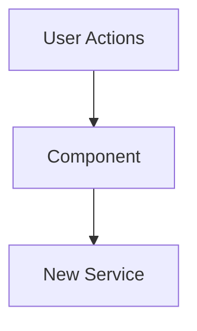

# Pull Request: [Title e.g., Weekend Batch P1.4 - Team Management]

## 📋 Summary

## 🗺️ Roadmap Progress

| Item ID | Feature Name   | Phase | Status    | Notes                 |
| ------- | -------------- | ----- | --------- | --------------------- |
| [P1-UI] | [Deep Copy]    | 1     | ✅ Done   | wired in TaskList.jsx |
| [P2-DB] | [RLS Policies] | 2     | ⚠️ Review | Security critical     |

## 🏗️ Architecture Decisions

### Key Patterns & Decisions

- **Pattern A:** [Explanation of why we chose this approach]
- **Tech Debt:** [e.g., Deep clone logic lives in TaskList.jsx for now; needs extraction to hook later.]

### Logic Flow / State Changes



## 🔍 Review Guide

### 🚨 High Risk / Security Sensitive

- `path/to/policies.sql` - [Why is this risky? e.g., RLS Policy Change]
- `path/to/auth_service.js` - [Authentication logic]

### 🧠 Medium Complexity

- `path/to/feature_component.jsx` - [Core logic implementation]

### 🟢 Low Risk / Boilerplate

- `path/to/styles.css`
- `path/to/fixtures.json`

## 🧪 Verification Plan

### 1. Environment Setup

- [ ] Run `npm install` (New dependencies added: `[package-name]`)
- [ ] Run migration: `[filename].sql`

### 2. Seed Data (Copy/Paste)

```sql
-- Example: Insert a test user to verify invites
INSERT INTO public.profiles (id, email) VALUES ('uuid-123', 'tester@test.com');

```

### 3. Test Scenarios

1. **Happy Path:** [Step-by-step instructions]
2. **Edge Case:** [What happens if network fails?]

---

<details>
<summary><strong>📉 Detailed Changelog (Collapsible)</strong></summary>

- `src/components/TaskItem.jsx`: Added `data-testid` for selection
- `src/utils/dateUtils.js`: Fixed offset calculation bug
- ...

</details>
