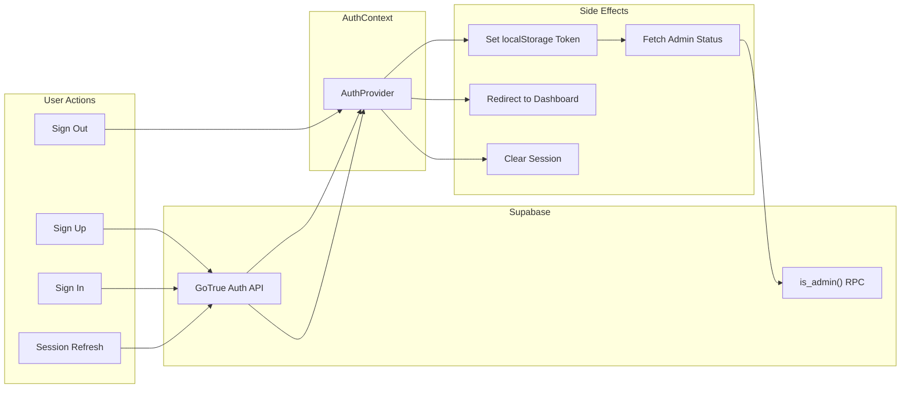
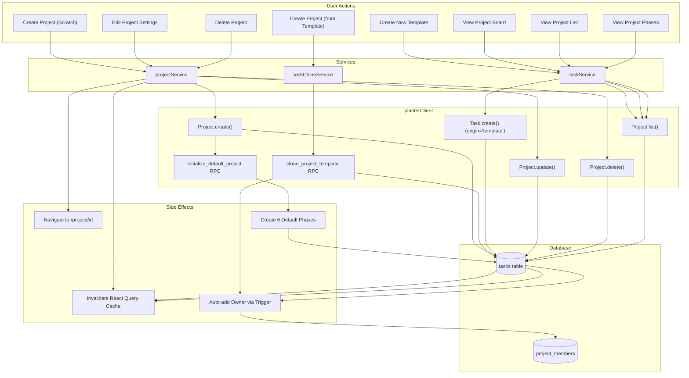
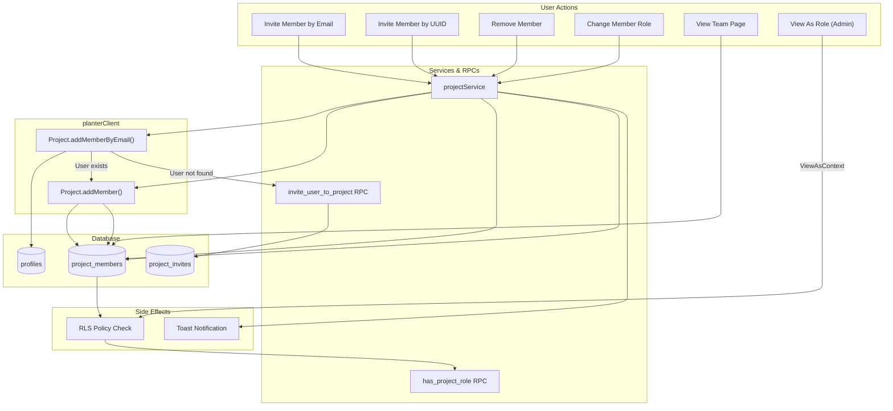
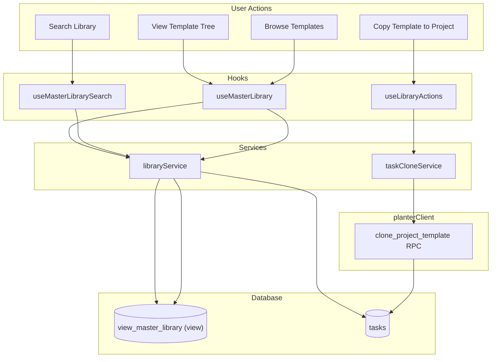
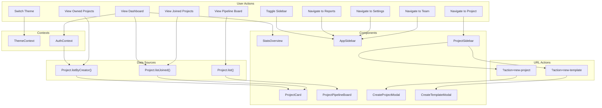
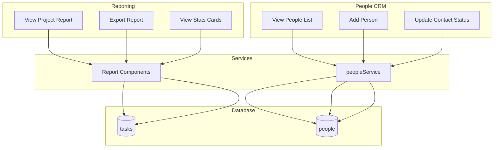
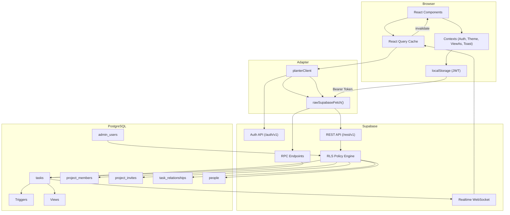
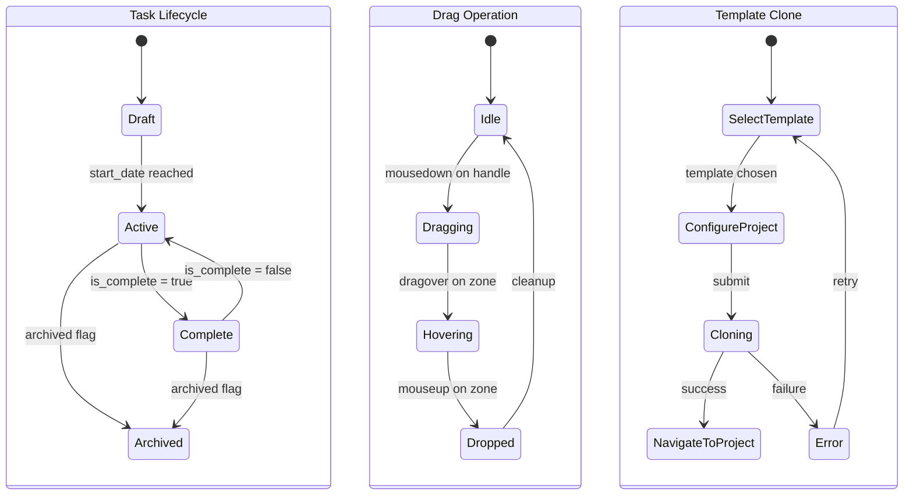

# PlanterPlan — Project Mind Map

> **Last Updated**: 2026-02-21  
> **Purpose**: A complete catalog of context files + a visual breakdown of all actions, data flows, and component interactions across the application.

---

## 1. Context File Catalog

Every file that gives meaningful context about this project, organized by role.

### 📐 Architecture & Design

| File | Purpose | Priority |
|:-----|:--------|:---------|
| [FULL_ARCHITECTURE.md](FULL_ARCHITECTURE.md) | **Single Source of Truth** — 900+ line deep reference covering tech stack, FSD structure, provider tree, API adapter, all 11 feature domains, DB schema, security model, realtime flow, ADRs, and legacy component diagrams | 🔴 Critical |
| [repo-context.yaml](../repo-context.yaml) | Machine-readable semantic dependency graph, behavior specs, contracts, state machines, and health metrics | 🔴 Critical |
| [AGENT_CONTEXT.md](AGENT_CONTEXT.md) | Quick-start codebase map for AI agents — directory structure, key patterns, golden path files | 🔵 Useful |
r
---

### 📊 Product & Roadmap

| File | Purpose | Priority |
|:-----|:--------|:---------|
| [README.md](../README.md) | Project overview, setup instructions, feature summary | 🔴 Critical |
| [spec.md](../spec.md) | Full project spec, roadmap, and status checklist | 🔴 Critical |
| [deep-research-report.md](../deep-research-report.md) | Deep competitive/market research analysis | 🟡 Reference |

---

### 🗄️ Database & Schema

| File | Purpose | Priority |
|:-----|:--------|:---------|
| [schema.sql](db/schema.sql) | **Full DDL** — 37K of tables, views, indexes, RLS policies, RPCs, triggers | 🔴 Critical |
| [one_time_setup.sql](db/one_time_setup.sql) | Initial DB bootstrap script | 🟡 Reference |
| [config.toml](../supabase/config.toml) | Supabase local config (auth, API, storage, realtime settings) | 🟡 Reference |

---

### 🧪 Testing & Quality

| File | Purpose | Priority |
|:-----|:--------|:---------|
| [testing-strategy.md](operations/testing-strategy.md) | Detailed testing methodology and patterns | 🔵 Useful |
| [playwright-e2e-testing-system.md](../playwright-e2e-testing-system.md) | E2E infrastructure reference (69K) | 🟡 Reference |
| [e2e-helpers.ts](../e2e/fixtures/e2e-helpers.ts) | Centralized test auth/mock helpers | 🔵 Useful |
| [agent-test-scripts.md](operations/agent-test-scripts.md) | Structured manual test scripts for AI agents | 🟢 Low |

---

### ⚙️ Operations & DevOps

| File | Purpose | Priority |
|:-----|:--------|:---------|
| [local_development.md](operations/local_development.md) | Local dev setup guide | 🔵 Useful |
| [SAFE_MIGRATION.md](operations/SAFE_MIGRATION.md) | Database migration safety procedures | 🟡 Reference |
| [playwright.config.ts](../playwright.config.ts) | E2E test runner configuration | 🔵 Useful |
| [vite.config.js](../vite.config.js) | Build system, path aliases, chunk splitting | 🔵 Useful |
| [package.json](../package.json) | Dependencies, scripts, project metadata | 🔵 Useful |

---

### 🔧 Configuration & CI

| File | Purpose | Priority |
|:-----|:--------|:---------|
| [.env](../.env) | Supabase URL/Key, test credentials | 🔵 Useful |
| [eslint.config.js](../eslint.config.js) | Linting rules | 🟢 Low |
| [jsconfig.json](../jsconfig.json) | Path alias resolution for IDE | 🟢 Low |
| [dependabot.yml](../.github/dependabot.yml) | Automated dependency updates | 🟢 Low |
| [pull_request_template.md](../.github/pull_request_template.md) | PR template | 🟢 Low |

---

### 📝 Tracking & Debt

| File | Purpose | Priority |
|:-----|:--------|:---------|
| [DEBT_REPORT.md](../DEBT_REPORT.md) | Technical debt log | 🟡 Reference |
| [LESSONS.md](../LESSONS.md) | Engineering lessons learned — 260 entries of hard-won knowledge (17K) | 🔴 Critical |
| [TODO.md](../TODO.md) | Active backlog items | 🔵 Useful |

---

### 🚀 Source Code Entry Points

| File | Purpose | Priority |
|:-----|:--------|:---------|
| [App.jsx](../src/app/App.jsx) | Root component — provider tree, routing, AuthSeeder | 🔴 Critical |
| [planterClient.js](../src/shared/api/planterClient.js) | API adapter layer — all data access | 🔴 Critical |
| [TaskTree.tsx](../src/features/tasks/components/TaskTree/TaskTree.tsx) | Core Task Tree logic & recursion | 🔴 Critical |
| [main.jsx](../src/main.jsx) | Vite entry point | 🟡 Reference |
| [globals.css](../src/styles/globals.css) | Tailwind v4 theme tokens & design system | 🔵 Useful |

---

## 2. System Mind Map — High-Level Architecture

```mermaid
mindmap
  root((PlanterPlan))
    Auth & Access
      Supabase GoTrue
      AuthContext
        callWithTimeout 10s guard
        Bounded admin-role RPC
      JWT via localStorage
      5 RBAC Roles
        Owner
        Editor
        Coach
        Viewer
        Limited
      Client-Side RBAC Guards
        canEdit permission gating
        Disabled controls for Viewers
      RLS on All Tables
      Admin Users Table
    Data Layer
      planterClient Adapter
        Raw Fetch to REST API
        Entity Client Factory
        6 Registered Entities
        - [x] **Wave 9: Security & Permissions**
          - [x] Verified RLS for `tasks` (Owner/Editor write, Viewer read).
          - [x] Verified `project_members` policies (Owner/Admin only).
          - [x] Verified `invite_user_to_project` RPC (Editor escalation check).
          - [x] Verified `project_invites` table policy (Direct insert protection).

        - [x] **Wave 10: Stabilization & Integrity (v1.0)**
          - [x] **Root ID Integrity**:
            - [x] Backfilled `root_id` for all existing tasks.
            - [x] Added `set_root_id_from_parent` trigger for auto-maintenance.
            - [x] Added `tasks_root_id_required_for_children` CHECK constraint.
          - [x] **Date Logic**:
            - [x] Fixed `clone_project_template` to correctly shift dates based on new start date.
          - [x] **Schema Consolidation**:
            - [x] Merged `harden_invites` and `stabilization_v1` into `docs/db/schema.sql`.
            - [x] Verified and removed redundant `remove_project_creation_trigger` and `fix_rls_policy`.
            - [x] Verified and removed redundant `remove_project_creation_trigger` and `fix_rls_policy`.
            - [x] Removed temporary artifacts (`remote_schema_dump`, `schema_drift`).
            - [x] **Security Hardening**:
              - [x] Secured `invite_user_to_project` against NULL inviter role (auth bypass).
              - [x] Secured `clone_project_template` with strict ownership checks.
              - [x] Verified via `RPCHardening.test.js`.
        
        - [x] **Wave 11: Security Restorations & Bundle Cleanup**
          - [x] Pruned 12 unused `@radix-ui` dependencies and `@supabase-cache-helpers` to drastically reduce bundle size.
          - [x] Restored `XSS.test.jsx` targeting modern FSD `TaskActions`.
          - [x] Restored `RLS.test.js` checking authenticated role access in Vitest.
          - [x] Restored `AuthContext.security.test.jsx` default safeguards.
        
        - [x] **Wave 12: Repo Polish (v1.1)**
          - [x] **E2E Stabilization**: Fixed flaky logout in `auth.spec.ts` via stateful mocks and `dispatchEvent`.
          - [x] **Dependency Pruning**: Purged 19 orphaned components from `src/shared/ui/` and 11 unreferenced NPM packages.
          - [x] **ADR Sync**: Finalized ADR-002 validating React 18.3.1 for release.

        - [x] **Wave 13: Architectural & Security Hardening**
          - [x] **Auth Hardening**: Wrapped E2E bypasses in `VITE_E2E_MODE` and fixed `signOut` desync.
          - [x] **Data Performance**: Implemented granular React Query invalidation and O(1) tree rendering maps.
          - [x] **XSS Restoration**: Removed all `dangerouslySetInnerHTML` from titles/cards.
          - [x] **Decomposition**: Successfully deconstructed `useTaskBoard.js` "God Hook" into atomic features.
          - [x] **CI Resolution**: Fixed Type-Safety (useTaskMutations), DnD Deduplication, and test hangs (CreateProjectModal).
        auth.updateProfile adapter
      Supabase PostgreSQL
        tasks table
        project_members
        project_invites
        task_relationships
        people
        admin_users
      6 Server RPCs
        is_admin
        has_project_role
        clone_project_template
        invite_user_to_project (Hardened)
        get_invite_details
        initialize_default_project
      2 Triggers
        handle_updated_at (Auto Timestamp)
        trigger_phase_unlock (Auto Phase Unlock)
    Frontend Shell
      React 18.3.1 (ADR-002) + TypeScript + Vite 7
      Feature-Sliced Design (FSD)
        @app
        @pages
        @features
        @shared
        @entities
      Provider Tree
        ThemeProvider
        AuthProvider
        ViewAsWrapper
        ToastProvider
        ErrorBoundary react-error-boundary
      React Router v7
        7 Protected Routes
        2 Public Routes
      React Query Cache
        Global staleTime 2min
        Bounded retry 1
        refetchOnWindowFocus disabled
      Realtime Subscriptions
    Robustness Layer
      Error Handling
        onError toast on all mutations
        isError state on queries
        No swallowed errors
      Validation
        Project Name required
        Avatar URL regex
        Zod schema checks
      Performance
        useMemo Dashboard grouping
        useMemo Project sorting
      Theme Consistency
        Semantic design tokens
        bg-card text-card-foreground
        Full dark mode support
      UX Completeness
        Delete confirmations
        GettingStarted dismiss persist
        Coming Soon tab badges
        Loading states on modals
      Feature Domains
        Tasks Domain
          Task Tree (Recursive)
          Task Row (Logic/UI Split)
          Task Details Panel
          Task Actions
          Drag and Drop (Cycle Detection)
          Task Resources
          Inline Task Input
      Projects Domain
        Create from Scratch
        Create from Template
        Project Settings
        Membership RBAC
        Phase Management
      Dashboard Domain
        Project Cards
        Stats Overview
        Pipeline Board
        Create Modal
      Navigation Domain
        App Sidebar
        Project Sidebar
          New Project Button (?action=new-project)
          New Template Button (?action=new-template)
        Header Bar
        ViewAs Selector
      Library Domain
        Create Template Modal
          Categories: Checklist, Workflow, Blueprint
        Template Browser
        Search and Filter
        Deep Clone to Instance
      People CRM
        Contact List
        Add Person
        Status Pipeline
      Reports Domain
        Print View
        Export
        Stats Cards
      Mobile Domain
        Floating Action Button
        Agenda View
    UI System
      35 Active UI Components
      Tailwind v4 Tokens
      Framer Motion Animations
      dnd-kit Drag System
      Recharts Visualization
      Lucide Icons
    Testing
      Vitest Unit Tests
        src/tests/unit/RPCHardening.test.js (New)
        src/tests/unit/XSS.test.jsx (Restored)
        src/tests/security/RLS.test.js (Restored)
        src/tests/unit/AuthContext.security.test.jsx (Restored)
      Playwright E2E
        25 Verified Scenarios
        12 Journey Specs (Stable)
        Parametric Auth Seeding
        100% Concurrent Pass Rate
        Shared e2e-helpers
    DevOps
      GitHub Actions CI
      Dependabot
      Release Drafter
      Supabase Edge Functions
```

---

## 3. Action Flow Map — All User Actions & Their Connections

This is the core mind-map: **every user-triggerable action** in the app, what it touches, and how systems connect.

### 3.1 Authentication Actions



### 3.2 Project Lifecycle Actions



### 3.3 Task CRUD Actions

```mermaid
flowchart TD
    subgraph "User Actions"
        T1[Create Task]
        T2[Edit Task]
        T3[Complete Task]
        T4[Delete Task]
        T5[Drag & Drop Task]
        T6[Inline Add Task]
        T7[Select Task (Details Panel)]
        T8[Add Dependency]
        T9[Attach Resource]
    end

    subgraph "Hooks"
        H1[useTaskMutations]
        H2[useTaskTreeDnD]
        H3[useTaskBoard]
        H4[useTaskDetails]
        H5[useTaskForm]
        H6[useTaskOperations]
        H7[useTaskTree]
        H8[useProjectSelection]
    end

    subgraph "Services"
        TS2[taskService]
        TRS[taskResourcesService]
    end

    subgraph "planterClient"
        PC_TC["Task.create()"]
        PC_TU["Task.update()"]
        PC_TD["Task.delete()"]
        PC_TF["Task.filter()"]
        PC_TR["TaskResource.create()"]
    end

    subgraph "Database"
        DB_T2[(tasks)]
        DB_REL[(task_relationships)]
        DB_RES[(task_resources)]
    end

    subgraph "Side Effects"
        OPT[Optimistic UI Update]
        CACHE[Cache Invalidation]
        RT[Realtime Broadcast]
        DATE[Date Cascade]
        POS[Position Recalc]
        CYCLE[Cycle Detection] // New
    end

    T1 --> H1 --> TS2 --> PC_TC --> DB_T2
    T2 --> H1 --> TS2 --> PC_TU --> DB_T2
    T3 --> H6 --> TS2 --> PC_TU --> DB_T2
    T4 --> H1 --> TS2 --> PC_TD --> DB_T2
    
    T5 --> H2 --> CYCLE
    CYCLE -->|Valid| OPT --> POS --> PC_TU --> DB_T2
    CYCLE -->|Invalid| OPT -->|Revert| OPT

    T6 --> H5 --> H1
    T7 --> H4 --> PC_TF --> DB_T2
    T8 --> TS2 --> DB_REL
    T9 --> TRS --> PC_TR --> DB_RES

    DB_T2 --> RT --> CACHE
    DB_T2 --> DATE
```

### 3.4 Team & Membership Actions



### 3.5 Library & Template Actions



### 3.6 Dashboard & Navigation Actions



### 3.7 Reporting & People Actions



---

## 4. Data Flow — How Everything Connects



---

## 5. Cross-Domain Interaction Matrix

Shows which domains directly interact with each other.

| | Tasks | Projects | Dashboard | Nav | Library | People | Reports | Auth | Mobile |
|:--|:--:|:--:|:--:|:--:|:--:|:--:|:--:|:--:|:--:|
| **Tasks** | — | ✅ | ✅ | ✅ | ✅ | ❌ | ✅ | ✅ | ✅ |
| **Projects** | ✅ | — | ✅ | ✅ | ✅ | ✅ | ✅ | ✅ | ❌ |
| **Dashboard** | ✅ | ✅ | — | ✅ | ❌ | ❌ | ❌ | ✅ | ❌ |
| **Navigation** | ✅ | ✅ | ✅ | — | ❌ | ❌ | ✅ | ✅ | ❌ |
| **Library** | ✅ | ✅ | ❌ | ✅ | — | ❌ | ❌ | ✅ | ❌ |
| **People** | ❌ | ✅ | ❌ | ❌ | ❌ | — | ❌ | ✅ | ❌ |
| **Reports** | ✅ | ✅ | ❌ | ✅ | ❌ | ❌ | — | ✅ | ❌ |
| **Auth** | ✅ | ✅ | ✅ | ✅ | ✅ | ✅ | ✅ | — | ✅ |
| **Mobile** | ✅ | ❌ | ❌ | ❌ | ❌ | ❌ | ❌ | ✅ | — |

---

## 6. State Machine Summary

Three key state machines govern application behavior:



---

## 7. Robustness Hardening Audit — All 22 Items ✅

All items from the Gap Analysis have been implemented across 5 atomic waves. Each item is verified present in source.

### Wave 1: Error Handling & User Feedback

| # | Item | File(s) | Status |
|:--|:-----|:--------|:------:|
| 1.1 | `onError` toast on all 4 mutations (update, delete, create task + create project) | `Project.jsx`, `Dashboard.jsx` | ✅ |
| 1.2 | Un-swallow errors in `handleAddTask` | `Project.jsx` | ✅ |
| 1.3 | `isError` + retry state on Dashboard projects query | `Dashboard.jsx` | ✅ |
| 1.5 | Remove debug `console.log` from Dashboard | `Dashboard.jsx` | ✅ |
| 1.6 | Toast on `updateStatusMutation` `onError` | `Dashboard.jsx` | ✅ |

### Wave 2: Architectural Hygiene

| # | Item | File(s) | Status |
|:--|:-----|:--------|:------:|
| 6.2 | Global `QueryClient` defaults (`staleTime: 2min`, `retry: 1`, `refetchOnWindowFocus: false`) | `main.jsx` | ✅ |
| 6.3 | Standardize on `react-error-boundary` (removed custom `ErrorBoundary.jsx`) | `App.jsx`, `TaskTree.tsx`, `TaskRow.tsx` | ✅ |

### Wave 3: RBAC Guards & UX Completeness

| # | Item | File(s) | Status |
|:--|:-----|:--------|:------:|
| 1.4 | Delete confirmation for tasks (`window.confirm`) | `Project.jsx` | ✅ |
| 3.1 | Client-side `canEdit` RBAC guards (disable edits for viewers) | `Project.jsx` | ✅ |
| 3.2 | Settings navigation tabs → "Coming Soon" badge + disabled | `Settings.jsx` | ✅ |
| 5.1 | Loading state on `InviteMemberModal` submit | `InviteMemberModal.jsx` | ✅ |
| 5.2 | No-op handlers reviewed in `TaskDetailsModal` | `Project.jsx` | ✅ |
| 5.3 | `GettingStartedWidget` dismiss persisted to `localStorage` | `Dashboard.jsx` | ✅ |

### Wave 4: Dark Mode Token Migration

| # | Item | File(s) | Status |
|:--|:-----|:--------|:------:|
| 2.1 | `Project.jsx` → semantic tokens (`bg-card`, `text-card-foreground`, `border-border`) | `Project.jsx` | ✅ |
| 2.2 | `Settings.jsx` & `Reports.jsx` → semantic tokens | `Settings.jsx`, `Reports.jsx` | ✅ |
| 2.3 | `Home.jsx` → semantic tokens | `Home.jsx` | ✅ |

### Wave 5: Validation, Architecture & Performance

| # | Item | File(s) | Status |
|:--|:-----|:--------|:------:|
| 4.1 | Client-side validation on Project Name (required) | `CreateProjectModal.jsx` | ✅ |
| 4.2 | Avatar URL regex validation on blur | `Settings.jsx` | ✅ |
| 6.1 | Route profile updates through `planter.auth.updateProfile()` (removed raw Supabase import) | `Settings.jsx`, `planterClient.js` | ✅ |
| 7.1 | Memoize Dashboard task/member filtering via `useMemo` | `Dashboard.jsx` | ✅ |
| 7.2 | Memoize sorted phases/milestones via `useMemo` | `Project.jsx` | ✅ |

### Auth Stabilization (Cross-Cutting)

| Item | File | Status |
|:-----|:-----|:------:|
| Replace `Promise.race` timeout with `callWithTimeout(rpc, 10s)` for `is_admin` check | `AuthContext.jsx` | ✅ |

### Wave 6: Template System & Schema Hardening

| # | Item | File(s) | Status |
|:--|:-----|:--------|:------:|
| 8.1 | Fix Sidebar "New Project/Template" buttons (were stubs) | `ProjectSidebarContainer.jsx` | ✅ |
| 8.2 | URL-driven modal state (`?action=new-project`) | `Dashboard.jsx` | ✅ |
| 8.3 | Dedicated `CreateTemplateModal` with categories | `CreateTemplateModal.jsx` | ✅ |
| 8.5 | Added indexes for `creator` and `assignee_id` | `schema.sql` | ✅ |

### Wave 7: Final RLS Hardening & UX Polish

| # | Item | File(s) | Status |
|:--|:-----|:--------|:------:|
| 9.1 | **Zombie Trigger Removal**: Dropped `trigger_maintain_task_root_id` (caused 403s) | `schema.sql` (migrations) | ✅ |
| 9.2 | **RLS Insert Policy**: Updated to allow self-referential `root_id` | `schema.sql` | ✅ |
| 9.3 | **Date Picker UX**: Added Year/Month dropdowns + 3-month future default | `CreateProjectModal.jsx` | ✅ |
| 9.4 | **Sidebar Active State**: Fixed "My Projects" highlighting | `SidebarNavItem.jsx` | ✅ |

### Wave 8: E2E Concurrency Stabilization

| # | Item | File(s) | Status |
|:--|:-----|:--------|:------:|
| 10.1 | **Mock Enrichment**: Added list-query mocks to ensure sidebar updates race-free | `golden-paths.spec.ts` | ✅ |
| 10.2 | **Locator Precision**: Hardened Date Picker & Settings selectors against DOM churn | `golden-paths.spec.ts` | ✅ |
| 10.3 | **Flow Alignment**: Updated Sidebar tests to handle "Choose Template" modal | `sidebar-actions.spec.ts` | ✅ |
| 10.4 | **Stateful Mocking**: Implemented in-memory mutation for `PATCH` requests to support atomic drag-drop limits | `drag-drop.spec.ts` | ✅ |


### Wave 9: Database Harmonization & Security Hardening

| # | Item | File(s) | Status |
|:--|:-----|:--------|:------:|
| 11.1 | **Privilege Violation Fix**: Hardened `invite_user_to_project` to prevent Editors from inviting Owners | `schema.sql` (migrations) | ✅ |
| 11.2 | **RLS Lockdown**: Secure `project_invites` INSERT policy to strict Role Hierarchy | `schema.sql` (migrations) | ✅ |
| 11.3 | **Profile Update**: Added `updateProfile` adapter to PlanterClient | `planterClient.js` | ✅ |
| 11.4 | **Project Creation**: Hotfixed `createProject` service to use `createProjectWithDefaults` | `projectService.js` | ✅ |
| 11.5 | **Auth Stability**: Monotonic sequence counter in `AuthContext` to prevent race conditions | `AuthContext.jsx` | ✅ |
| 11.6 | **Perf Optimization**: Server-side filtering in `listByCreator` | `planterClient.js` | ✅ |

### Wave 10: Task Tree Refactoring & Hardening

| # | Item | File(s) | Status |
|:--|:-----|:--------|:------:|
| 12.1 | **Component Extraction**: `TaskTree` extracted from `ProjectView` | `TaskTree.tsx` | ✅ |
| 12.2 | **Component Decomposition**: `TaskRow` split into Logic + UI | `TaskRow.tsx`, `TaskRowUI.tsx` | ✅ |
| 12.3 | **DnD Hardening**: Cycle Detection preventing invalid drops | `useTaskTreeDnD.ts` | ✅ |
| 12.4 | **Action Isolation**: `TaskActions` component for atomic operations | `TaskActions.tsx` | ✅ |
| 12.5 | **Detail View**: `TaskDetails` side panel integration | `TaskDetails.tsx`, `ProjectView.tsx` | ✅ |
