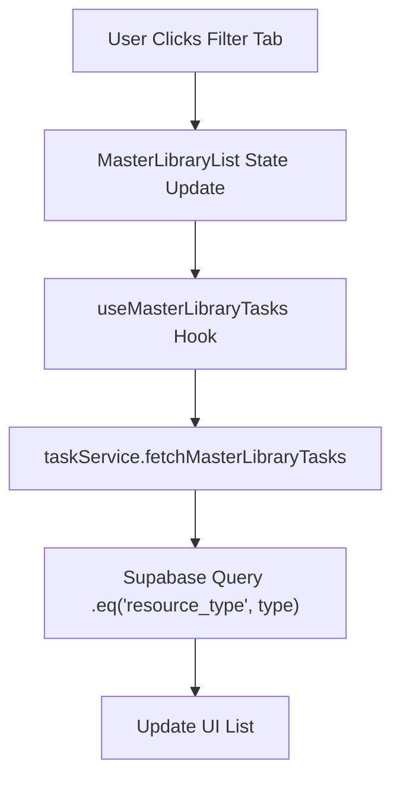

# Pull Request: Feature: Resource Filters & Critical Search Fix

## 📋 Summary

- **Resource Filtering**: Users can now filter the Master Library by "Text", "PDF", or "URL" to quickly find specific types of content.
- **Visual Badges**: Added UI badges to library items indicating their resource type.
- **Critical Search Fix**: Resolved a crashing bug in the Master Library search function that prevented users from finding templates.

## 🗺️ Roadmap Progress

| Item ID | Feature Name | Phase | Status | Notes |
| ------- | ------------ | ----- | ------ | ----- |
| [P5-RESOURCE-FILTERS] | Resource Filters | 3 | ✅ Done | Full stack implementation (DB, API, UI). |

## 🏗️ Architecture Decisions

### Key Patterns & Decisions

- **Schema Extension**: Added `resource_type` and `resource_url` to the `tasks` table rather than a separate table to keep the "everything is a task" model simple.
- **Search Robustness**: The search service previously sorted by `updated_at`, which does not exist in the `view_master_library` view. Switched to `created_at` to ensure reliability.
- **Server-Side Filtering**: Filtering is done via Supabase query builder for efficiency, rather than filtering in memory on the client.

### Logic Flow (Filtering)



## 🔍 Review Guide

### 🚨 High Risk / Security Sensitive

- `docs/db/migrations/003_add_resource_type.sql` - **Schema Change:** Adds columns to the core `tasks` table.

### 🧠 Medium Complexity

- `src/services/taskService.js` - Contains the fix for search sorting and the new filtering logic.
- `src/hooks/useMasterLibrarySearch.js` - Updated to pass filter state to the service.

### 🟢 Low Risk / Boilerplate

- `src/components/tasks/MasterLibraryList.jsx` - UI updates for tabs and badges.

## 🧪 Verification Plan

### 1. Environment Setup

- [ ] Run migration: `docs/db/migrations/003_add_resource_type.sql` in Supabase SQL Editor.
- [ ] No new npm dependencies.

### 2. Seed Data (Copy/Paste)

```sql
-- Tag an existing template as a PDF for testing
UPDATE public.tasks 
SET resource_type = 'pdf' 
WHERE origin = 'template' 
LIMIT 1;

-- Tag another as URL
UPDATE public.tasks 
SET resource_type = 'url' 
WHERE origin = 'template' 
AND resource_type IS NULL
LIMIT 1;
```

### 3. Test Scenarios

1.  **Filter Verification:**
    *   Navigate to Master Library.
    *   Click "PDF" tab. Ensure only the task updated above appears.
    *   Click "All" tab. Ensure all tasks appear.
2.  **Search Verification:**
    *   Type "Test" (or any known task title) in the search bar.
    *   **Success:** Results appear without error.
    *   **Failure:** "Failed to load results" error (Fixed in this PR).

---

<details>
<summary><strong>📉 Detailed Changelog (Collapsible)</strong></summary>

- `src/services/taskService.js`: Fixed sort column for search; added filter logic.
- `src/components/tasks/MasterLibraryList.jsx`: Added filter tabs and state.
- `src/hooks/useMasterLibraryTasks.js`: Wired up `resourceType` param.
- `src/hooks/useMasterLibrarySearch.js`: Wired up `resourceType` param.
- `docs/db/migrations/003_add_resource_type.sql`: New migration file.

</details>
