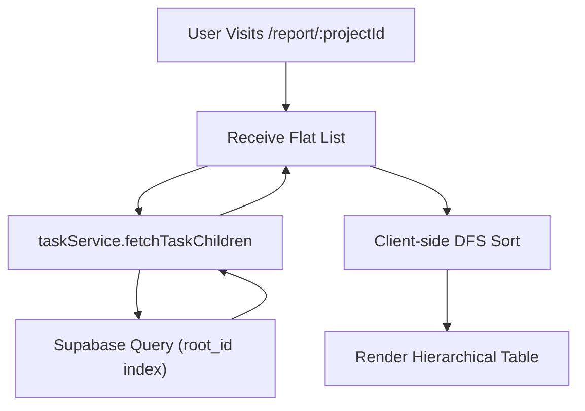

# Pull Request: Tech Debt Fix & Project Status Report UI

## 📋 Summary

*   **Project Reports:** Users can now view a read-only, print-friendly "Project Status Report" for any project, showing completion percentages, overdue items, and a hierarchical task list.
*   **Performance Boost:** The system now fetches task trees significantly faster and more reliably by leveraging the database's `root_id` index instead of inefficient scanning.
*   **Documentation Fixes:** Fixed broken diagrams in the README and standardized the roadmap documentation.

## 🗺️ Roadmap Progress

| Item ID | Feature Name | Phase | Status | Notes |
| ------- | ------------ | ----- | ------ | ----- |
| `P5-REPORT-UI` | Monthly Report View | 3 | ✅ Done | Implemented via `ProjectReport.jsx` |
| `P6-RECURSIVE-FETCH` | Recursive Fetch Optimization | 4 | ✅ Done | Addressed via `root_id` optimization in `taskService` |

## 🏗️ Architecture Decisions

### Key Patterns & Decisions

*   **DFS Rendering for Reports:**
    *   **Why:** The `fetchTaskChildren` service returns a flat list of tasks. To render them hierarchically in the report (Project > Phase > Task), we implemented a Depth-First Search (DFS) sort in the frontend component (`ProjectReport.jsx`).
    *   **Trade-off:** We are doing the sorting in memory (client-side) rather than a complex SQL recursive CTE. This is acceptable given the `root_id` pre-filtering ensures we only process one project at a time.

*   **Root ID Optimization:**
    *   **Why:** The previous `fetchTaskChildren` fetched *all* tasks for an origin and filtered them.
    *   **Change:** Updated to query `where root_id = ?`, leveraging the database index for immediate O(1) access to the project tree.

### Logic Flow / State Changes

## 🔍 Review Guide

### 🚨 High Risk / Security Sensitive

*   `src/services/taskService.js`: Core data fetching logic changed. Verify that `fetchTaskChildren` correctly handles both root projects and sub-tasks (though it now defaults to fetching the whole tree via `root_id`).

### 🧠 Medium Complexity

*   `src/components/reports/ProjectReport.jsx`: New component. Review the DFS sorting logic and the "Overdue" calculation (checks `due_date < now` AND `status != completed`).

### 🟢 Low Risk / Boilerplate

*   `README.md`: Diagram syntax fixes.
*   `roadmap.md`: Status updates.
*   `docs/ROADMAP-TEMPLATE.md` & `docs/ROADMAP-PROMPT.md`: New documentation standards.

## 🧪 Verification Plan

### 1. Environment Setup

*   No new dependencies or migrations required.

### 2. Test Scenarios

1.  **Happy Path (Report Viewing):**
    *   Login to the app.
    *   Manually navigate to `/report/<your-project-id>` (get ID from URL in dashboard).
    *   **Verify:** You see the "Project Status Report".
    *   **Verify:** Tasks are indented correctly (hierarchy matches dashboard).
    *   **Verify:** "Completion" % looks accurate.

2.  **Tech Debt Check:**
    *   Open a project normally.
    *   **Verify:** The Task List still loads correctly (regression test for `taskService` change).
