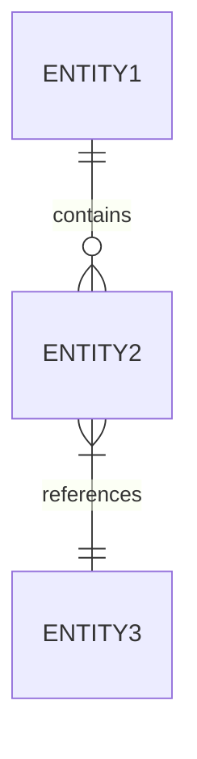
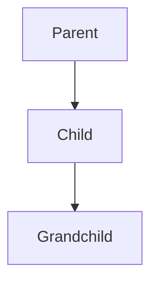
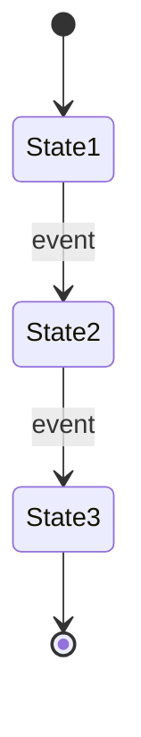
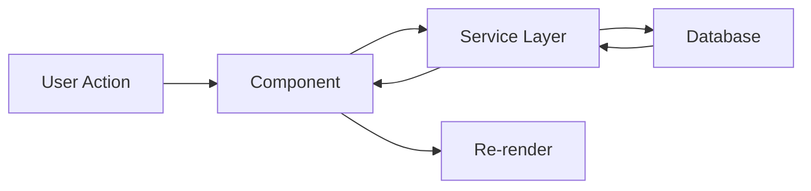

# README Generation Prompt

## Your Task

You are a senior software architect conducting a thorough code review. Your goal is to produce a README that enables a code reviewer or project manager with zero prior context to understand this codebase within 15 minutes. Adhere strictly to the format defined in `docs/README-TEMPLATE.md`.

## Instructions

### Phase 1: Deep Analysis (Do This First)

Before writing anything, systematically review the codebase:

1. **Map the file structure** — Identify all directories and their purposes
2. **Identify entry points** — Find main/index files, routing, app initialization
3. **Trace data flow** — Follow how data moves from UI → state → persistence
4. **Catalog components** — List every component/module and what it owns
5. **Extract the domain model** — What are the core entities? How do they relate?
6. **Identify state management** — Where does state live? How is it shared?
7. **Review database/API layer** — What's the schema? What services exist?
8. **Note security boundaries** — Auth, permissions, access control
9. **Find the gotchas** — What's incomplete? What's hacky? What's fragile?

Take your time. Read the actual code, not just file names.

### Phase 2: Generate README

Using ONLY what you found in the code (never invent or assume), produce a README with this exact structure.
**Constraint**: Every claim must be backed by a file link. if you can't link it, leave it out.

---

## 1. What Is This?

3-5 sentences maximum. Answer:

- What does this application do?
- Who is it for?
- What problem does it solve?

No marketing language. No feature lists. Just the core purpose.

---

## 2. Project Structure

### Directory Layout

```
src/
├── folder/        # One-line description
├── folder/        # One-line description
└── ...
```

Annotate every top-level directory. Go one level deeper for complex folders.

### Where to Find Things

| To change...  | Look in...        |
| ------------- | ----------------- |
| [common task] | `path/to/file.js` |
| [common task] | `path/to/file.js` |

Include 5-10 of the most likely things a developer would need to find.

### Environment Requirements

List every environment variable required to run the application:

```
VARIABLE_NAME=<description>
VARIABLE_NAME=<description>
```

Note any external dependencies (databases, APIs, services).

---

## 3. Core Concepts

This section builds the mental model. For each concept:

- One paragraph explaining what it is and why it exists
- A Mermaid diagram if it involves relationships, hierarchy, or state changes
- Concrete examples from the codebase

Include diagrams for:

**Entity Relationships** (if the domain has related entities):



**Hierarchies** (if there are nested structures):



**State Machines** (if entities have lifecycles):



Only include concepts that are essential to understanding the system. Aim for 3-6 concepts.

---

## 4. Architecture

### Data Flow

Describe how data moves through the system. Use a diagram:



### Component Responsibilities

| Component       | Responsibility        |
| --------------- | --------------------- |
| `ComponentName` | What it owns and does |

List the major components/modules. Be specific about what each one is responsible for.

### Database Schema

| Table/Collection | Purpose        | Key Fields                   |
| ---------------- | -------------- | ---------------------------- |
| `table_name`     | What it stores | `field1`, `field2`, `field3` |

If there are important indexes, constraints, or relationships, note them.

### Security Model

How is access controlled? Include:

- Authentication method
- Authorization model (roles, permissions)
- Any row-level security or data isolation

---

## 5. Current State

### Working Features

List features that are fully implemented and functional:

- ✅ Feature description
- ✅ Feature description

### Known Limitations

List features that are incomplete, broken, or missing:

- ⚠️ Limitation description
- ⚠️ Limitation description

### Technical Debt

List architectural issues, code smells, or deferred decisions:

- Specific file or pattern that needs attention
- Why it's a problem

**Be brutally honest in this section.** The goal is to help someone understand what they're walking into.

---

## Output Requirements

1. **Accuracy over completeness** — Only document what exists. Never describe planned features, aspirational architecture, or what "should" happen.

2. **Concrete references** — When describing patterns or components, reference actual file paths and function names.

3. **Diagrams must reflect code** — Every diagram must be derivable from the actual codebase. No idealized architectures.

4. **Evidence Rule** — If you can't cite a file path, you can't claim it.

5. **Honest current state** — The "Current State" section should be unflinching. If 60% of the codebase is technical debt, say so.

6. **Minimal prose** — Prefer tables, diagrams, and code blocks over paragraphs. A developer should be able to scan, not read.

7. **No setup instructions** — This is not a "how to run" guide. It's a "how to understand" guide.

---

## Anti-Patterns to Avoid

❌ Describing features that don't exist in code
❌ Documenting aspirational architecture from design docs or comments
❌ Generic descriptions that could apply to any project
❌ Marketing language ("robust", "scalable", "modern")
❌ Listing every file (focus on what matters)
❌ Diagrams that don't match actual code flow
❌ Hiding or minimizing problems
❌ Duplicating information that's already in code comments
