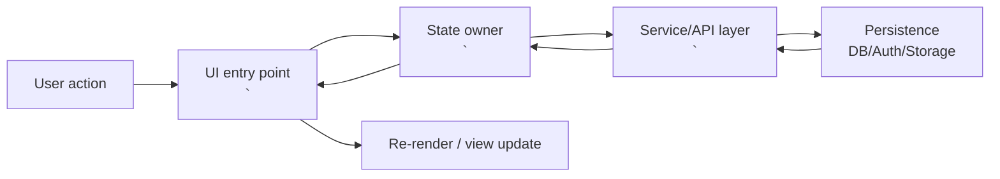
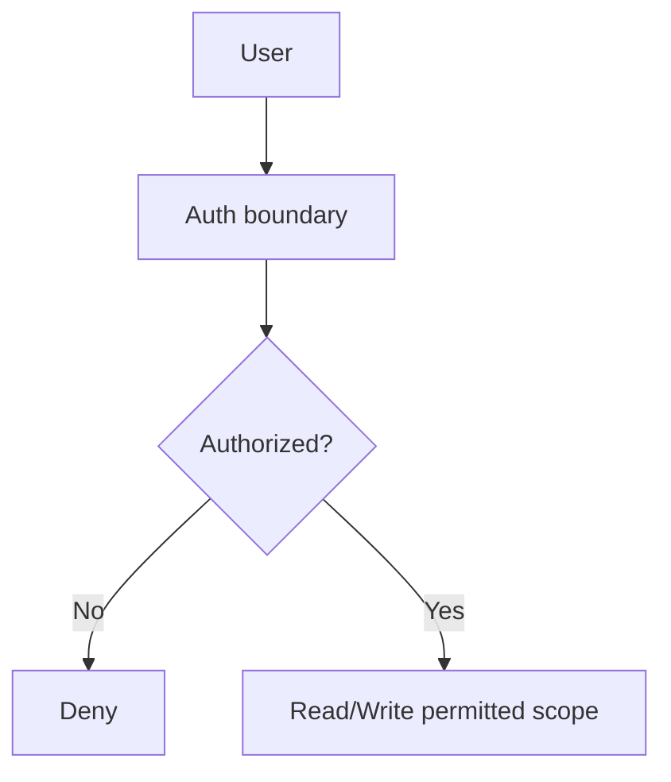

````markdown
<!--
README CONTRACT (keep this block at the top)

Scope:
- This README is a codebase-understanding document for reviewers + PMs.
- It is NOT a roadmap, NOT a setup guide, NOT marketing.

Non-negotiables:
- Document ONLY what exists in the repo at the referenced commit.
- **Evidence Rule**: If you can't link it, you can't claim it.
- Every non-trivial claim must be backed by concrete repo evidence:
  - file paths, exported symbols, function names, table/column names, migration filenames.
- Mermaid diagrams must be derivable from real code flows (handlers/events/states).
- Keep the 5-section structure intact. Do not add new top-level sections.

Update discipline:
- Before editing, update "Last verified" and "Commit".
- If a section cannot be verified from code, mark it explicitly as "Unverified" and describe what is missing.
-->

# <ProjectName>

**Last verified**: YYYY-MM-DD (America/Los_Angeles)  
**Commit**: <git-sha>  
**Primary audience**: code reviewers, project managers

---

## 1. What Is This?

<3-5 sentences max. No marketing. No feature lists.>

- What does the application do?
- Who is it for?
- What problem does it solve?

---

## 2. Project Structure

### Directory Layout

```text
<repo-root>/
  <dir>/                 # one-line purpose
  <dir>/                 # one-line purpose
  ...
```
````

### Where to Find Things

| To change...  | Look in...       |
| ------------- | ---------------- |
| <common task> | `<path/to/file>` |
| <common task> | `<path/to/file>` |
| <common task> | `<path/to/file>` |
| <common task> | `<path/to/file>` |
| <common task> | `<path/to/file>` |

### Environment Requirements

**Required env vars**

```text
<ENV_VAR_NAME>=<what it is used for + where read in code>
<ENV_VAR_NAME>=<what it is used for + where read in code>
```

**External dependencies**

- <DB/Auth/Storage/etc> -> <what> (refer to config file(s): `<path>`)
- <Queue/Cache/etc> -> <what> (refer to config file(s): `<path>`)

---

## 3. Core Concepts & Mental Model

<3-6 concepts. This is the highest ROI section. Focus on the _mental model_ (e.g., life cycles, hierarchies, state machines).
Each concept must include: (1) one paragraph explaining _why_ it exists (2) a Mermaid diagram derived from code (3) concrete code references.>

### 3.1 <Concept name>

<One paragraph: what it is + why it exists + how it shows up in the code. Include file paths.>

```mermaid
<erDiagram | graph TD | stateDiagram-v2>
```

**Repo evidence**

- `<path/to/file>` -> <symbol/function/component name>
- `<path/to/file>` -> <schema/migration/config reference>

### 3.2 <Concept name>

...

---

## 4. Architecture

### 4.1 Data Flow

<Describe how data moves through the system. Keep it concrete: UI -> state -> service -> persistence -> UI.>



### 4.2 Component Responsibilities

| Component/Module | Responsibility          | Primary files      |
| ---------------- | ----------------------- | ------------------ |
| `<Name>`         | <what it owns and does> | `<path>`, `<path>` |
| `<Name>`         | <what it owns and does> | `<path>`, `<path>` |

### 4.3 Database Schema

| Table/Collection | Purpose          | Key fields                      |
| ---------------- | ---------------- | ------------------------------- |
| `<name>`         | <what it stores> | `<field>`, `<field>`, `<field>` |

**Relationships / constraints (only if present and important)**

- <relationship> -> <how enforced> (migration: `<path>` / code: `<path>`)

**Indexes worth knowing**

- `<index>` -> <why it exists> (migration: `<path>`)

### 4.4 Security Model

**Authentication**

- Method -> <e.g., Supabase Auth / JWT / OAuth> (code: `<path>`)

**Authorization**

- Roles/permissions -> <summary> (code/policies: `<path>`)

**Data isolation**

- RLS / tenant scoping -> <how enforced> (policies/migrations: `<path>`)



---

## 5. Current State

### 5.1 Working Features

- ✅ <feature> (evidence: `<path>`)
- ✅ <feature> (evidence: `<path>`)

### 5.2 Known Limitations

- ⚠️ <limitation> (symptom -> cause -> evidence: `<path>`)
- ⚠️ <limitation> (symptom -> cause -> evidence: `<path>`)

### 5.3 Technical Debt (Brutal Honesty)

- <debt item> -> why it matters -> evidence: `<path>`
- <debt item> -> why it matters -> evidence: `<path>`

```

```
