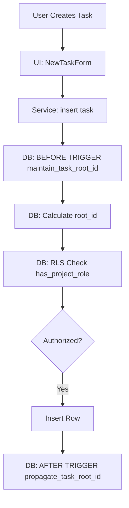

# Pull Request: Critical Backend Scale-Down & Ambiguity Fixes

## 📋 Summary

- **Massive Backend Downsizing**: Consolidated the database schema from ~40 mixed-domain tables to **2 core tables** (`tasks`, `project_members`). This eliminates technical debt from previous "sports management" experiments and focuses entirely on hierarchical task management.
- **Critical Bug Fixes (Ambiguity Saga)**: Iteratively resolved specific PL/pgSQL variable naming conflicts ("Ambiguous Column Reference") that were blocking Task Creation and RLS operations (Migrations 006-010).
- **Data Integrity**: Restored missing fields (`purpose`, `actions`, `resources`) and enforced strict RLS policies. Added robust, infinite-depth backfill logic in `one_time_setup.sql`.
- **Documentation**: Synchronized `Roadmap`, `Engineering Knowledge`, and `Testing Strategy` with the new optimized architecture.

## 🗺️ Roadmap Progress

| Item ID | Feature Name | Phase | Status | Notes |
| ------- | ------------ | ----- | ------------------------ | ------- |
| P1-CORE | Core Schema Optimization | 1 | ✅ Done | Reduced to 2 tables. |
| DB-RLS | RLS & Permissions | 1 | ✅ Done | `has_project_role`, `check_project_ownership`. |
| DB-FIX | Ambiguous Column Fixes | 1 | ✅ Done | Trigger & Auth function cleanup. |
| FE-SAVE | Task Persistence | 1 | ✅ Done | Purpose/Actions/Resources saving correctly. |

## 🏗️ Architecture Decisions

### Key Patterns & Decisions

- **Adaptable Hierarchy (Adjacency List)**: We chose a simple `parent_task_id` adjacency list for `tasks`, reinforced by a **denormalized `root_id`**. This allows efficient subtree retrieval without recursive CTEs for permissions checking.
- **Strict PL/pgSQL Naming**: Enforced Hungarian notation (e.g., `v_root_id`) for all local variables in functions to prevent PostgreSQL from confusing them with column names (`root_id`).
- **Canonical Helper Functions**: Replaced disparate logic/views with 5 canonical `SECURITY DEFINER` functions (e.g., `get_task_root_id`) to bypass RLS loops safely when calculating permissions.

### Logic Flow / State Changes

## 🔍 Review Guide

### 🚨 High Risk / Security Sensitive

- `docs/db/schema.sql` - **Core Auth Logic & RLS**. Defines who can do what (replaces old migration files).

### 🧠 Medium Complexity

- `src/components/NewTaskForm.jsx` - Ensuring `purpose`, `actions`, `resources` are not dropped during state updates.

### 🟢 Low Risk / Boilerplate

- `docs/operations/ENGINEERING_KNOWLEDGE.md` - Documentation updates.

## 🧪 Verification Plan

### 1. Environment Setup

- [ ] Run `npm install`
- [ ] Run `docs/db/schema.sql` (Idempotent single source of truth).

### 2. Test Scenarios

1. **Golden Path (Browser Agent Verified)**:
    - Create Project "Golden Path".
    - Create Task "Child A" (Verify "Ambiguous Column" error is GONE).
    - Edit Task "Child A" -> Add Purpose/Actions -> Save.
    - Refresh -> Verify Data Persists.
    - Delete Project.

2. **Ambiguity Check**:
    - Try to insert a task without a `root_id` provided (Trigger should catch it).
    - Try to view a project as a non-member (RLS should block it).

---

<strong>📉 Detailed Changelog (Collapsible)</strong>

- `docs/db/schema.sql` (Refactored to be the Single Source of Truth, removing dynamic SQL. **Includes 42P13 Fixes via explicit DROP FUNCTION**).
- `docs/db/one_time_setup.sql` (Consolidated data migrations. **Added robust backfill loop**).
- **Scripts**:
  - `test-db-connection.js` (Secured with env vars)
- **Docs**:
  - Updated `ENGINEERING_KNOWLEDGE.md` with PL/pgSQL lessons.
  - Updated `README-PROMPT.md` and `ROADMAP-PROMPT.md`.
- **Frontend**:
  - `NewTaskForm.jsx`: State fix.
  - `TaskList.jsx`: Fixed nullish coalescing for empty strings.
  - `dateUtils.js`: UTC normalization.

