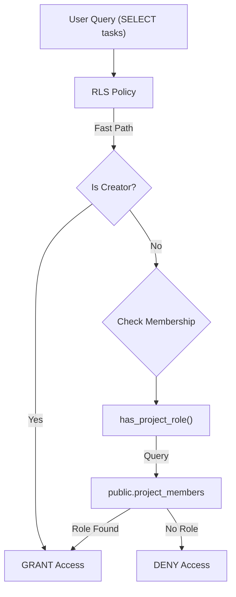
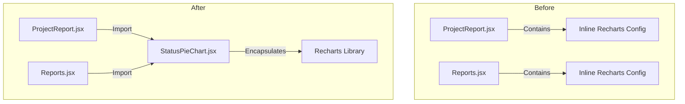

# Pull Request: Time Management, Teams, Field Mode & Security Audit

## 📋 Summary

This release is a major milestone that delivers the core "Time & Team" feature set—transforming the application into a fully fledged Project Management suite with CRM, Inventory, and Mobile capabilities. Simultaneously, it concludes a comprehensive **Security & Hygiene Audit**, enforcing strict Role-Based Access Control (RBAC) and Row Level Security (RLS) across the entire database.

## ✨ New Features (The "What")

### 👥 People & Teams (CRM Lite)
- **Dedicated People Tab**: Manage project staff, volunteers, and contacts in a separate view.
- **Roles & Permissions**: Assign specific roles (Owner, Editor, Coach, Limited) that actively restrict what users can do.
- **Invitations**: Seamlessly invite new members by email.

### 📱 Mobile Field Mode
- **Field-Ready UI**: A complete redesign of the mobile experience for on-the-go usage.
- **Action Button (FAB)**: A floating "Quick Add" button for instant task creation on mobile.
- **Daily Agenda**: A focused "Today" view widget for mobile users.

### 📦 Inventory & Resources
- **Asset Tracking**: A new system to track physical items (Keys, Equipment, Vehicles) linked to projects.
- **Locations**: Assign assets to specific storage locations.

### 🧠 Smart Logic & Flow
- **Project Tabs**: The interface is now organized into clean tabs: **Tasks**, **People**, **Budget**, and **Assets**.
- **Checkpoints**: Phases can now be "Locked", strictly enforcing sequential progress (Finish Phase 1 to unlock Phase 2).
- **Date Inheritance**: Phase dates now automatically expand to cover their child tasks.

## 🛡️ Security & Architecture (The "How")

### 🔐 Strict Data Privacy (RLS)
We have activated strict "Row Level Security" (RLS). Data is now **invisible** by default—only the Project Creator and explicitly invited Members can see a project's tasks. A new `has_project_role` function efficiently verifies membership without recursion.



### 🧩 Component Extraction
To improve maintainability, reporting logic was extracted from monolithic pages into reusable components.



## �️ Roadmap Progress

| Feature | Status | Impact |
| :--- | :--- | :--- |
| **People/CRM Lite** | ✅ Live | Manage volunteers/staff distinct from tasks. |
| **Budgeting Lite** | ✅ Live | Basic financial tracking per project. |
| **Mobile Field Mode** | ✅ Live | Optimized UI for phone usage. |
| **Inventory System** | ✅ Live | Track physical assets. |
| **Checkpoints** | ✅ Live | Enforce sequential project flow. |
| **Strict Security** | ✅ Live | Enterprise-grade access control. |
| **Tech Debt Audit** | ✅ Done | CSS cleanup & RLS Hardening. |

## �🔍 Review Guide

### 🚨 High Risk / Security Sensitive

- `supabase/migrations/20260119_fix_rls.sql` - **CRITICAL**: This migration changes the `tasks` table policy from "Public Read" to "Restricted". Must be verified to ensure no legitimate access is blocked.
- `docs/db/schema.sql` - The Source of Truth for the DB schema, updated to reflect the new policies.

### 🧠 Medium Complexity

- `src/features/people/*` - New CRM logic and UI.
- `src/features/mobile/*` - New Mobile UI components.
- `src/features/reports/components/StatusPieChart.jsx` - Extracted component.

### 🟢 Low Risk / Boilerplate

- `src/styles/components/*.css` - Deletion of 900+ lines of dead code (Tailwind migration).
- `src/tests/integration/golden-paths-mobile.test.jsx` - New test file (additive).

## 🧪 Verification Plan

### 1. Environment Setup

- [ ] Run `npm install` (No new deps, but good practice)
- [ ] Apply Migration: run the contents of `supabase/migrations/20260119_fix_rls.sql` in your local Supabase SQL editor.

### 2. Manual Verification

- **Security (RLS):**
  1. Login as User A.
  2. Create a Project.
  3. Login as User B (who is NOT a member).
  4. Attempt to fetch User A's project by ID.
  5. **Expected**: Returns `null` or empty array (Access Denied).
- **Mobile Field Mode:**
  1. Resize browser to mobile width (<640px).
  2. Verify "Agenda" widget and "Quick Add" FAB appear.

### 3. Automated Tests

```bash
npm test src/tests/integration/golden-paths-mobile.test.jsx
npm test
```

---

<details>
<summary><strong>📉 Detailed Changelog (Collapsible)</strong></summary>

- `src/features/people/*`: Added CRM Lite features.
- `src/features/inventory/*`: Added Asset Tracking.
- `src/features/mobile/*`: Added Mobile UI.
- `src/features/reports/components/StatusPieChart.jsx`: Extracted pie chart logic.
- `supabase/migrations/20260119_fix_rls.sql`: Added RLS security migration.
- `docs/db/schema.sql`: Updated schema docs.
- `src/styles/components/*.css`: Deleted Legacy CSS.
- `src/tests/integration/golden-paths-mobile.test.jsx`: Added mobile integration tests.

</details>
