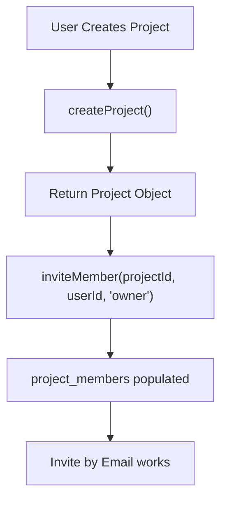

# Pull Request: Invite Function Fix & UI Aesthetic Restoration

## 📋 Summary

- **Detailed UI Restoration**:
  - Implemented Light Theme Sidebar (White bg) to eliminate contrast clashes
  - Fixed Flexbox layout structure to resolve margin issues
  - Consolidated "New Project/Template" actions to top of sidebar
  - Added Status Dot indicators to sidebar items
- **Fixed invite-by-email 403 error** by ensuring project creators are automatically added to the `project_members` table upon project creation
- **Restored modal positioning** by implementing React Portal with inline styles to escape stacking context issues
- **Enhanced UI aesthetics** with improved sidebar hover effects, task card shadows/spacing, and premium panel gradients
- **Added engineering knowledge entries** documenting modal portal patterns and project membership initialization

## 🗺️ Roadmap Progress

| Item ID | Feature Name | Phase | Status | Notes |
| ------- | ------------ | ----- | ------ | ----- |
| P5-EMAIL-INVITES | Invite by Email | 5 | ✅ Done | Fixed 403 error; membership logic added |
| P6-SIDE-NAV | Side Navigation | 6 | ✅ Done | UI polish & Light Theme complete |

## 🏗️ Architecture Decisions

### Key Patterns & Decisions

- **Portal Pattern for Modals**: Moved modal rendering to `ReactDOM.createPortal(content, document.body)` to escape CSS stacking context issues.
- **Light Theme Sidebar**: Switched sidebar from Dark (`bg-slate-900`) to Light (`bg-white`) to match the "Modern SaaS" aesthetic and reduce visual clash.
- **Pure Flexbox Layout**: Refactored `DashboardLayout` to use `flex: 1` instead of fixed margins, ensuring proper spacing on all screen sizes.
- **Status Indicators**: Added visual status dots (Grey/Blue/Green) to sidebar navigation items for better at-a-glance scanning.

### Logic Flow

## 🔍 Review Guide

### 🚨 High Risk / Security Sensitive

- `src/components/organisms/TaskList.jsx` - Project membership initialization logic (lines 244-259)
- `src/hooks/useTaskOperations.js` - Modified to return project data (lines 88-130)

### 🧠 Medium Complexity

- `src/components/organisms/SideNav.jsx` - Refactored for light theme and consolidated actions
- `src/atoms/SidebarNavItem.jsx` - New atom with status indicators
- `src/styles/layout.css` - Major layout and theme overhaul

### 🟢 Low Risk / Boilerplate

- `src/styles/components/task-card.css` - Spacing and shadow adjustments
- `src/styles/components/panels.css` - Gradient headers

## 🧪 Verification Plan

### 1. Environment Setup

- [ ] Ensure `npm start` is running on port 3000
- [ ] Verify Supabase Edge Function `invite-by-email` is deployed

### 2. Test Scenarios

1. **Visual UI Check**:
   - Verify Sidebar is White/Light Grey
   - Verify "New Project" buttons are at the top
   - Verify Layout handles window resizing without margin issues

2. **New Project Invite (Happy Path)**:
   - Create a new project "Test Project"
   - Click "Invite Member"
   - Enter an email address
   - Verify success message

3. **Modal Positioning**:
   - Open any project
   - Click "Invite Member"
   - Verify modal appears centered on screen

---

<strong>📉 Detailed Changelog (Collapsible)</strong>

- `src/components/atoms/SidebarNavItem.jsx`: Created reusable nav item with status dots
- `src/components/organisms/SideNav.jsx`: Implemented light theme, removed redundant headers
- `src/components/organisms/InviteMemberModal.jsx`: Added ReactDOM.createPortal with inline styles
- `src/components/organisms/TaskList.jsx`: Added inviteMember call after project creation
- `src/hooks/useTaskOperations.js`: Modified createProject to return project data
- `src/styles/layout.css`: Complete overhaul for Light Theme and Flexbox layout
- `src/styles/components/task-card.css`: Increased padding, enhanced shadows
- `src/styles/components/panels.css`: Added gradient headers
- `docs/operations/ENGINEERING_KNOWLEDGE.md`: Added FE-022 (Modal Portals), SEC-023 (Membership Init)

