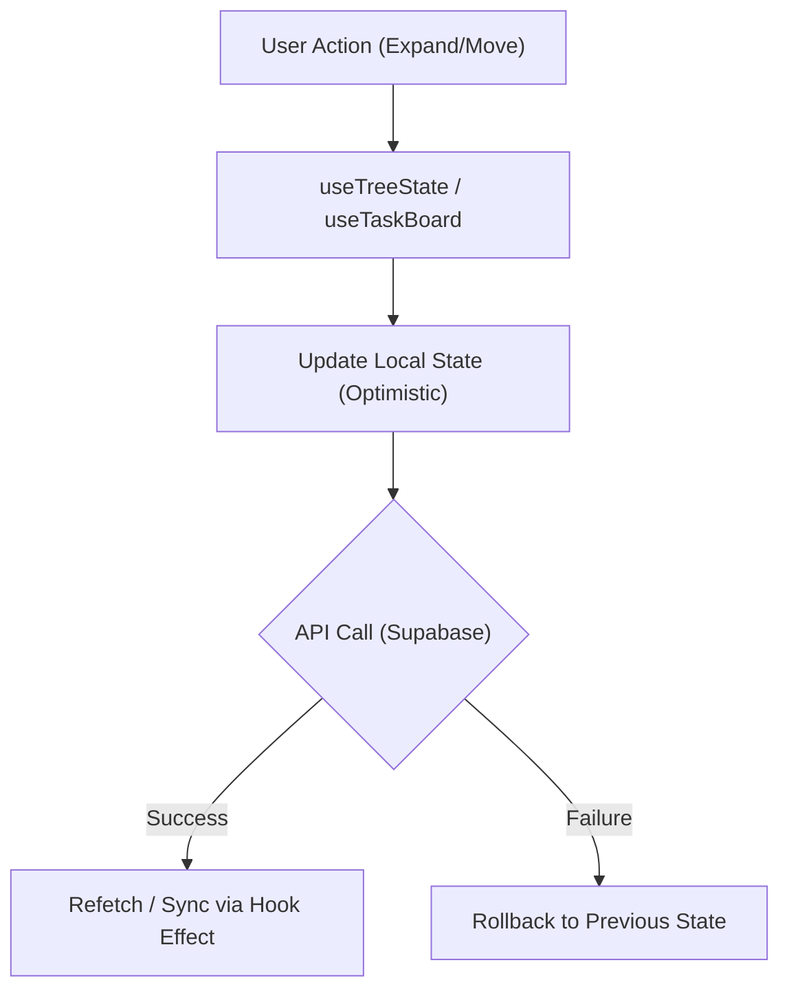

# Pull Request: Core Resilience: Database Hardening, State Robustness & Modernized Workflows

## 📋 Summary

This pull request represents a comprehensive 'Health & Hygiene' initiative to bolster the application's core resilience, streamline state management, and modernize development workflows. It involves significant architectural refactoring on both the frontend and backend, enhancing performance, security, and maintainability across the board. The changes aim to create a more robust and scalable foundation for future development.

## ✨ Highlights

- **Major UI/State Refactor:** Decomposed the monolithic `MasterLibraryList` component into a dedicated `useTreeState` hook and refactored `TaskList` to utilize a new `useTaskBoard` hook, centralizing complex logic for improved maintainability and separating concerns between data fetching, state management, and rendering.
- **Database Hardening:** Hardened the database layer with robust recursion guards in PostgreSQL triggers, idempotent migration scripts to prevent failures on fresh installs, and refined Row Level Security (RLS) policies for enhanced security and data integrity, including storage access control.
- **Modernized Workflows:** Overhauled the `.agent/` directory with new AI agent workflows for automated roadmap advancement, comprehensive technical debt auditing (including documentation review), and pre-PR documentation generation, streamlining development processes.
- **Performance & UX Improvements:** Introduced paginated project loading and on-demand hydration for joined projects, significantly enhancing application performance and responsiveness by fetching data only when needed.
- **Dependency & Consistency Updates:** Updated 24+ outdated npm packages and replaced brittle hardcoded status strings with a centralized `TASK_STATUS` constant system, improving code consistency and reducing potential errors.
- **Optimistic Rollback Implementation:** Optimistic UI updates now include `previousStatus` capture and revert logic, ensuring a graceful fallback to the prior state in case of API failures, improving user experience during network inconsistencies.

## 🗺️ Roadmap Progress

| Item ID             | Feature Name                  | Phase | Status  | Notes                                                                |
| ------------------- | ----------------------------- | ----- | ------- | -------------------------------------------------------------------- |
| **P5-TREE-PERF**    | Recursive Tree Optimization   | 5     | ✅ Done | Refactored `MasterLibraryList` to use strict effect-based syncing.   |
| **P5-TECH-DEBT**    | Tech Debt Resolution          | 5     | ✅ Done | Modularized Master Library logic and updated dependencies.          |
| **P5-OPT-ROLLBACK** | Optimistic Rollback           | 5     | ✅ Done | Implemented `previousStatus` capture and revert logic.              |

## 🏗️ Architecture Decisions

### Key Patterns & Decisions

- **Pattern A (Facaded Hooks):** Extracted `useTreeState` and `useTaskBoard` to separate "Loading/Expansion" logic from "Rendering". This prevents "God Component" bloat.
- **Pattern B (Safe Migrations):** Refactored `one_time_setup.sql` to use `DO $$` blocks with column existence checks, ensuring scripts are safe to run on both fresh and existing databases.
- **Pattern C (Agent Workflows):** Formalized common dev tasks (roadmap updates, pre-pr docs) into `.agent/workflows/` to ensure consistency in AI assistance.

### Logic Flow / State Changes



## 🔍 Review Guide

### 🚨 High Risk / Security Sensitive

- `docs/db/schema.sql` - Core database definition changes; includes RLS policy updates and trigger modifications.
- `package-lock.json` - Significant updates to internal dependencies; potential for breaking changes in sub-dependencies.
- `src/hooks/useTreeState.js` - New core logic for the Master Library tree view; handles recursive state management.

### 🧠 Medium Complexity

- `src/hooks/useTaskBoard.js` - Compositor hook for project/task operations, drag-and-drop, and hydration.
- `.agent/` directory - New rules and workflows that define AI agent capabilities.
- `src/components/organisms/MasterLibraryList.jsx` - Significant code deletion; now a thin wrapper around `useTreeState`.
- `src/constants/index.js` - Introduction of `TASK_STATUS` constants.

### 🟢 Low Risk / Boilerplate

- `DEBT_REPORT.md` - Status updates on technical debt auditing.
- `docs/operations/` - Documentation consolidation (merging engineering knowledge and test plans).

## 🧪 Verification Plan

### 1. Environment Setup

- [ ] Run `npm install` to sync the updated lockfile.
- [ ] Verify database schema using `docs/db/schema.sql` for fresh installs or `one_time_setup.sql` for migrations.

### 2. Manual Verification

- **Performance & Hydration**:
    1. Log in and verify projects load via paginated requests.
    2. Click a "Joined Project"; verify it hydrations on-demand and displays tasks correctly.
- **Master Library Tree**:
    1. Go to "Master Library" and verify expansion/collapsing recursion works.
    2. Verify added tasks appear in the correct hierarchy immediately.
- **Optimistic Rollback**:
    1. Trigger a status change; manually disconnect network; verify UI reverts to original status on failure.

### 3. Automated Tests

```bash
npm test -- src/components/organisms/MasterLibraryList.test.jsx
npm run lint
```

---

<details>
<summary><strong>📉 Detailed Changelog (Collapsible)</strong></summary>

- `src/hooks/useTreeState.js`: New hook extracting tree logic from MasterLibraryList.
- `src/hooks/useTaskBoard.js`: New compositor hook for TaskList.
- `src/components/organisms/MasterLibraryList.jsx`: Refactored to use `useTreeState`.
- `src/components/organisms/TaskList.jsx`: Refactored to use `useTaskBoard`.
- `src/services/projectService.js`: Added pagination to `getUserProjects`.
- `src/constants/index.js`: Added `TASK_STATUS` and `ROLES` constants.
- `docs/db/schema.sql`: Consolidated migrations; added triggers and RLS.
- `docs/db/one_time_setup.sql`: Hardened with safe-drop checks.
- `.agent/`: New workflows and rules files.

</details>

---
