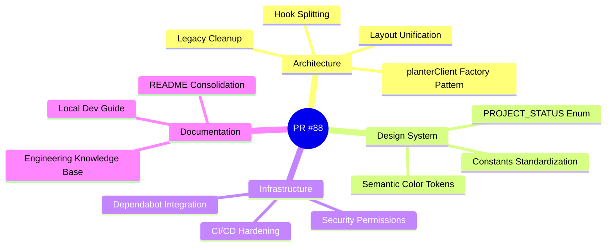
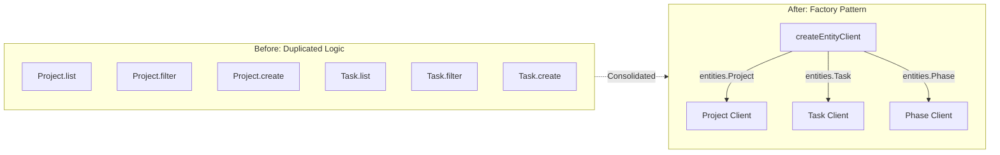
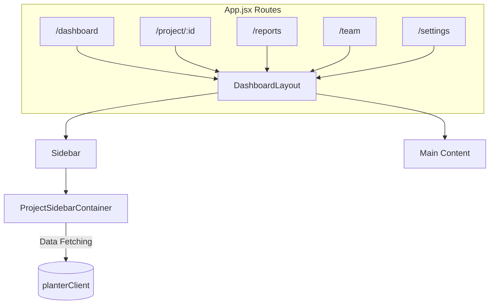
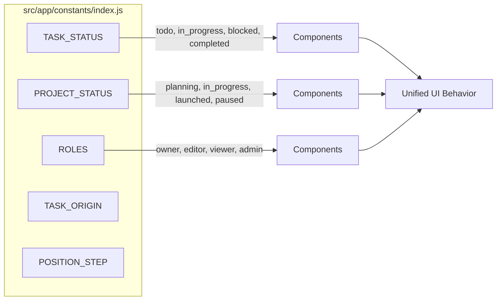
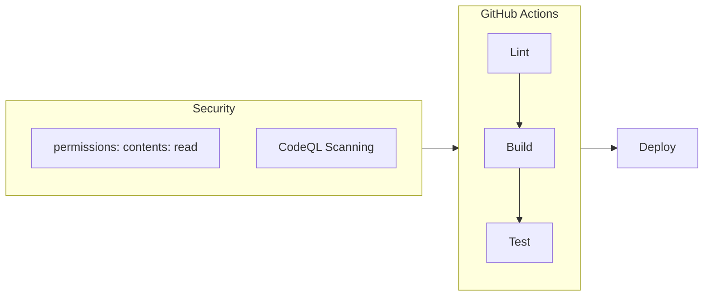

# Master Review Orchestrator: Design System & Architecture Hardening

## Summary

This PR represents a comprehensive **Master Audit** of the PlanterPlan codebase, executing all phases of the `master-review-orchestrator` workflow. It enforces Design System standards (Rule 30), hardens Architecture patterns (Rule 40), consolidates technical debt, and professionalizes the repository infrastructure.

> **Scope**: ~105 files changed | 24 commits | 3 major phases

---

## Change Overview



---

## 1. Architecture Refactoring

### 1.1 Generic Entity Client Pattern

Refactored `src/shared/api/planterClient.js` to use a `createEntityClient` factory, eliminating duplicated CRUD logic across entity types.



**Key Changes:**
| File | Change |
|:---|:---|
| `src/shared/api/planterClient.js` | Factory pattern with unified CRUD methods |
| `src/tests/unit/planterClient.test.jsx` | Unit tests for `filter`, `list`, `create`, `delete` |

### 1.2 Layout Unification

Established the **"Pages own their Layout"** pattern by wrapping all major routes in `DashboardLayout`.



**Key Changes:**
| File | Change |
|:---|:---|
| `src/app/App.jsx` | All routes wrapped in `DashboardLayout` |
| `src/features/navigation/components/ProjectSidebarContainer.jsx` | Centralized sidebar data logic |
| `src/layouts/DashboardLayout.jsx` | Accepts optional `sidebar` prop |

### 1.3 Legacy Cleanup

Removed deprecated directories and consolidated navigation components.

| Removed | Reason |
|:---|:---|
| `src/components/project/` | Migrated to `src/features/projects/` |
| `src/components/Sidebar.jsx` | Replaced by `AppSidebar.jsx` |
| `src/components/SideNav.jsx` | Replaced by `ProjectSidebar.jsx` |
| Stale Vite aliases (`lib`, `api`, `entities`) | Using `@shared/`, `@features/` instead |

---

## 2. Design System Alignment (Rule 30)

### 2.1 Constants Standardization

Centralized all status, role, and origin constants in `src/app/constants/index.js`.



**Breaking Change Fixed:**
- Changed `TASK_STATUS.COMPLETED` from `'complete'` → `'completed'`
- Changed `Task` model default from `'not_started'` → `'todo'`

**Files Updated:**
| Component | Constants Used |
|:---|:---|
| `StatsOverview.jsx` | `TASK_STATUS.*` |
| `ProjectCard.jsx` | `TASK_STATUS.COMPLETED`, `PROJECT_STATUS.*` |
| `Reports.jsx` | `TASK_STATUS.*` for calculations |
| `PhaseCard.jsx`, `MilestoneSection.jsx`, `ProjectHeader.jsx` | `TASK_STATUS.COMPLETED`, `PROJECT_STATUS.*` |
| `CreateProjectModal.jsx` | `PROJECT_STATUS.PLANNING` |
| `RoleIndicator.jsx` | `ROLES.VIEWER` default |
| `golden-paths.test.jsx` | All constants imported |

### 2.2 Semantic Color Tokens

Standardized chart and badge colors using CSS variables.

```javascript
// src/app/constants/colors.js
export const CHART_COLORS = {
  [TASK_STATUS.TODO]: 'var(--color-slate-400)',
  [TASK_STATUS.IN_PROGRESS]: 'var(--color-amber-500)',
  [TASK_STATUS.BLOCKED]: 'var(--color-rose-500)',
  [TASK_STATUS.COMPLETED]: 'var(--color-emerald-500)',
};
```

---

## 3. Repository Professionalization

### 3.1 CI/CD Hardening



**Key Changes:**
| File | Change |
|:---|:---|
| `.github/workflows/ci.yml` | Added explicit `permissions: contents: read` |
| `package.json` | `--max-warnings 0` for strict linting |

### 3.2 Dependency Updates

Applied safe patch updates from Dependabot:

| Package | Before | After |
|:---|:---|:---|
| `@supabase/supabase-js` | 2.89.0 | 2.90.1 |
| `framer-motion` | 12.24.0 | 12.26.1 |
| `tailwindcss` | 4.0.0 | 4.1.18 |
| `vitest` | 4.0.16 | 4.0.17 |

> ⚠️ **Deferred**: React 18→19, react-router-dom 6→7, recharts 2→3 (major breaking changes)

### 3.3 Branch Cleanup

| Branch | Action | Reason |
|:---|:---|:---|
| `feature/master-review-orchestrator_v2` | ❌ Deleted | 20 commits behind, no unique changes |
| `dependabot/npm_and_yarn/...` | ❌ Deleted | PR closed, patch updates applied manually |

---

## 4. Documentation Updates

### 4.1 Files Updated

| Document | Changes |
|:---|:---|
| `README.md` | Consolidated with local dev guide, updated verification date |
| `docs/operations/local_development.md` | Accurate Vite/Vitest commands, port 3000 |
| `docs/operations/ENGINEERING_KNOWLEDGE.md` | Added lessons on sidebar logic, import paths |
| `.github/archive/` | Created for ephemeral PR drafts |

### 4.2 Knowledge Base Entries Added

- **Sidebar Data Flow**: `ProjectSidebarContainer` pattern
- **Layout Propagation**: Pages own their layout wrapper
- **Import Path Consistency**: Use `@features/`, `@shared/` aliases

---

## 5. Database Schema

Added invite-by-email functionality:

```sql
-- docs/db/schema.sql
CREATE OR REPLACE FUNCTION public.invite_project_member(
  p_project_id UUID,
  p_email TEXT,
  p_role TEXT DEFAULT 'viewer'
) RETURNS JSONB
```

---

## Verification

### Test Results

```
✅ Golden Paths (5/5 passed)
   ├── Path A: Dashboard renders correctly
   ├── Path A: Empty states handled
   ├── Path B: Task board columns styled
   ├── Path B: Detail panel opens on click
   └── Path C: Navigation updates breadcrumbs

✅ Build: Succeeded (3.92s)
✅ Lint: 0 warnings (--max-warnings 0)
```

### Manual Verification

- Sidebar populates on `/dashboard`, `/project/:id`, `/reports`
- Task status changes persist correctly
- Project creation uses `PROJECT_STATUS.PLANNING`

---

## Breaking Changes

| Change | Migration |
|:---|:---|
| `TASK_STATUS.COMPLETED` value | Update any code comparing to `'complete'` → use constant |
| Task model default status | New tasks created with `'todo'` instead of `'not_started'` |
| Removed Vite aliases (`lib`, `api`) | Use `@shared/lib`, `@shared/api` instead |

---

## Commit History (24 commits)

```
9be87b9 chore(deps): apply safe patch updates from dependabot
cb53b5b chore: address PR review feedback - harden CI, cleanup UI, expand tests
90c11e4 docs: log lesson about GitHub Issues setting blocker
9381cbe Merge branch 'main' into feature/master-review-orchestrator
3799089 cleanup: remove dead breadcrumbs and redundant debt report
5a15819 chore: add debt and knowledge automation workflows
275e2f4 chore: configure github mcp integration
fc00ef8 docs: update PR description and knowledge base
7a1b05a fix: replace sonner with use-toast (Fixes build error)
cf4f0e2 fix: rule 30 compliance (css vars) and test hygiene
db3021e refactor: lint hygiene (54→14 warnings)
bc14b5a refactor: consolidate navigation (Sidebar→AppSidebar)
1c3d2a1 chore: remove stale docs & persist debt report
0f4b0e2 refactor: use css variables for chart colors
a983ba4 refactor: optimize codebase round 2
c6aeebc refactor: enforce FSD, migrate UI to shared
7a01fb5 fix: restore navbar visibility, fix imports
ed982a1 merge: consolidate v2 branch
727b1f1 feat: design system standardization, RPC fix
...
```

---

## 6. New Features & UX Improvements
 
 ### 6.1 Kanban Board View
 Implemented a full Kanban Board view alongside the existing list view.
 - **Drag & Drop**: Tasks can be moved between columns (`Todo` -> `In Progress`) to update status.
 - **View Switcher**: Toggle between List and Board view in Project Tasks.
 - **Components**: Added `BoardTaskCard`, `BoardColumn`, and `ProjectBoardView` (FSD compliant).
 
 ### 6.2 Date Inheritance (Bottom-Up)
 Implemented automatic date aggregation for Milestones and Phases.
 - **Logic**: Parent task dates (`start_date`, `due_date`) are automatically calculated bounds of their children.
 - **Recursive**: Updates propagate up the tree (Child -> Parent -> Root).
 - **Triggers**: Creating, Updating, or Deleting a task triggers inheritance.
 
 ### 6.3 UX Polish
 - **Drag Handles**: Added `GripVertical` handle for clear affordance in List View.
 - **Modals**: Fixed transparent backgrounds by enforcing `bg-white`.
 - **New Project**: Aligned Template Cards with Dashboard aesthetics (Orange Gradients + Hover scaling).
 - **Noise Reduction**: Eliminated console warnings and lint errors.

---

## Reviewers Checklist

- [ ] Verify constants usage in any custom components
- [ ] Confirm sidebar renders on all protected routes
- [ ] Test task status changes end-to-end
- [ ] Review CI permissions are appropriate for org

---

**Related Issues**: Closes #90, #91, #92, #93, #94, #95, #96
