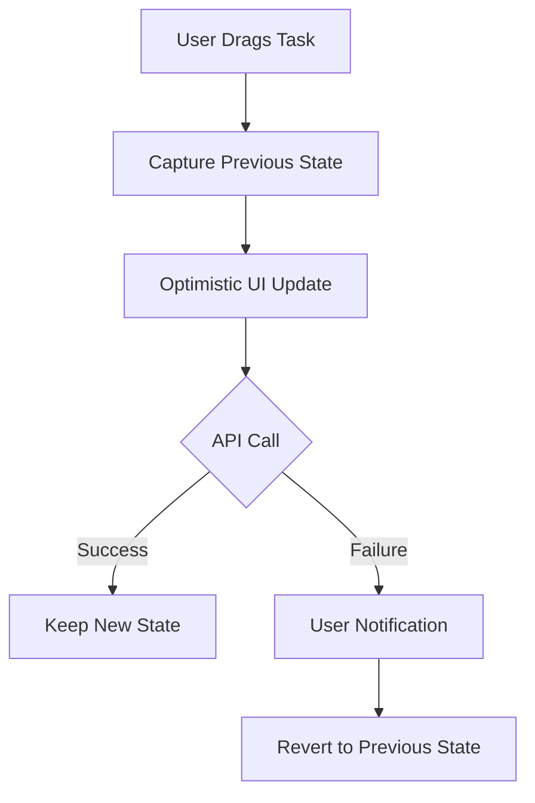

# Pull Request: Feature - Optimistic Rollback & Global Error Boundaries

## 📋 Summary

- **Graceful Failure Handling**: Implemented a rollback mechanism for drag-and-drop operations. If the backend persistence fails, the task list immediately snaps back to its previous state.
- **Improved UX**: Replaced the jarring full-page refetch (`fetchTasks`) with a localized state reversion, preventing scroll jumps and white screens.
- **Global Error Handling**: Integrated `react-error-boundary` to catch unhandled runtime errors and display a friendly "Try Again" UI instead of crashing to a white screen.
- **Documentation**: Updated the Engineering Knowledge Base with the new "Optimistic Rollback Strategy" pattern.

## 🗺️ Roadmap Progress

| Item ID           | Feature Name                    | Phase   | Status  | Notes                                                   |
| ----------------- | ------------------------------- | ------- | ------- | ------------------------------------------------------- |
| [P5-OPT-ROLLBACK] | Optimistic Rollback Refinement | Phase 5 | ✅ Done | Included console error logging and user-friendly alert. |
| [P5-ERR-BOUNDARY] | Error Boundaries Integration    | Phase 5 | ✅ Done | Wrapped AppRoutes with global ErrorBoundary.            |

## 🏗️ Architecture Decisions

### Key Patterns & Decisions

- **Pattern A (Local State Capture):** We capture `previousTasks` strictly *before* the optimistic update loop. This ensures we have a clean snapshot to revert to.
- **Pattern B (Synchronous Reversion):** We use `setTasks(previousTasks)` in the `catch` block. This is synchronous and prevents the UI from lingering in an invalid state while waiting for a fetch.
- **Pattern C (Error Boundary):** Wrapped the root `AppRoutes` in a global `ErrorBoundary`. This ensures that even if a specific route crashes, the user is presented with a recovery option (`window.location.reload()`) rather than a blank page.

### Logic Flow / State Changes

## 🔍 Review Guide

### 🚨 High Risk / Security Sensitive

- None.

### 🧠 Medium Complexity

- `src/components/tasks/TaskList.jsx` - The core `handleDragEnd` logic was modified to include the try/catch/rollback block.
- `src/App.jsx` - Wrapped routes with `ErrorBoundary`.

### 🟢 Low Risk / Boilerplate

- `src/components/common/ErrorFallback.jsx` - New fallback component.
- `docs/operations/ENGINEERING_KNOWLEDGE.md` - Documentation updates.
- `roadmap.md` - Status updates.
- `package.json` - Added `react-error-boundary`.

## 🧪 Verification Plan

### 1. Environment Setup

- [ ] New dependency: `react-error-boundary`. Run `npm install`.
- [ ] No migrations.

### 2. Seed Data (Copy/Paste)

N/A

### 3. Test Scenarios

1. **Happy Path**: Drag a task. Ensure it moves and stays moved (assuming API works).
2. **Failure Path (Simulated)**:
    - Temporarily throw an error in `updateTaskPosition`.
    - Drag a task.
    - Verify the task moves initially (optimistic).
    - Verify an error banner appears ("Failed to update task position").
    - Verify the task snaps back to its original position without a page reload.
3. **Error Boundary**:
    - Temporarily throw an error in a component (e.g., inside `TaskList` render).
    - Verify the "Something went wrong" screen appears.
    - Click "Try Again" and verify the app reloads.

---

<!-- markdownlint-disable MD033 -->

<strong>📉 Detailed Changelog (Collapsible)</strong>

- `src/components/tasks/TaskList.jsx`: Implemented rollback logic and non-blocking error banner.
- `src/App.jsx`: Added ErrorBoundary.
- `src/components/common/ErrorFallback.jsx`: Created fallback UI.
- `docs/operations/ENGINEERING_KNOWLEDGE.md`: Added [UI-016] entry.
- `docs/git_documentation/DOCS-STANDARDIZATION.md`: Deleted (Cleanup).
- `roadmap.md`: Updated completion status.

<!-- markdownlint-enable MD033 -->
