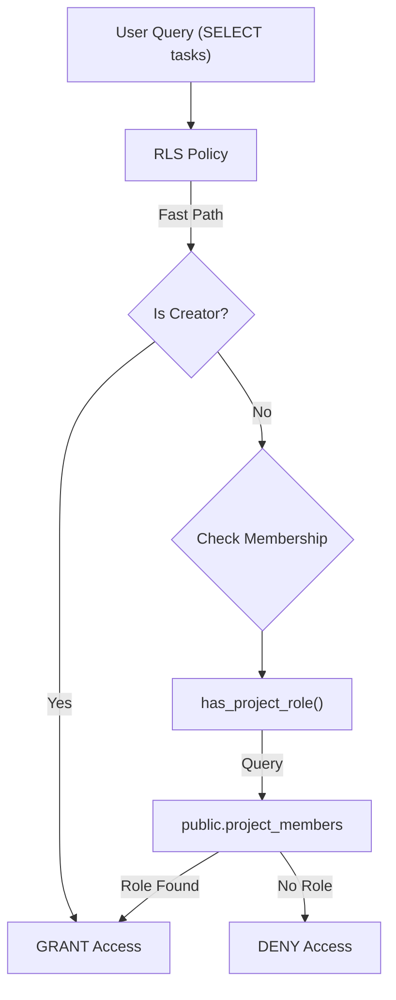
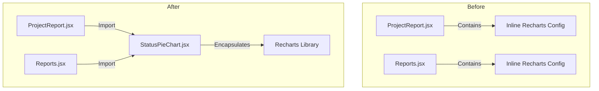

# Pull Request: Exhaustive Audit & Security Hardening

## 📋 Summary

This pull request completes a comprehensive "Deep Scan" audit of the codebase, focusing on critical security hardening, technical debt remediation, and architectural hygiene. It locks down the database's Row Level Security (RLS) to strictly enforce ownership and membership, removes significant legacy CSS debt, and modularizes reporting components for better maintainability.

## ✨ Highlights

- **Critical Security Hardening:** Implemented a robust RLS policy for the `tasks` table that strictly enforces "Creator" or "Project Member" access, removing a previous "Public Read" vulnerability.
- **RBAC Logic Implementation:** Replaced stubbed security functions with a real `has_project_role` PostgreSQL function that verifies membership against the `project_members` table without recursion.
- **Visual Hygiene & CSS Cleanup:** Deleted over 900 lines of legacy, dead CSS files (`src/styles/components/*.css`), consolidating all styling into the Tailwind v4 utility system.
- **Component Architecture Refactor:** Extracted the inline charting logic from `ProjectReport.jsx` into a reusable, tested `StatusPieChart` component, simplifying the reporting views.
- **Mobile Verification:** Added a new `golden-paths-mobile.test.jsx` integration test suite to verify critical mobile user flows.

## 🗺️ Roadmap Progress

| Item ID | Feature Name | Phase | Status | Notes |
| ------- | ------------ | ----- | ------------------------ | ------- |
| `P5-TECH-DEBT` | Tech Debt Resolution | 5 | ✅ Done | CSS cleanup & Chart Refactor |
| `P5-CLEANUP` | Infrastructure Maintenance | 5 | ✅ Done | Security & Hygiene |
| `P10-QUALITY` | Quality Convergence | 10 | ✅ Done | RLS Fixes & Mobile Tests |
| `SEC-HARDEN` | Audit & Security Round | - | ✅ Done | RLS Lockdown |

## 🏗️ Architecture Decisions

### Key Patterns & Decisions

- **Direct Member Lookup (RLS):** We pioneered a strict non-recursive pattern for RLS. Instead of the `tasks` policy querying itself (which caused recursion errors in the past), it now calls `has_project_role` which strictly queries the separate `project_members` table.
- **Component Extraction:** The `StatusPieChart` was extracted to solve a maintainability issue where chart configuration (Colors, Legends) was duplicated across pages. It now accepts a simple data prop and handles its own Recharts configuration.

### Logic Flow / State Changes

#### New RLS Security Flow



#### Chart Component Extraction



## 🔍 Review Guide

### � High Risk / Security Sensitive

- `supabase/migrations/20260119_fix_rls.sql` - **CRITICAL**: This migration changes the `tasks` table policy from "Public Read" to "Restricted". Must be verified to ensure no legitimate access is blocked.
- `docs/db/schema.sql` - The Source of Truth for the DB schema, updated to reflect the new policies.

### � Medium Complexity

- `src/features/reports/components/StatusPieChart.jsx` - New component. Verify it handles empty states and theme colors correctly.
- `src/features/tasks/components/TaskDetailsView.jsx` - Validated the removal of the hardcoded `hasLicense` check.
- `src/features/navigation/components/SidebarNavItem.jsx` - Switched to `Link` for client-side routing.

### � Low Risk / Boilerplate

- `src/styles/components/*.css` - Deletion of dead code.
- `src/tests/integration/golden-paths-mobile.test.jsx` - New test file (additive).

## 🧪 Verification Plan

### 1. Environment Setup

- [ ] Run `npm install` (No new deps, but good practice)
- [ ] Apply Migration: run the contents of `supabase/migrations/20260119_fix_rls.sql` in your local Supabase SQL editor.

### 2. Manual Verification

- **Security (RLS):**
  1. Login as User A.
  2. Create a Project.
  3. Login as User B (who is NOT a member).
  4. Attempt to fetch User A's project by ID.
  5. **Expected**: Returns `null` or empty array (Access Denied).
- **Reporting:**
  1. Navigate to "Reports".
  2. Verify the Pie Chart renders with correct colors (Brand colors).
- **Navigation:**
  1. Resize browser to mobile width (<640px).
  2. Open Sidebar and click a Project.
  3. **Expected**: URL changes, drawer closes, and content updates.

### 3. Automated Tests

```bash
npm test src/tests/integration/golden-paths-mobile.test.jsx
npm test
```

---

<details>
<summary><strong>📉 Detailed Changelog (Collapsible)</strong></summary>

- `src/features/reports/components/StatusPieChart.jsx`: Extracted pie chart logic.
- `src/features/reports/components/ProjectReport.jsx`: Refactored to use new Chart component.
- `supabase/migrations/20260119_fix_rls.sql`: Added RLS security migration.
- `docs/db/schema.sql`: Updated schema docs.
- `src/features/tasks/components/TaskDetailsView.jsx`: Fixed license gating.
- `src/features/navigation/components/SidebarNavItem.jsx`: Implemented `Link` component.
- `src/styles/components/buttons.css`: Deleted (Dead code).
- `src/styles/components/forms.css`: Deleted (Dead code).
- `src/styles/components/panels.css`: Deleted (Dead code).
- `src/styles/components/task-details.css`: Deleted (Dead code).
- `src/tests/integration/golden-paths-mobile.test.jsx`: Added mobile integration tests.

</details>
